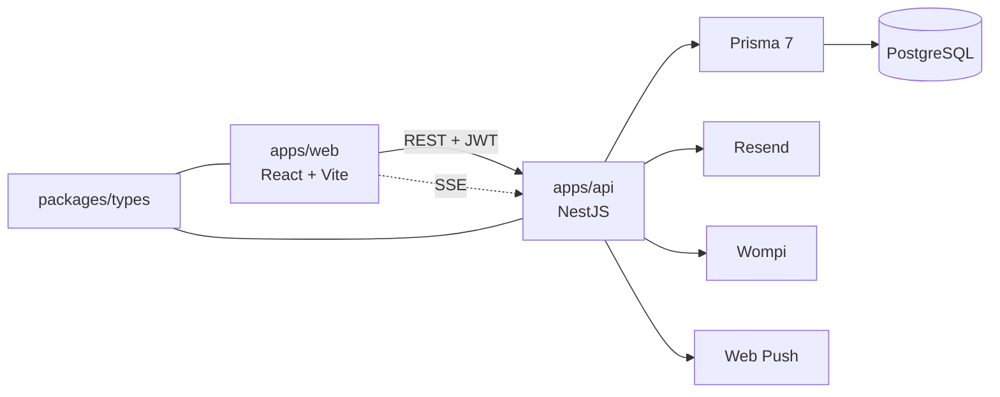

# 🧩 Estado de Implementación — Agendya

> Qué está construido hoy y en qué rama. [[MVP-v1]] y [[Arquitectura-Tecnica]]
> son la planificación original. El detalle técnico vive en el sitio de
> documentación (`docs/`, dentro de este vault); esta nota solo resume y enlaza.

## Ramas

| Rama | Estado | Contenido |
| --- | --- | --- |
| `dev` | Integrada | Todo lo de la tabla de áreas salvo el período de prueba |
| `AG-178-…-periodo-de-prueba-30-dias-acceso-full` | Commit `ec38d9f`, **pendiente de merge** | Período de prueba (resumen abajo) |
| `AG-171-crear-base-de-backoffice-…` | **No integrada** | Backoffice separado: usuarios internos, tickets, auditoría |

## Áreas implementadas

| Área | Estado | Documentación |
| --- | --- | --- |
| Registro, login, Google, beta cerrada, recuperar contraseña, términos | dev | [[docs/src/content/docs/features/authentication\|Autenticación]] |
| Planes, límites, pagos Wompi, cancelar/reactivar, vencimiento | dev | [[docs/src/content/docs/features/professionals\|Profesionales › Planes]] · [[docs/src/content/docs/features/admin-panel\|Panel de administrador]] |
| Panel de Super Admin | dev | [[docs/src/content/docs/features/admin-panel\|Panel de administrador]] |
| Correos (Resend) y notificaciones | dev | [[docs/src/content/docs/features/notifications\|Notificaciones]] |
| Reservas, agenda, recordatorios, vencimiento de citas | dev | [[docs/src/content/docs/features/appointments\|Citas]] · [[docs/src/content/docs/features/agenda\|Agenda]] · [[docs/src/content/docs/database/appointment-lifecycle\|Ciclo de vida]] |
| Citas manuales | dev | Solo en esta nota (ver abajo) |
| Servicios que exceden el plan | dev | Solo en esta nota (ver abajo) |
| Período de prueba de 30 días | AG-178 | Esta nota; al integrarse, [[docs/src/content/docs/features/admin-panel\|Panel de administrador]] |

Referencia general: [[docs/src/content/docs/api/reference|API]] ·
[[docs/src/content/docs/database/models|Modelos]] ·
[[docs/src/content/docs/database/er-model|Modelo ER]] ·
[[docs/src/content/docs/testing|Testing]].

## Aún no documentado en `docs/`

### Citas manuales

El profesional crea citas desde la Agenda con `POST /bookings`
(`ManualBookingModal`). Correo del cliente opcional, sin validar horario laboral,
sin fechas pasadas, con la misma guarda de solapamiento y el mismo límite
mensual del plan que las reservas online. Se guardan con `source = MANUAL` y no
generan notificación in-app. La UI ofrece horas en pasos de 15 min en la zona
del profesional.

### Servicios que exceden el plan

Nunca se borran. En cada cambio de plan, `enforceServiceLimit` marca los
sobrantes con `Service.planLocked`: salen de la página pública pero el
profesional los sigue viendo. `POST /services/:id/enable` reactiva uno y, si ya
está en el límite, bloquea el habilitado más antiguo.

## Período de prueba (AG-178, pendiente de merge)

- Un Super Admin da **30 días de acceso completo** (plan Negocios) desde
  *Plan y prueba*. Al terminar, la cuenta vuelve sola a su plan facturado.
- Dos campos en `Professional` (`trialStartedAt`, `trialEndsAt`) y la tabla de
  auditoría `TrialEvent`. `plan` no se toca.
- `effectivePlan()` en `@agendya/types` decide los límites: plan de prueba
  mientras `trialStartedAt <= now < trialEndsAt`, si no el plan facturado.
- El vencimiento no depende de un cron; un barrido horario solo bloquea
  servicios sobrantes. No se borra ningún dato.
- Acciones: activar, extender (1–30 días), terminar; una prueba por cuenta salvo
  excepción. Columna *Prueba* en Registros y buscador desde 3 caracteres.
- Pendiente: avisos antes del vencimiento.

Por qué se diseñó así: [[Decision - Plan efectivo derivado para el periodo de prueba]].

## Flujo general

## Volver

- [[Proyecto Personal]] · [[🏠 Home]]
