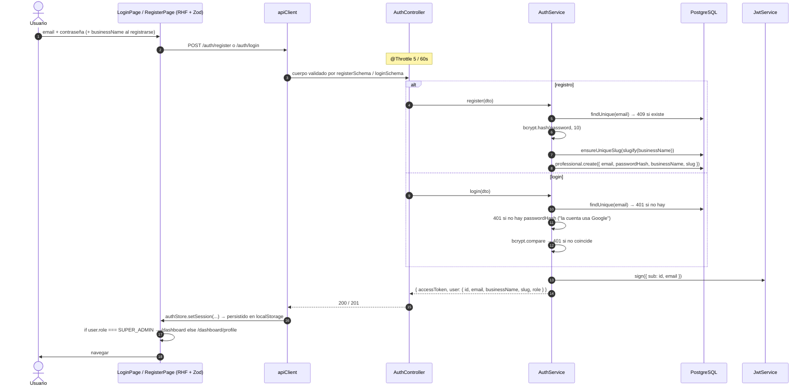
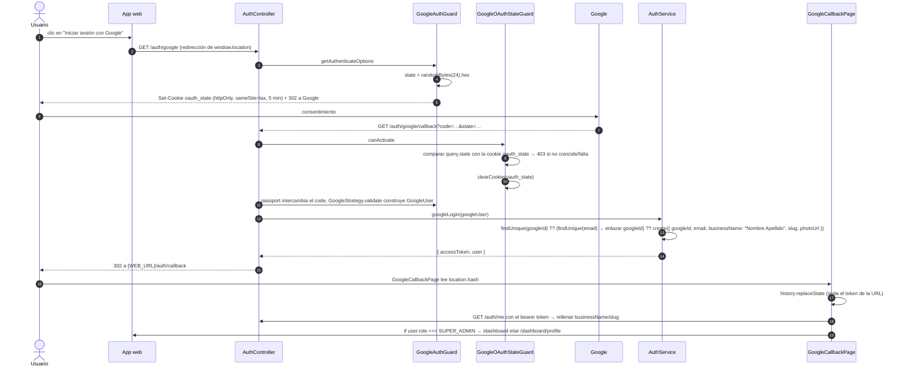
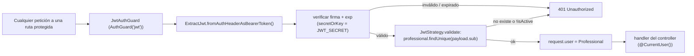

Dos formas de entrar, una sola salida: un **JWT** firmado (`{ sub, email }`,
`expiresIn` por defecto `7d`) que la app web guarda en `localStorage`
(`agendya-auth`) y envía como `Authorization: Bearer <token>` en cada petición
autenticada. Cada profesional tiene un `role`: `INDEPENDENT` (por defecto),
`SUPER_ADMIN` lo marca una fila en `PlatformAccessEmail` (`access =
SUPER_ADMIN`), no un correo hardcodeado. `BUSINESS_ADMIN` existe en el enum
y no se usa todavía.

La API es **sin estado** — sin almacén de sesión, sin cookie de autenticación.
La única cookie del sistema es la cookie efímera de `state` de OAuth que se
describe abajo.

## Email + contraseña

## Google OAuth 2.0

Por qué el token vuelve en el **fragmento** de la URL (`#token=`), no en un
query string: los fragmentos nunca se envían a ningún servidor, nunca se
escriben en logs de servidor/proxy y nunca se incluyen en una cabecera
`Referer`. `GoogleCallbackPage` lo lee una vez e inmediatamente lo saca del
historial con `replaceState`.

:::note[Protección contra CSRF de login]
Sin la comprobación de `state`, un atacante podría iniciar su propio flujo OAuth
y engañar a una víctima para que lo complete, dejando el navegador de la víctima
en una sesión atada a la cuenta de Google del atacante. `GoogleAuthGuard` genera
el `state` y `GoogleOAuthStateGuard` lo impone en el callback.
:::

:::caution[Estrategia condicional]
`GoogleStrategy` solo se registra cuando están definidos tanto
`GOOGLE_CLIENT_ID` como `GOOGLE_CLIENT_SECRET` (`passport-oauth2` lanza al
construirse si faltan, lo que rompería el bootstrap y toda ejecución e2e en CI).
Sin credenciales, las rutas `/auth/google*` simplemente no están disponibles.
:::

## Usar el token

En el cliente, `apiClient` adjunta la cabecera bearer desde `authStore`;
cualquier respuesta `401` dispara `authStore.logout()`, y los guards de ruta
(`PrivateRoute` / `PublicRoute`) redirigen según la presencia del token.

Lista completa de endpoints en la [página de la funcionalidad de
autenticación](/features/authentication/).
