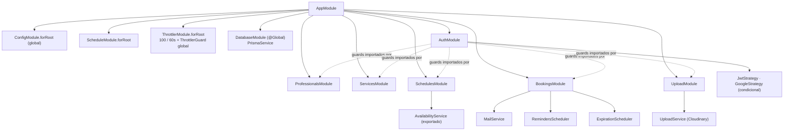

**Stack:** NestJS 11 · Prisma 7 + `@prisma/adapter-pg` · PostgreSQL · Zod 4 ·
`@nestjs/jwt` + `passport-jwt` · `passport-google-oauth20` ·
`@nestjs/schedule` · `@nestjs/throttler` · `helmet` · `resend` · `cloudinary` ·
`bcrypt` · `date-fns` / `date-fns-tz`.

## Grafo de módulos

`DatabaseModule` es `@Global()`, así que cada módulo inyecta `PrismaService` sin
importarlo. `AuthModule` expone `JwtAuthGuard` (vía `AuthGuard('jwt')`), que los
demás controladores de funcionalidad aplican con `@UseGuards(JwtAuthGuard)`.

## Capas

| Capa | Responsabilidad | No debe |
| --- | --- | --- |
| **Controller** | Mapeo de rutas, `@UseGuards`, `@Throttle`, enlazar `ZodValidationPipe(schema)`, extraer `@CurrentUser()` / `@Param` / `@Query`, delegar | Contener reglas de negocio ni tocar Prisma |
| **Service** | Reglas de negocio, comprobaciones de propiedad, puertas de política, transacciones, llamar a `MailService` | Conocer los objetos de request/response HTTP |
| **PrismaService** | Acceso tipado a la BD, `$transaction`, `$queryRaw` | — |
| **Helpers puros** | `booking-policy.ts`, `common/utils/*` — sin dependencias de BD/framework, testeados directamente | Importar Nest o Prisma |

`bootstrap.ts` (`configureApp`) contiene el cableado de seguridad (helmet +
CORS) y lo llaman **tanto** `main.ts` **como** la suite e2e, así que las pruebas
ejercitan exactamente lo que corre en producción.

## Módulos de funcionalidad

| Módulo | Controladores | Puntos destacados del servicio |
| --- | --- | --- |
| `auth` | `AuthController` (`/auth`) | `register` / `login` (bcrypt, `SALT_ROUNDS=10`), `googleLogin` (enlazar-por-googleId → enlazar-por-email → crear), `buildAuthResponse` firma el JWT |
| `professionals` | `ProfessionalsController` (`/professionals`, JWT), `ProfessionalsPublicController` (`/public/professionals/:slug`) | `getProfile` (+ conteo `bookingsThisMonth`), `updateProfile` (parcial, unicidad del slug), `isSlugAvailable`, `findPublicBySlug` (solo servicios activos) |
| `services` | `ServicesController` (`/services`, JWT) | CRUD + `duplicate`; `assertWithinPlanLimit` (`PLAN_SERVICE_LIMITS`); `softDelete` pone `deletedAt` + `isActive=false`; cada mutación revalida `findOwnedOrThrow` |
| `schedules` | `SchedulesController` (`/schedules`, JWT), `AvailabilityController` (`/public/professionals/:slug/availability`) | `setWorkingHours` = borrar-todo + `createMany` en un `$transaction`; `createException` mapea Prisma `P2002` → `409`; `AvailabilityService.getAvailableSlots` es el algoritmo de grilla |
| `bookings` | `BookingsController` (`/bookings`, JWT), `BookingsCreateController` (`/public/professionals/:slug/bookings`), `BookingsTokenController` (`/public/bookings/:token`) | `createPublicBooking`, `updatePublicBooking`, `reschedule*`, `cancel*`, `listAgenda`, `completeByProfessional`; `assertModifiable` es la única puerta de mutación; `commitBookingSlot` / `commitReschedule` corren `Serializable` + reintento |
| `upload` | `UploadController` (`/upload/image`, JWT) | Lista blanca de MIME (sin SVG), topes de tamaño por variante, stream a Cloudinary (`agendya-logos` / `agendya-covers`) |

## Infraestructura compartida

- **`ZodValidationPipe`** — `schema.safeParse(value)`; ante fallo lanza
  `BadRequestException({ message: 'Validation failed', errors: flatten() })`.
- **Decorador `CurrentUser`** — devuelve `request.user` (el `Professional`
  completo, puesto por `JwtStrategy.validate`).
- **`MailService`** — un método por tipo de correo; hace `escapeHtml` de cada
  valor interpolado; se convierte en una línea de log cuando `RESEND_API_KEY` no
  está.
- **`timezone.util.ts`** — `weekdayFromDateString`, `dateOnlyUtc`,
  `formatDateOnly`, `zonedInstant`, `zonedDateParts`.
- **`slug.util.ts`** — `slugify` (quita acentos con NFD, `[^a-z0-9]+ → -`, tope
  de 50 caracteres) + `ensureUniqueSlug` (añade `-2`, `-3`, …).
