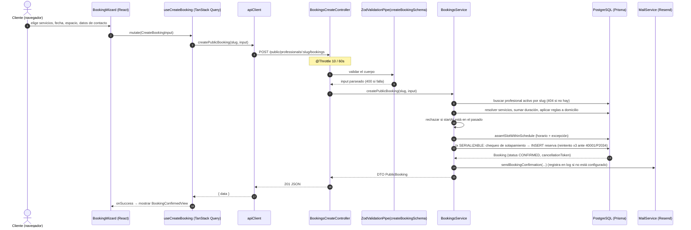
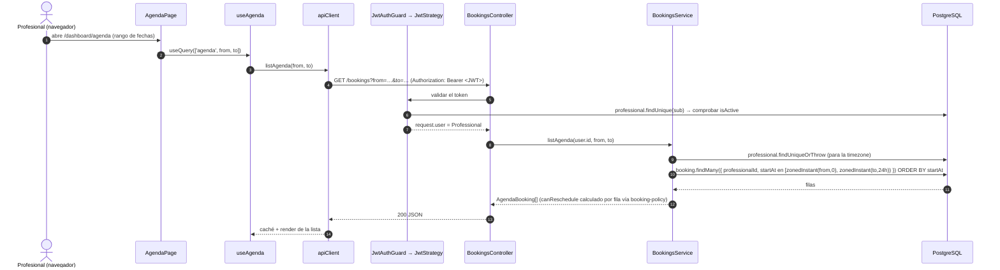

## Ejemplo 1 — un cliente crea una reserva



Puntos clave:

- **La validación ocurre dos veces a propósito** — el asistente valida con el
  esquema Zod por UX, la API revalida el mismo esquema por confianza.
- **La puerta de espacio es autoritativa en el servidor.** La lista de
  disponibilidad que mostró el asistente puede estar obsoleta;
  `assertSlotWithinSchedule` + el chequeo de solapamiento serializable son lo
  que realmente evita una reserva doble.
- **El correo nunca bloquea la respuesta ante un fallo** — `MailService.send`
  captura y registra.
- Las reservas nuevas se crean `CONFIRMED` (`@default(CONFIRMED)` en el modelo).
  `PENDING` existe en el enum pero ningún flujo actual lo asigna.

## Ejemplo 2 — un profesional carga la agenda



- Los parámetros de query `from`/`to` son fechas de calendario (`YYYY-MM-DD`);
  el servicio los convierte en instantes absolutos **en la timezone del
  profesional** antes de consultar.
- `canReschedule` / `canCancel` en cada fila los derivan los predicados puros de
  `booking-policy.ts`, así que la UI puede deshabilitar botones sin una ida y
  vuelta — pero los endpoints de mutación revalidan las mismas reglas.

## La forma genérica

```
Usuario → React → hook → api.ts → apiClient(+JWT)
        → Controller (guard, ZodValidationPipe)
        → Service (propiedad + política + tx)
        → Prisma → PostgreSQL
        → mapeador de DTO → JSON → caché → render
```
