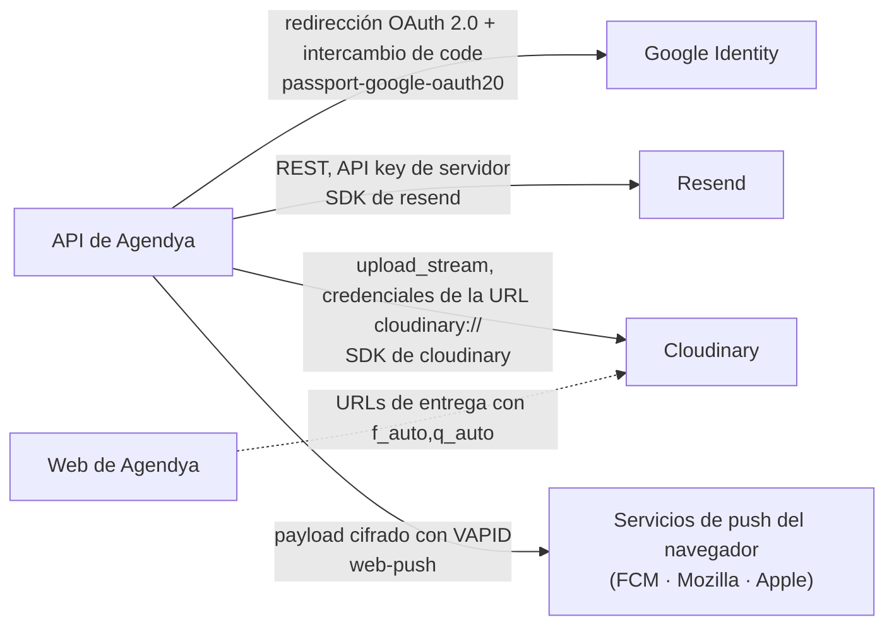

Agendya se integra con cuatro servicios externos. **Los cuatro son opcionales
para el desarrollo local** — cada uno tiene un modo degradado definido.

## Google Identity (OAuth 2.0)

| | |
| --- | --- |
| Librería | `passport-google-oauth20` vía `@nestjs/passport` |
| Config | `GOOGLE_CLIENT_ID`, `GOOGLE_CLIENT_SECRET`, `GOOGLE_CALLBACK_URL` |
| Scopes | `email`, `profile` |
| Código | `modules/auth/strategies/google.strategy.ts`, `guards/google-auth.guard.ts`, `guards/google-oauth-state.guard.ts` |
| Se usa para | «Iniciar sesión con Google» — crea o enlaza un `Professional` por `googleId` / `email` |
| **Sin configurar** | El provider `GoogleStrategy` resuelve a `null`; rutas `/auth/google*` no disponibles. El login por email/contraseña no se ve afectado. |

Ver el [Flujo de autenticación](/architecture/authentication/) para la secuencia
completa, incluido el manejo del `state` de CSRF.

## Resend (correo transaccional)

| | |
| --- | --- |
| Librería | `resend` |
| Config | `RESEND_API_KEY` |
| Dirección de origen | `Agendya <reservas@agendya.app>` (fija en `MailService`) |
| Código | `infra/mail/mail.service.ts`, `infra/mail/html.util.ts` |
| Correos | confirmación · recordatorio (24h y 2h) · reprogramación (al cliente) · reprogramación (al profesional) · cancelación |
| **Sin configurar** | `this.resend` es `null`; `send()` registra `"[dev] Email a <to>: <subject>"` y retorna. Los fallos de envío cuando sí está configurado se capturan y registran, nunca se lanzan. |

Cada valor proporcionado por el usuario que se interpola en el cuerpo de un
correo pasa primero por `escapeHtml` (el formulario de reserva es público y sin
autenticar). Las fechas se formatean con `Intl.DateTimeFormat('es-CO', {
dateStyle: 'full', timeStyle: 'short', timeZone })` en la timezone del
profesional.

Ver [Notificaciones](/features/notifications/).

## Cloudinary (subida de imágenes)

| | |
| --- | --- |
| Librería | `cloudinary` (v2) |
| Config | `CLOUDINARY_URL` (`cloudinary://<api_key>:<api_secret>@<cloud_name>`) |
| Código | `infra/upload/upload.service.ts`, `infra/upload/upload.controller.ts` |
| Carpetas / transforms | `agendya-logos` → `limit 400×400` · `agendya-covers` → `limit 1600×600` |
| Entrada aceptada | solo `image/png`, `image/jpeg`, `image/webp`, `image/gif` (**sin SVG** — puede llevar script) |
| Topes de tamaño | logo 6 MB, portada 12 MB, límite duro de multer 15 MB |
| **Sin configurar** | `ensureConfigured()` lanza `ServiceUnavailableException` → `503` desde `POST /upload/image`. El resto del perfil se guarda igual. |

La app web **reduce las imágenes en el navegador** (`professionals/image.ts`,
`createImageBitmap` + canvas) antes de subir, así que los topes del servidor son
guardas contra abuso, no el redimensionado principal. Las URLs entregadas se
reescriben en el cliente con `f_auto,q_auto[,c_limit,w_<n>]` por
`shared/image/cloudinary.ts`.

## Web Push (avisos a la PWA)

| | |
| --- | --- |
| Librería | `web-push` |
| Config | `VAPID_PUBLIC_KEY`, `VAPID_PRIVATE_KEY`, `VAPID_SUBJECT` |
| Código | `modules/notifications/push-subscriptions.service.ts`; service worker en `apps/web/src/sw.ts` |
| Se usa para | Aviso del sistema operativo al profesional cuando entra una cita, aunque la PWA esté cerrada — un canal de entrega más para la fila `Notification` |
| Endpoint destino | El navegador entrega un `endpoint` por dispositivo (FCM para Chrome, Mozilla para Firefox, Apple para Safari); no hay una cuenta de proveedor que configurar, solo el par de claves VAPID |
| **Sin configurar** | Sin las tres claves, `sendToProfessional` es un no-op y `GET /notifications/push/public-key` devuelve `null`; el dashboard oculta el interruptor y el feed sigue por SSE |

Ver [Notificaciones › Web Push](/features/notifications/#web-push) para el modelo
`PushSubscription`, el service worker y el flujo del frontend.

## Resumen

| Servicio | Variable de entorno | Si falta → |
| --- | --- | --- |
| Google OAuth | `GOOGLE_CLIENT_ID` + `GOOGLE_CLIENT_SECRET` | Login con Google deshabilitado; el login por contraseña funciona |
| Resend | `RESEND_API_KEY` | Correos registrados en log, no enviados |
| Cloudinary | `CLOUDINARY_URL` | `POST /upload/image` → 503 |
| Web Push | `VAPID_PUBLIC_KEY` + `VAPID_PRIVATE_KEY` + `VAPID_SUBJECT` | Push desactivado; el feed sigue por SSE |
