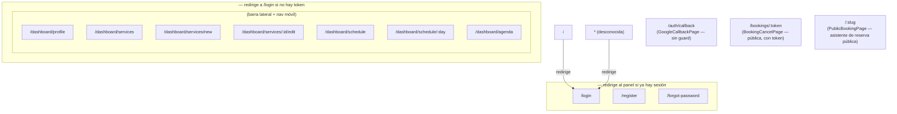

**Stack:** React 19 · Vite 8 · TypeScript · React Router 7 · TanStack Query 5 ·
Zustand 5 · React Hook Form 7 + `@hookform/resolvers` (Zod) · Tailwind CSS v4 ·
Moon Design System (`@moondesignsystem/react` + `/ui`) · Vitest + Testing
Library + MSW · Playwright · oxlint.

## Punto de entrada

```
index.html  ── script de tema pre-paint, <link>s de fuentes, #root
  └─ src/main.tsx
       └─ <StrictMode>
            └─ <QueryClientProvider client={new QueryClient()}>
                 └─ <App/> → <AppRouter/>
```

`main.tsx` también importa por efecto secundario `shared/theme/themeStore` para
que el tema persistido / del sistema se aplique a `<html>` al arrancar.

## Patrón de módulo por funcionalidad

Todo vive bajo `src/modules/<funcionalidad>/` y sigue la misma forma:

```
modules/services/
├── api.ts                 envoltorios finos sobre apiClient — una función por endpoint
├── hooks/
│   ├── useServices.ts     useQuery({ queryKey: ['services'], queryFn: listServices })
│   ├── useCreateService.ts   useMutation + queryClient.invalidateQueries
│   └── …
├── ServicesPage.tsx       componente de ruta
├── ServiceFormPage.tsx    componente de ruta (crear + editar)
├── components/            componentes locales de la funcionalidad
├── format.ts              helpers puros locales de la funcionalidad
└── ServicesPage.test.tsx  Vitest + Testing Library + MSW
```

Módulos: `auth`, `dashboard`, `professionals`, `services`, `schedules`,
`bookings` (agenda del profesional), `publicBooking` (asistente de cara al
cliente).

`src/shared/` contiene el código transversal: `api/apiClient.ts`,
`api/getApiErrorMessage.ts`, `theme/` (store + toggle), `a11y/useFocusTrap.ts`,
`components/` (átomos Button, Input, Card, Badge), `image/cloudinary.ts`.

## Árbol de rutas



Solo `LoginPage` está en el bundle inicial. Todas las demás rutas usan
`React.lazy()` + `<Suspense>` — ver
[manualChunks de vite.config](/performance/). `/:slug` es la última ruta
declarada para que no pueda ensombrecer `/login`, `/dashboard/*`, etc.

## Estado del cliente

| Estado | Herramienta | ¿Persistido? | Notas |
| --- | --- | --- | --- |
| Auth (`accessToken`, `user`) | Zustand + `persist` | clave de `localStorage` `agendya-auth` | Leído de forma síncrona por `apiClient` y los guards de ruta |
| Tema (`manualTheme`) | Zustand + `persist` (`partialize`) | clave de `localStorage` `agendya-theme` | Solo se guarda el override explícito; el `theme` efectivo siempre se deriva como `manualTheme ?? preferencia del SO` |
| Datos de contacto de la reserva pública | Zustand (`customerStore`) | — | Prellena el paso de contacto del asistente |
| Datos del servidor (perfil, servicios, horario, agenda, disponibilidad, reservas) | TanStack Query | caché en memoria | Invalidados por el `onSuccess` del `useMutation` correspondiente |
| Estado de formulario | React Hook Form | — | `zodResolver` contra un esquema de `@agendya/types` (o un espejo local a la página) |

## Tubería de obtención de datos

```
Componente
  → useQuery / useMutation (hook del módulo)
    → función de api.ts
      → apiClient.get/post/patch/put/delete
        → fetch(buildUrl(path, params), { headers: Authorization: Bearer <token> })
        → no-2xx → lanza ApiError(status, cuerpoParseado); 401 → authStore.logout()
      ← { data }
  ← resultado tipado → render / caché
```

`getApiErrorMessage(error, fallback)` normaliza `ApiError.data.message` (string
o string[]) a un texto de cara al usuario para los banners de error a nivel de
formulario.

## Estilos

- Tailwind v4 vía `@tailwindcss/vite`, importado en `src/styles/tailwind.css`
  junto con `moon-core.css` / `moon-components.css` de Moon (en un solo archivo
  — Tailwind solo compila bloques `@theme` donde también ve `@import
  'tailwindcss'`).
- `@custom-variant dark` está cableado a `[data-theme="dark"]` en `<html>`
  (puesto por el store de tema), **no** a `prefers-color-scheme`, así que las
  clases `dark:` siguen el toggle in-app.
- `main.scss` contiene propiedades CSS personalizadas (tokens de color, colores
  de las insignias de estado) que se adaptan por tema.
- Las fuentes (Outfit / Plus Jakarta Sans / Inter) se cargan con etiquetas
  `<link>` en `index.html`, no con un `@import` de CSS, para el FCP.
