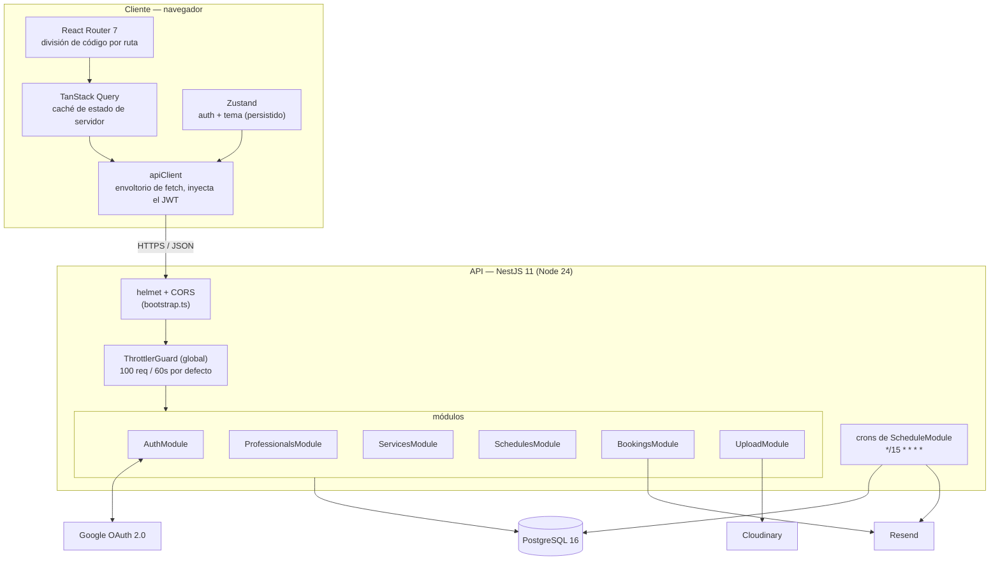
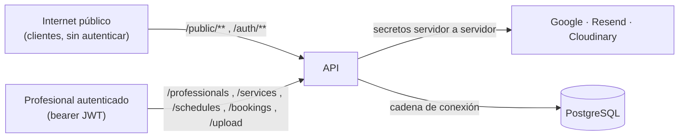

## Procesos

| Proceso | Runtime | Responsabilidades |
| --- | --- | --- |
| **Web** | Bundle estático servido al navegador (build de Vite) | UI, enrutamiento, estado del cliente, validación de formularios, llamadas a la API |
| **API** | Un único proceso Node.js | Enrutamiento HTTP, autenticación, validación, reglas de negocio, acceso a la BD, correo, subidas **y** las tareas cron en proceso |

Los schedulers cron (`RemindersScheduler`, `ExpirationScheduler`) corren
**dentro del proceso de la API** vía `@nestjs/schedule`
`ScheduleModule.forRoot()` — no hay un worker aparte. Cada job `@Cron` es
`*/15 * * * *` (cada 15 minutos) y se protege con `DISABLE_SCHEDULED_JOBS`.

## Fronteras de confianza

- Superficie **sin autenticar**: `GET /`, `GET /health`, `POST /auth/register`,
  `POST /auth/login`, las rutas de Google OAuth y todo lo que cuelga de
  `/public/**` (profesional-por-slug, disponibilidad, crear reserva y la
  lectura/edición/cancelación/reprogramación de reserva con token).
- Superficie **autenticada**: protegida por `JwtAuthGuard` — `/auth/me`,
  `/professionals/**` (salvo el subcontrolador público), `/services/**`,
  `/schedules/**`, `/bookings` (agenda + acciones del profesional),
  `/upload/**`.
- La propiedad siempre se revalida en la capa de servicio con
  `where: { id, professionalId }` — un JWT válido del profesional A no puede
  tocar las filas del profesional B.

## Preocupaciones transversales

| Preocupación | Dónde |
| --- | --- |
| Cabeceras de seguridad | `helmet()` en `bootstrap.ts` (CSP completa — API JSON, sin HTML) |
| CORS | Función de origen a medida en `bootstrap.ts` + `common/utils/cors.util.ts` (`WEB_URL` configurado + cualquier origen localhost/red privada) |
| Rate limiting | Guard global de `@nestjs/throttler`; overrides por ruta con `@Throttle` |
| Validación de entrada | `ZodValidationPipe` con esquemas de `@agendya/types`, por ruta |
| Autenticación | `passport-jwt` (`JwtStrategy` recarga al profesional y comprueba `isActive`) |
| Configuración | `@nestjs/config` global, `config/configuration.ts` |
| Zonas horarias | `common/utils/timezone.util.ts` (`date-fns-tz`) |
| Errores | Subclases de `HttpException` de Nest → JSON `{ statusCode, message, error }` |

Ver [Arquitectura del backend](/architecture/backend/) para el detalle interno
de los módulos y [Arquitectura de la API](/api/conventions/) para las
convenciones de rutas.
