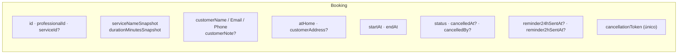
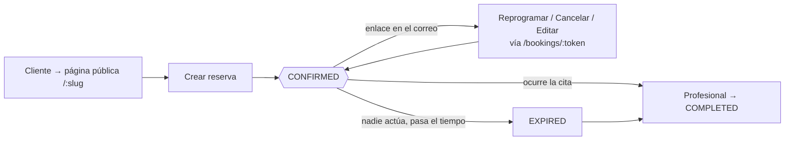

## El registro

Una `Booking` se crea en el momento en que un cliente completa el asistente
público. **Fija como snapshot** el nombre y la duración del servicio para que
ediciones posteriores al `Service` no reescriban lo acordado, y lleva un
`cancellationToken` único que impulsa cada acción del lado del cliente sin
necesidad de cuenta.



## Máquina de estados de status

`BookingStatus` = `PENDING | CONFIRMED | CANCELLED | COMPLETED | NO_SHOW |
EXPIRED`. **La Fase 1 usa cuatro de los seis.**

```mermaid
stateDiagram-v2
  [*] --> CONFIRMED: createPublicBooking()<br/>(@default(CONFIRMED))

  CONFIRMED --> CONFIRMED: reprogramar / editar<br/>(nuevo startAt, endAt)
  CONFIRMED --> CANCELLED: cancela el cliente (token)<br/>o el profesional (agenda)<br/>— dentro de la ventana de política
  CONFIRMED --> COMPLETED: el profesional marca completada
  CONFIRMED --> EXPIRED: startAt pasó, sin tocar<br/>(barrido de ExpirationScheduler, o<br/>perezosamente en assertModifiable)

  EXPIRED --> COMPLETED: el profesional marca completada<br/>(olvidó cerrarla durante la cita)

  CANCELLED --> [*]
  COMPLETED --> [*]
  EXPIRED --> [*]: terminal salvo que se complete

  note right of PENDING
    En el enum, nunca asignado
    por ningún camino de codigo de la Fase 1.
  end note
  note right of NO_SHOW
    En el enum, nunca asignado
    por ningún camino de codigo de la Fase 1.
  end note
```

### Transiciones que el código realmente realiza

| Desde | Hacia | Disparador | Guarda |
| --- | --- | --- | --- |
| *(ninguno)* | `CONFIRMED` | `createPublicBooking` | el espacio cabe en el horario, sin excepción, sin solapamiento (serializable) |
| `CONFIRMED` | `CONFIRMED` | `reschedule*` / `updatePublicBooking` | `assertModifiable`: sigue confirmada, no pasada, fuera de `cancellationPolicyHours`; el nuevo espacio libre |
| `CONFIRMED` | `CANCELLED` | `cancelPublicBooking` (token) / `cancelByProfessional` (agenda) | `assertModifiable`; establece `cancelledAt`, `cancelledBy` |
| `CONFIRMED` / `EXPIRED` | `COMPLETED` | `completeByProfessional` | el estado debe ser `CONFIRMED` o `EXPIRED` |
| `CONFIRMED` | `EXPIRED` | `ExpirationScheduler` (`*/15 * * * *`) `updateMany({ status: CONFIRMED, startAt < now })`; **o** perezosamente dentro de `assertModifiable` cuando se toca una fila confirmada obsoleta | — |

### Transiciones rechazadas (`assertModifiable`)

| Estado actual | Intento de cancelar/modificar → |
| --- | --- |
| `CANCELLED` | `409 "Esta reserva ya fue cancelada."` |
| `COMPLETED` | `409 "Esta reserva ya fue completada."` |
| `NO_SHOW` | `409 "Esta reserva fue marcada como no asistida."` |
| `EXPIRED` o `startAt` en el pasado | `403 "Esta reserva ya venció…"` (y autosana `CONFIRMED → EXPIRED`) |
| `CONFIRMED` pero dentro de la ventana de política | `403 "Solo puedes {cancelar\|modificar} con al menos N horas de anticipación."` |

## El recorrido del cliente



Solo estos estados y transiciones existen en el código — no hay lista de espera,
no hay retención de depósito, no hay paso de aprobación `PENDING`, y `NO_SHOW`
todavía no está conectado a ninguna acción.
