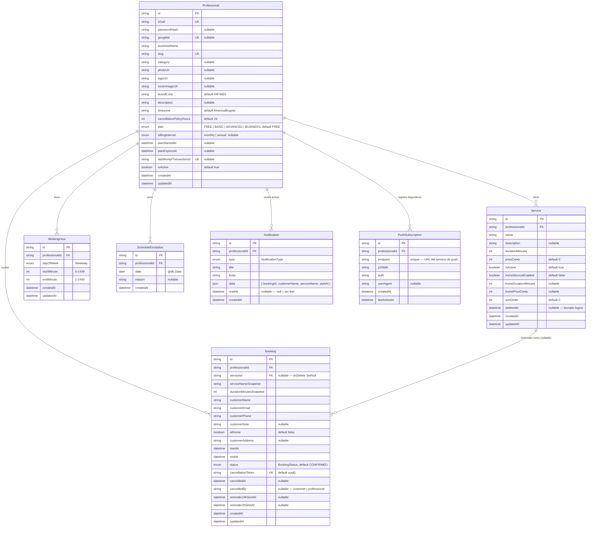

Fuente: `apps/api/prisma/schema.prisma`. Provider PostgreSQL, todas las claves
primarias `String @id @default(uuid())`.

## Relaciones y reglas de cascada

| Desde | Hacia | Cardinalidad | `onDelete` |
| --- | --- | --- | --- |
| `Service.professional` | `Professional` | muchos a uno | `Cascade` — al borrar un profesional, se borran sus servicios |
| `WorkingHour.professional` | `Professional` | muchos a uno | `Cascade` |
| `ScheduleException.professional` | `Professional` | muchos a uno | `Cascade` |
| `Booking.professional` | `Professional` | muchos a uno | `Cascade` |
| `Notification.professional` | `Professional` | muchos a uno | `Cascade` |
| `PushSubscription.professional` | `Professional` | muchos a uno | `Cascade` |
| `Booking.service` | `Service` | muchos a uno, **opcional** | `SetNull` — al borrar un servicio se conservan sus reservas; `serviceId` pasa a `null`, y `serviceNameSnapshot` / `durationMinutesSnapshot` preservan lo que se reservó |

## Enums

| Enum | Valores |
| --- | --- |
| `Weekday` | `SUNDAY`, `MONDAY`, `TUESDAY`, `WEDNESDAY`, `THURSDAY`, `FRIDAY`, `SATURDAY` |
| `BookingStatus` | `PENDING`, `CONFIRMED`, `CANCELLED`, `COMPLETED`, `NO_SHOW`, `EXPIRED` |
| `Plan` | `FREE`, `BASIC`, `ADVANCED`, `BUSINESS` |
| `NotificationType` | `APPOINTMENT_CREATED` (único emitido hoy; el enum se ampliará) |

## Notas de diseño

- **Sin tabla `Customer`.** La identidad del cliente son tres campos
  (`customerName` / `customerEmail` / `customerPhone`) capturados por reserva.
  Una entidad `Customer` está explícitamente diferida más allá de la Fase 1.
- **Snapshots en `Booking`.** `serviceNameSnapshot` y
  `durationMinutesSnapshot` congelan lo que reservó el cliente, para que
  ediciones posteriores (o el borrado) del `Service` no reescriban el
  histórico.
- **Borrado lógico en `Service`** vía `deletedAt`; las consultas filtran
  `deletedAt: null`. El código de aplicación nunca emite un borrado físico.
- **El dinero** son unidades menores enteras (`priceCents`, `homePriceCents`) —
  sin flotantes. Rango `0 … 100_000_000`.
- **La hora del día** son enteros de «minutos desde medianoche» en
  `WorkingHour` (`0–1439` inicio, `1–1440` fin).

Ver [Modelos de Prisma](/database/models/) para el detalle a nivel de campo y
[Índices y restricciones](/database/indexes/) para la estrategia de índices.
