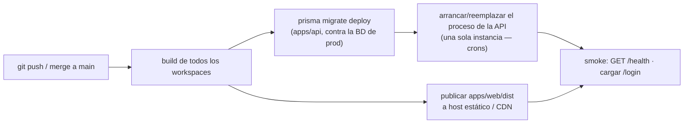
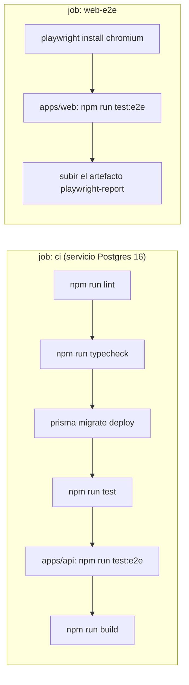

:::caution[Sin config de CD / hosting en el repo]
A la fecha de la Fase 1 el repositorio **no** contiene manifiestos de despliegue
— ni `Dockerfile`, ni `vercel.json` / `render.yaml` / `fly.toml` / `Procfile`,
ni un job de deploy en CI. `.github/workflows/ci.yml` corre **solo CI** (lint,
typecheck, test, build). Todo lo de abajo sobre *dónde* corren las cosas está
marcado como `TODO` y lo debe decidir el equipo.
:::

## Lo que el repo define

### Builds de producción

| Artefacto | Comando | Salida | Se ejecuta con |
| --- | --- | --- | --- |
| Tipos compartidos | `npm run build -w packages/types` (también en `postinstall`) | `packages/types/dist/` | — |
| API | `npm run build -w apps/api` → `nest build` | `apps/api/dist/` | `node apps/api/dist/main` (o `npm run start:prod` en `apps/api`) |
| Web | `npm run build -w apps/web` → `tsc -b && vite build` | `apps/web/dist/` (estático) | cualquier host estático / CDN |

`npm run build` en la raíz construye los tres.

### Requisitos de runtime (API)

- Node.js 24.
- Env: `DATABASE_URL`, `JWT_SECRET` (**fuerte, no el de ejemplo**), `WEB_URL`
  (el origen real del frontend — impulsa CORS, la redirección de OAuth, los
  enlaces de correo). Opcionales: `JWT_EXPIRES_IN`, `PORT`, `SLOT_GRID_MINUTES`,
  `RESEND_API_KEY`, `CLOUDINARY_URL`, `GOOGLE_CLIENT_ID` /
  `GOOGLE_CLIENT_SECRET` / `GOOGLE_CALLBACK_URL`. Ver
  [Variables de entorno](/getting-started/environment/).
- Un PostgreSQL alcanzable. Las tareas cron en proceso (`RemindersScheduler`,
  `ExpirationScheduler`) corren donde corra el proceso de la API — **ejecuta
  exactamente una instancia**, o duplicarán trabajo (no hay lock distribuido).

### Requisitos de runtime (web)

- Solo archivos estáticos. Establece `VITE_API_URL` en **tiempo de build** al
  origen de la API (Vite lo inyecta). Fallback de SPA: toda ruta desconocida
  debe servir `index.html` (enrutamiento del lado del cliente, incl. `/:slug`).

### Migraciones de base de datos

```bash
cd apps/api
npx prisma migrate deploy        # aplica las migraciones pendientes, sin prompts
```

Ejecútalo como paso de release **antes** de que la nueva versión de la API sirva
tráfico. Las migraciones son solo hacia adelante; para revertir, despliega el
código anterior + una nueva migración compensatoria.



## CI (lo que realmente corre hoy)

`.github/workflows/ci.yml`, en push y PR a `main`:



Runners: `ubuntu-latest`, Node desde `.nvmrc`, `npm ci`. Env de CI:
`DATABASE_URL` (contenedor de servicio en `:5432`), `JWT_SECRET: ci-test-secret`,
`JWT_EXPIRES_IN`, `SLOT_GRID_MINUTES`, `PORT`. Sin credenciales de terceros.

## Desplegar este sitio de documentación

Se incluye un workflow: **`.github/workflows/docs.yml`** construye `docs/` con
Astro y publica en **GitHub Pages** en los push a `main` que tocan `docs/**`.

- Activa Pages → «GitHub Actions» en los ajustes del repo.
- Pon la URL real en `docs/astro.config.mjs` (`site`, y `base: '/Agendya/'` para
  un sitio de proyecto) — actualmente `https://emberalab.github.io` con un
  `TODO`.
- Local: `cd docs && npm run build && npm run preview`.

## TODO — decisiones que el equipo aún debe tomar

- Host de la API (plataforma de contenedores vs. PaaS) y cómo se respeta la
  restricción de una sola instancia por los crons.
- Proveedor de PostgreSQL gestionado + política de backups.
- Host estático / CDN de la web y el `VITE_API_URL` de tiempo de build por
  entorno.
- Almacenamiento de secretos para `JWT_SECRET`, `RESEND_API_KEY`,
  `CLOUDINARY_URL`, Google OAuth.
- Google OAuth: registrar el `GOOGLE_CALLBACK_URL` de producción.
- Un entorno de staging y un flujo de promover-a-prod.
