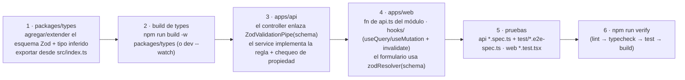

## Convenciones

### Formateo

| Área | Herramienta | Config |
| --- | --- | --- |
| `apps/web`, `packages/types` | Prettier (raíz) | `.prettierrc` — `singleQuote`, `trailingComma: all` |
| `apps/api` | Prettier (propio) | `apps/api/.prettierrc` + su propio script `format`; **excluido** de la pasada de Prettier de la raíz (`.prettierignore`) |
| Markdown (incl. docs de planificación) | — | Excluido de Prettier por completo |

`npm run format` / `npm run format:check` en la raíz.

### Linting

- `apps/api` → **ESLint** (`npm run lint` = `eslint --fix`).
- `apps/web` → **oxlint**.
- `npm run lint` en la raíz se reparte a ambos.

### Pruebas

- `apps/api` → **Jest**: `*.spec.ts` junto al código; e2e en
  `apps/api/test/*.e2e-spec.ts`.
- `apps/web` → **Vitest** (`*.test.tsx`) + **Playwright** (`apps/web/tests/`).

### Idioma

Las cadenas de cara al usuario (mensajes de error de la API, textos de UI,
correos) están en **español (es-CO)**. El código, los comentarios, los
identificadores y esta documentación están en inglés (la documentación también
en español).

### Principios de diseño en el código

- **Por capas / responsabilidad única** — controller (HTTP) → service (reglas) →
  Prisma (datos) → helpers puros (`booking-policy.ts`, `common/utils/*`). Los
  helpers puros no tienen dependencias de framework/BD, así que se testean
  directamente.
- **Contrato primero / DRY** — un esquema Zod por payload en `@agendya/types`,
  usado para los tipos en compilación en ambos lados y la validación en runtime
  en la API.
- **No repetir el cableado de seguridad** — `configureApp()` lo comparten
  `main.ts` y la suite e2e para que las pruebas corran exactamente lo que corre
  producción.
- **Fallar de forma segura en las integraciones** — la ausencia de
  Resend/Cloudinary/Google se degrada con elegancia en lugar de romper.
- **El servidor es la autoridad** — la validación del cliente es UX; la API
  revalida y revuelve a comprobar propiedad, política y disponibilidad.
- **Historial inmutable** — las reservas fijan como snapshot el nombre/duración
  del servicio; los servicios se borran lógicamente.

## Flujo de Git

- Ramifica desde `main`. Los nombres de rama en este repo siguen
  `AG-<ticket>-<slug>` (estilo Linear).
- CI corre en los PR a `main` (lint → typecheck → migrate → unit → api e2e →
  build, más el job de Playwright). Mantenlo en verde: corre `npm run verify`
  antes de commitear para atrapar los mismos fallos localmente.
- Mensajes de commit: terminan con
  `Co-Authored-By: Claude Sonnet 5 <noreply@anthropic.com>` cuando se generan
  con Claude Code; las descripciones de PR terminan con el pie de Claude Code.

---

## Receta: agregar una funcionalidad que cambia la forma de un payload



Revisa `MVP-v1.md` primero — si la funcionalidad pertenece a `Fase-2/3/4-*.md`,
está fuera de alcance para la Fase 1.

## Receta: agregar un endpoint de API

1. Elige/extiende el módulo bajo `apps/api/src/modules/<funcionalidad>/`.
2. **Controller** — agrega el handler: verbo HTTP + ruta,
   `@UseGuards(JwtAuthGuard)` si es autenticado, `@Throttle({...})` si necesita
   un límite más ajustado, `@Body(new ZodValidationPipe(schema))` /
   `@Query(...)`, `@CurrentUser()` para el profesional, `@Param('id')` para los
   ids. Delega de inmediato al service.
3. **Service** — implementa. Carga-y-comprueba la propiedad
   (`findFirst({ id, professionalId })` → `NotFoundException`). Aplica la
   política. Usa `$transaction` (`Serializable` para las escrituras de espacio)
   donde las carreras importen. Mapea los errores de Prisma (`P2002` →
   `ConflictException`).
4. **Mapeador de DTO** — devuelve una forma tipada de `@agendya/types`, no la
   fila cruda de Prisma (patrones `toDto` / `toProfile` / `toAgendaBooking`).
5. **Web** — agrega el envoltorio de `api.ts` + un hook; invalida la clave de
   query correcta al tener éxito la mutación.
6. **Pruebas** — spec unitario para la regla del service; spec e2e para el
   contrato HTTP (camino feliz, validación `400`, auth `401`, propiedad `404`,
   el caso de conflicto). Agrégalo a la tabla de la
   [Referencia de endpoints](/api/reference/).

## Receta: agregar un modelo / campo de base de datos

```bash
cd apps/api
# edita prisma/schema.prisma
npx prisma migrate dev --name add_<cosa>     # crea el SQL, aplica, regenera el cliente
```

- Commitea la nueva carpeta `prisma/migrations/<timestamp>_add_<cosa>/`.
- Agrega `@@index(...)` para cualquier patrón de consulta nuevo (compuesto,
  columna más selectiva primero; Postgres **no** indexa las columnas FK
  automáticamente).
- Si es parte de un payload de API, actualiza `@agendya/types` y ambos
  consumidores.
- Actualiza [Modelo E-R](/database/er-model/), [Modelos de Prisma](/database/models/),
  [Índices](/database/indexes/).
- Ejecuta `npm run test:e2e` en `apps/api` (BD real) y `npm run typecheck`.

## Receta: agregar pruebas

| Capa | Ubicación | Notas |
| --- | --- | --- |
| Unitario API | `apps/api/src/**/<nombre>.spec.ts` | Prefiere testear helpers puros directamente |
| E2E API | `apps/api/test/<área>.e2e-spec.ts` | Importa `configureApp`; Postgres real; pon `DISABLE_SCHEDULED_JOBS=true` |
| Unitario web | `apps/web/src/**/<Nombre>.test.tsx` | Testing Library + MSW; no stubees `apiClient` |
| E2E web | `apps/web/tests/e2e/<área>/<nombre>.spec.ts` | Extiende los fixtures en `tests/fixtures/`; la API está stubeada |

## Receta: agregar una página de documentación

1. Crea `docs/src/content/docs/<sección>/<página>.md` (versión en español) y
   `docs/src/content/docs/en/<sección>/<página>.md` (versión en inglés), ambas
   con frontmatter (`title`, `description`).
2. Agrégala a la `sidebar` en `docs/astro.config.mjs` (por `slug`), con la
   etiqueta en español y su `translations: { en: '...' }`.
3. Usa vallas de Mermaid (```` ```mermaid ````) para los diagramas, tablas antes
   que prosa, y avisos de Starlight (`:::note`, `:::caution`, `:::tip`,
   `:::danger`).
4. `cd docs && npm run dev` para previsualizar; `npm run build` debe pasar
   (valida cada enlace interno y slug de la barra lateral).
5. Deriva el contenido del código. Si algo es genuinamente poco claro, escribe
   un aviso `TODO` en lugar de suponerlo.

## Ojo: `serviceFormSchema` refleja `createServiceSchema`

`ServiceFormPage.tsx` mantiene un esquema Zod **local** que duplica las reglas
del `createServiceSchema` de `@agendya/types` (mensajes localizados, valores por
defecto no nullables). Si cambias las reglas compartidas del servicio, cambia
también el esquema local a la página. Ver
[Formularios y validación](/frontend/forms-and-validation/).
