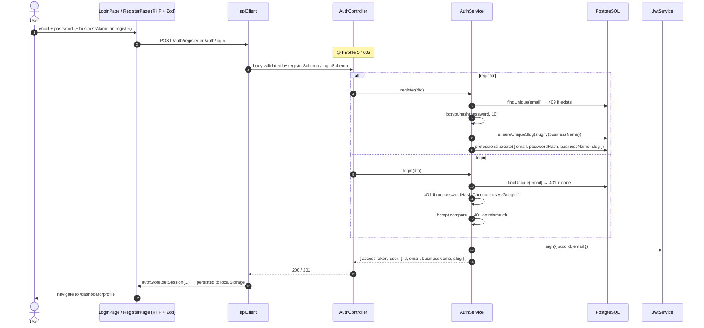
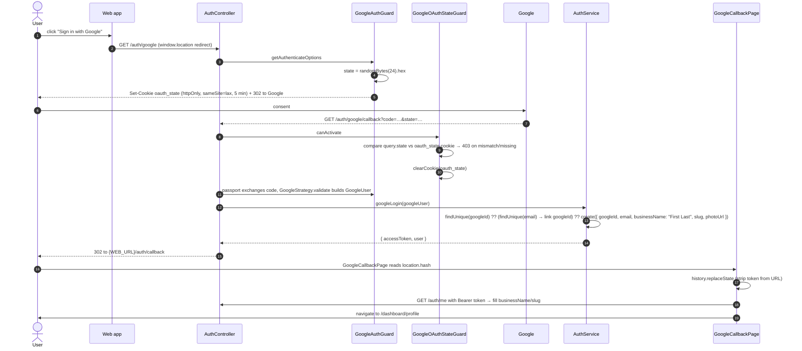
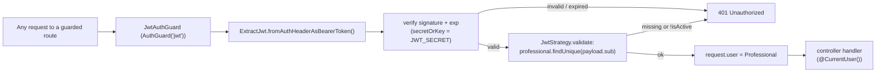

Two ways in, one output: a signed **JWT** (`{ sub, email }`, `expiresIn`
default `7d`) that the web app stores in `localStorage` (`agendya-auth`) and
sends as `Authorization: Bearer <token>` on every authenticated request.

The API is **stateless** — no session store, no auth cookie. The only cookie in
the system is the short-lived OAuth `state` cookie described below.

## Email + password

## Google OAuth 2.0

Why the token comes back in the URL **fragment** (`#token=`), not a query
string: fragments are never sent to any server, never written to server/proxy
logs, and never included in a `Referer` header. `GoogleCallbackPage` reads it
once and immediately `replaceState`s it out of history.

:::note[Login-CSRF protection]
Without the `state` check, an attacker could start their own OAuth flow and
trick a victim into completing it, landing the victim's browser in a session
tied to the attacker's Google account. `GoogleAuthGuard` mints the `state` and
`GoogleOAuthStateGuard` enforces it on the callback.
:::

:::caution[Conditional strategy]
`GoogleStrategy` is only registered when both `GOOGLE_CLIENT_ID` and
`GOOGLE_CLIENT_SECRET` are set (`passport-oauth2` throws at construction
otherwise, which would break bootstrap and every e2e run in CI). With no
credentials, `/auth/google*` routes are simply unavailable.
:::

## Using the token

On the client, `apiClient` attaches the bearer header from `authStore`; any
`401` response triggers `authStore.logout()`, and the route guards
(`PrivateRoute` / `PublicRoute`) redirect based on token presence.

Full endpoint list on the [Authentication feature page](/en/features/authentication/).
