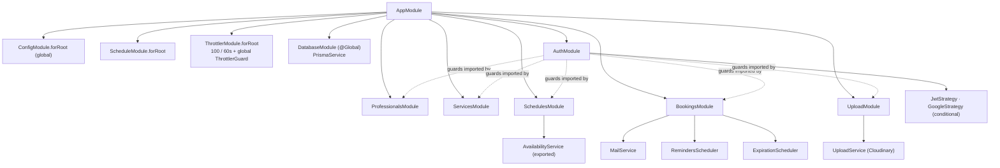

**Stack:** NestJS 11 · Prisma 7 + `@prisma/adapter-pg` · PostgreSQL · Zod 4 ·
`@nestjs/jwt` + `passport-jwt` · `passport-google-oauth20` ·
`@nestjs/schedule` · `@nestjs/throttler` · `helmet` · `resend` · `cloudinary` ·
`bcrypt` · `date-fns` / `date-fns-tz`.

## Module graph

`DatabaseModule` is `@Global()`, so every module injects `PrismaService`
without importing it. `AuthModule` exposes `JwtAuthGuard` (via `AuthGuard('jwt')`),
which the other feature controllers apply with `@UseGuards(JwtAuthGuard)`.

## Layering

| Layer | Responsibility | Must not |
| --- | --- | --- |
| **Controller** | Route mapping, `@UseGuards`, `@Throttle`, bind `ZodValidationPipe(schema)`, extract `@CurrentUser()` / `@Param` / `@Query`, delegate | Contain business rules or touch Prisma |
| **Service** | Business rules, ownership checks, policy gates, transactions, calling `MailService` | Know about HTTP request/response objects |
| **PrismaService** | Typed DB access, `$transaction`, `$queryRaw` | — |
| **Pure helpers** | `booking-policy.ts`, `common/utils/*` — no DB/framework deps, directly unit-tested | Import Nest or Prisma |

`bootstrap.ts` (`configureApp`) holds the security wiring (helmet + CORS) and
is called by **both** `main.ts` and the e2e suite, so tests exercise exactly
what production runs.

## Feature modules

| Module | Controllers | Service highlights |
| --- | --- | --- |
| `auth` | `AuthController` (`/auth`) | `register` / `login` (bcrypt, `SALT_ROUNDS=10`), `googleLogin` (link-by-googleId → link-by-email → create), `buildAuthResponse` signs the JWT |
| `professionals` | `ProfessionalsController` (`/professionals`, JWT), `ProfessionalsPublicController` (`/public/professionals/:slug`) | `getProfile` (+ `bookingsThisMonth` count), `updateProfile` (partial, slug-uniqueness), `isSlugAvailable`, `findPublicBySlug` (active services only) |
| `services` | `ServicesController` (`/services`, JWT) | CRUD + `duplicate`; `assertWithinPlanLimit` (`PLAN_SERVICE_LIMITS`); `softDelete` sets `deletedAt` + `isActive=false`; every mutation re-checks `findOwnedOrThrow` |
| `schedules` | `SchedulesController` (`/schedules`, JWT), `AvailabilityController` (`/public/professionals/:slug/availability`) | `setWorkingHours` = delete-all + `createMany` in one `$transaction`; `createException` maps Prisma `P2002` → `409`; `AvailabilityService.getAvailableSlots` is the grid algorithm |
| `bookings` | `BookingsController` (`/bookings`, JWT), `BookingsCreateController` (`/public/professionals/:slug/bookings`), `BookingsTokenController` (`/public/bookings/:token`) | `createPublicBooking`, `updatePublicBooking`, `reschedule*`, `cancel*`, `listAgenda`, `completeByProfessional`; `assertModifiable` is the single mutation gate; `commitBookingSlot` / `commitReschedule` run `Serializable` + retry |
| `upload` | `UploadController` (`/upload/image`, JWT) | MIME allow-list (no SVG), per-variant size caps, streams to Cloudinary (`agendya-logos` / `agendya-covers`) |

## Shared infrastructure

- **`ZodValidationPipe`** — `schema.safeParse(value)`; on failure throws
  `BadRequestException({ message: 'Validation failed', errors: flatten() })`.
- **`CurrentUser` decorator** — returns `request.user` (the full
  `Professional`, set by `JwtStrategy.validate`).
- **`MailService`** — one method per email type; `escapeHtml`s every
  interpolated value; no-ops to a log line when `RESEND_API_KEY` is unset.
- **`timezone.util.ts`** — `weekdayFromDateString`, `dateOnlyUtc`,
  `formatDateOnly`, `zonedInstant`, `zonedDateParts`.
- **`slug.util.ts`** — `slugify` (NFD-strip accents, `[^a-z0-9]+ → -`, 50-char
  cap) + `ensureUniqueSlug` (append `-2`, `-3`, …).
