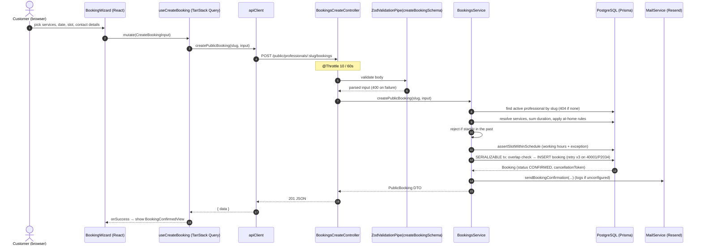
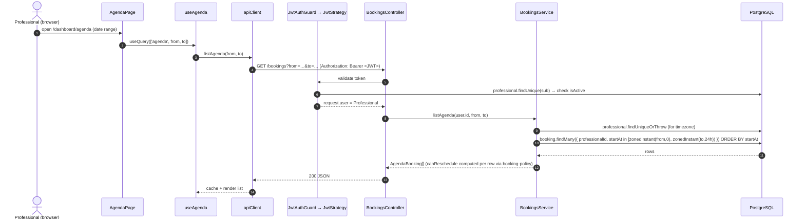

## Example 1 — a customer creates a booking



Key points:

- **Validation happens twice on purpose** — the wizard validates with the Zod
  schema for UX, the API re-validates the same schema for trust.
- **The slot guard is server-authoritative.** The availability list the wizard
  showed can be stale; `assertSlotWithinSchedule` + the serializable overlap
  check are what actually prevent a double-booking.
- **Email never blocks the response on failure** — `MailService.send` catches
  and logs.
- New bookings are created `CONFIRMED` (`@default(CONFIRMED)` on the model).
  `PENDING` exists in the enum but no current flow assigns it.

## Example 2 — a professional loads the agenda



- The `from`/`to` query params are calendar dates (`YYYY-MM-DD`); the service
  turns them into absolute instants **in the professional's timezone** before
  querying.
- `canReschedule` / `canCancel` on each row are derived by the pure
  `booking-policy.ts` predicates, so the UI can disable buttons without a
  round-trip — but the mutation endpoints re-check the same rules.

## The generic shape

```
User → React → hook → api.ts → apiClient(+JWT)
     → Controller (guard, ZodValidationPipe)
     → Service (ownership + policy + tx)
     → Prisma → PostgreSQL
     → DTO mapper → JSON → cache → render
```
