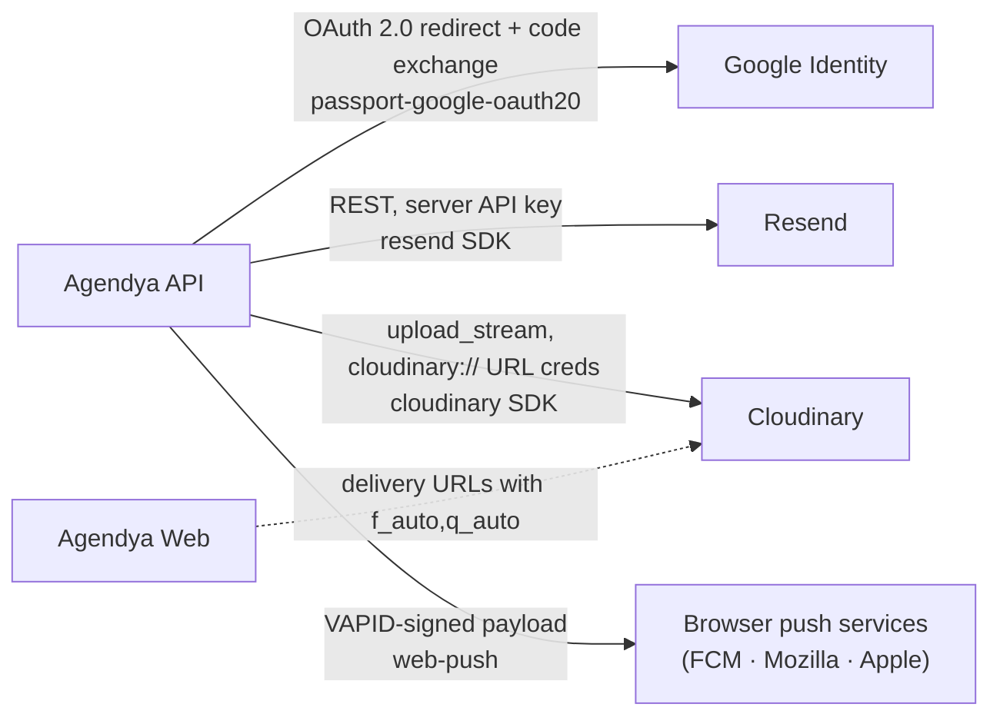

Agendya integrates with four external services. **All four are optional for
local development** — each has a defined degraded mode.

## Google Identity (OAuth 2.0)

| | |
| --- | --- |
| Library | `passport-google-oauth20` via `@nestjs/passport` |
| Config | `GOOGLE_CLIENT_ID`, `GOOGLE_CLIENT_SECRET`, `GOOGLE_CALLBACK_URL` |
| Scopes | `email`, `profile` |
| Code | `modules/auth/strategies/google.strategy.ts`, `guards/google-auth.guard.ts`, `guards/google-oauth-state.guard.ts` |
| Used for | "Sign in with Google" — creates or links a `Professional` by `googleId` / `email` |
| **Unconfigured** | `GoogleStrategy` provider resolves to `null`; `/auth/google*` routes unavailable. Email/password login unaffected. |

See the [Authentication flow](/en/architecture/authentication/) for the full
sequence including CSRF `state` handling.

## Resend (transactional email)

| | |
| --- | --- |
| Library | `resend` |
| Config | `RESEND_API_KEY` |
| From address | `Agendya <reservas@agendya.app>` (hard-coded in `MailService`) |
| Code | `infra/mail/mail.service.ts`, `infra/mail/html.util.ts` |
| Emails | confirmation · reminder (24h & 2h) · rescheduled (to customer) · rescheduled (to professional) · cancelled |
| **Unconfigured** | `this.resend` is `null`; `send()` logs `"[dev] Email a <to>: <subject>"` and returns. Send failures when configured are caught and logged, never thrown. |

Every user-supplied value interpolated into an email body is run through
`escapeHtml` first (the booking form is public and unauthenticated). Dates are
formatted with `Intl.DateTimeFormat('es-CO', { dateStyle: 'full', timeStyle:
'short', timeZone })` in the professional's timezone.

See [Notifications](/en/features/notifications/).

## Cloudinary (image uploads)

| | |
| --- | --- |
| Library | `cloudinary` (v2) |
| Config | `CLOUDINARY_URL` (`cloudinary://<api_key>:<api_secret>@<cloud_name>`) |
| Code | `infra/upload/upload.service.ts`, `infra/upload/upload.controller.ts` |
| Folders / transforms | `agendya-logos` → `limit 400×400` · `agendya-covers` → `limit 1600×600` |
| Accepted input | `image/png`, `image/jpeg`, `image/webp`, `image/gif` only (**no SVG** — can carry script) |
| Size caps | logo 6 MB, cover 12 MB, hard multer limit 15 MB |
| **Unconfigured** | `ensureConfigured()` throws `ServiceUnavailableException` → `503` from `POST /upload/image`. The rest of the profile still saves. |

The web app **downscales images in the browser** (`professionals/image.ts`,
`createImageBitmap` + canvas) before upload, so the server caps are abuse
guards, not the primary resize. Delivered URLs are rewritten client-side with
`f_auto,q_auto[,c_limit,w_<n>]` by `shared/image/cloudinary.ts`.

## Web Push (PWA alerts)

| | |
| --- | --- |
| Library | `web-push` |
| Config | `VAPID_PUBLIC_KEY`, `VAPID_PRIVATE_KEY`, `VAPID_SUBJECT` |
| Code | `modules/notifications/push-subscriptions.service.ts`; service worker in `apps/web/src/sw.ts` |
| Used for | An OS-level alert to the professional when a booking lands, even with the PWA closed — one more delivery channel for the `Notification` row |
| Target endpoint | The browser hands out a per-device `endpoint` (FCM for Chrome, Mozilla for Firefox, Apple for Safari); there is no provider account to configure, just the VAPID keypair |
| **Unconfigured** | With any of the three keys missing, `sendToProfessional` is a no-op and `GET /notifications/push/public-key` returns `null`; the dashboard hides the toggle and the feed still delivers over SSE |

See [Notifications › Web Push](/en/features/notifications/#web-push) for the
`PushSubscription` model, the service worker, and the frontend flow.

## Summary

| Service | Env var | Missing → |
| --- | --- | --- |
| Google OAuth | `GOOGLE_CLIENT_ID` + `GOOGLE_CLIENT_SECRET` | Google login disabled; password login fine |
| Resend | `RESEND_API_KEY` | Emails logged, not sent |
| Cloudinary | `CLOUDINARY_URL` | `POST /upload/image` → 503 |
| Web Push | `VAPID_PUBLIC_KEY` + `VAPID_PRIVATE_KEY` + `VAPID_SUBJECT` | Push disabled; feed still delivers over SSE |
