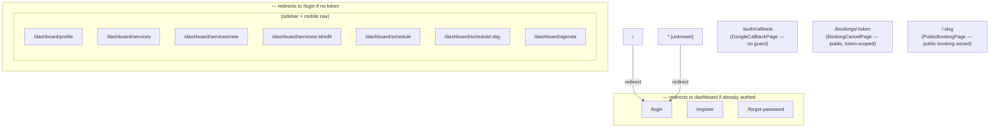

**Stack:** React 19 · Vite 8 · TypeScript · React Router 7 · TanStack Query 5 ·
Zustand 5 · React Hook Form 7 + `@hookform/resolvers` (Zod) · Tailwind CSS v4 ·
Moon Design System (`@moondesignsystem/react` + `/ui`) · Vitest + Testing
Library + MSW · Playwright · oxlint.

## Entry

```
index.html  ── pre-paint theme script, font <link>s, #root
  └─ src/main.tsx
       └─ <StrictMode>
            └─ <QueryClientProvider client={new QueryClient()}>
                 └─ <App/> → <AppRouter/>
```

`main.tsx` also side-effect-imports `shared/theme/themeStore` so the persisted
/ system theme is applied to `<html>` on boot.

## Feature-module pattern

Everything lives under `src/modules/<feature>/` and follows the same shape:

```
modules/services/
├── api.ts                 thin wrappers over apiClient — one function per endpoint
├── hooks/
│   ├── useServices.ts     useQuery({ queryKey: ['services'], queryFn: listServices })
│   ├── useCreateService.ts   useMutation + queryClient.invalidateQueries
│   └── …
├── ServicesPage.tsx       route component
├── ServiceFormPage.tsx    route component (create + edit)
├── components/            feature-local components
├── format.ts              feature-local pure helpers
└── ServicesPage.test.tsx  Vitest + Testing Library + MSW
```

Modules: `auth`, `dashboard`, `professionals`, `services`, `schedules`,
`bookings` (professional agenda), `publicBooking` (customer-facing wizard).

`src/shared/` holds cross-module code: `api/apiClient.ts`, `api/getApiErrorMessage.ts`,
`theme/` (store + toggle), `a11y/useFocusTrap.ts`, `components/` (Button, Input,
Card, Badge atoms), `image/cloudinary.ts`.

## Routing tree



Only `LoginPage` is in the initial bundle. Every other route is
`React.lazy()` + `<Suspense>` — see
[vite.config manualChunks](/en/performance/#code-splitting). `/:slug` is the
last-declared route so it can't shadow `/login`, `/dashboard/*`, etc.

## Client state

| State | Tool | Persisted? | Notes |
| --- | --- | --- | --- |
| Auth (`accessToken`, `user`) | Zustand + `persist` | `localStorage` key `agendya-auth` | Read synchronously by `apiClient` and the route guards |
| Theme (`manualTheme`) | Zustand + `persist` (`partialize`) | `localStorage` key `agendya-theme` | Only the explicit override is stored; effective `theme` is always derived as `manualTheme ?? OS preference` |
| Public-booking customer details | Zustand (`customerStore`) | — | Pre-fills the wizard's contact step |
| Server data (profile, services, hours, agenda, availability, bookings) | TanStack Query | in-memory cache | Invalidated by the matching `useMutation` `onSuccess` |
| Form state | React Hook Form | — | `zodResolver` against a `@agendya/types` schema (or a page-local mirror) |

## Data-fetch pipeline

```
Component
  → useQuery / useMutation (module hook)
    → api.ts function
      → apiClient.get/post/patch/put/delete
        → fetch(buildUrl(path, params), { headers: Authorization: Bearer <token> })
        → non-2xx → throw ApiError(status, parsedBody); 401 → authStore.logout()
      ← { data }
  ← typed result → render / cache
```

`getApiErrorMessage(error, fallback)` normalises `ApiError.data.message`
(string or string[]) into a user-facing string for form-level error banners.

## Styling

- Tailwind v4 via `@tailwindcss/vite`, imported in `src/styles/tailwind.css`
  alongside Moon's `moon-core.css` / `moon-components.css` (kept in one file —
  Tailwind only compiles `@theme` blocks where it also sees `@import
  'tailwindcss'`).
- `@custom-variant dark` is wired to `[data-theme="dark"]` on `<html>` (set by
  the theme store), **not** `prefers-color-scheme`, so `dark:` classes follow
  the in-app toggle.
- `main.scss` holds CSS custom properties (colour tokens, status-badge colours)
  that adapt per theme.
- Fonts (Outfit / Plus Jakarta Sans / Inter) are loaded with `<link>` tags in
  `index.html`, not a CSS `@import`, for FCP.
