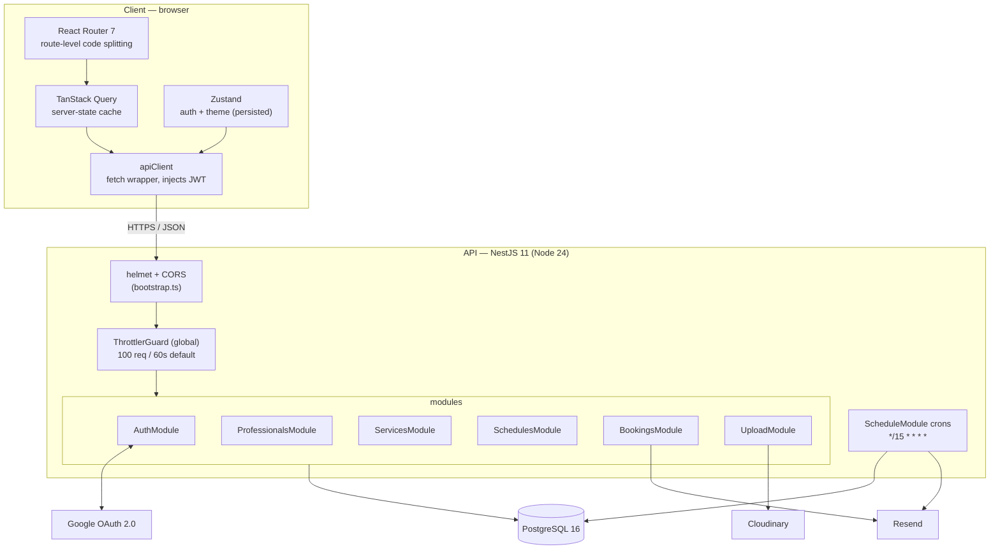
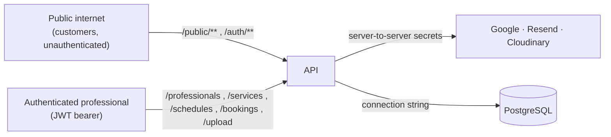

## Processes

| Process | Runtime | Responsibilities |
| --- | --- | --- |
| **Web** | Static bundle served to the browser (Vite build) | UI, routing, client state, form validation, calling the API |
| **API** | One Node.js process | HTTP routing, auth, validation, business rules, DB access, email, uploads, **and** the in-process cron jobs |

The cron schedulers (`RemindersScheduler`, `ExpirationScheduler`) run **inside
the API process** via `@nestjs/schedule` `ScheduleModule.forRoot()` — there is
no separate worker. Every `@Cron` job is `*/15 * * * *` (every 15 minutes) and
guards on `DISABLE_SCHEDULED_JOBS`.

## Trust boundaries

- **Unauthenticated** surface: `GET /`, `GET /health`, `POST /auth/register`,
  `POST /auth/login`, the Google OAuth routes, and everything under
  `/public/**` (professional-by-slug, availability, create booking, and the
  token-scoped booking read/update/cancel/reschedule).
- **Authenticated** surface: guarded by `JwtAuthGuard` — `/auth/me`,
  `/professionals/**` (except the public sub-controller), `/services/**`,
  `/schedules/**`, `/bookings` (agenda + professional actions), `/upload/**`.
- Ownership is always re-checked in the service layer with
  `where: { id, professionalId }` — a valid JWT for professional A cannot touch
  professional B's rows.

## Cross-cutting concerns

| Concern | Where |
| --- | --- |
| Security headers | `helmet()` in `bootstrap.ts` (full CSP — JSON API, no HTML) |
| CORS | Custom origin function in `bootstrap.ts` + `common/utils/cors.util.ts` (configured `WEB_URL` + `PUBLIC_WEB_URL` + any localhost/private-network origin) |
| Rate limiting | `@nestjs/throttler` global guard; per-route overrides via `@Throttle` |
| Input validation | `ZodValidationPipe` with `@agendya/types` schemas, per route |
| Auth | `passport-jwt` (`JwtStrategy` re-loads the professional and checks `isActive`) |
| Config | `@nestjs/config` global, `config/configuration.ts` |
| Timezones | `common/utils/timezone.util.ts` (`date-fns-tz`) |
| Errors | Nest built-in `HttpException` subclasses → JSON `{ statusCode, message, error }` |

See [Backend architecture](/en/architecture/backend/) for the module internals and
[API architecture](/en/api/conventions/) for route conventions.
