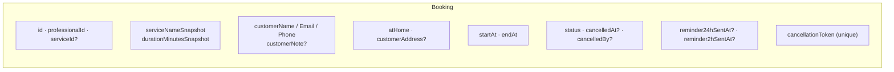
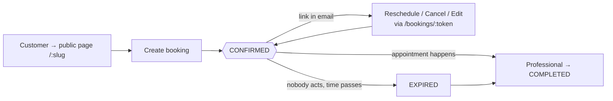

## The record

A `Booking` is created the moment a customer completes the public wizard. It
**snapshots** the service name and duration so later edits to the `Service`
don't rewrite what was agreed, and it carries a unique `cancellationToken`
that powers every customer-side action without an account.



## Status state machine

`BookingStatus` = `PENDING | CONFIRMED | CANCELLED | COMPLETED | NO_SHOW |
EXPIRED`. **Phase 1 uses four of the six.**

```mermaid
stateDiagram-v2
  [*] --> CONFIRMED: createPublicBooking()<br/>(@default(CONFIRMED))

  CONFIRMED --> CONFIRMED: reschedule / edit<br/>(new startAt, endAt)
  CONFIRMED --> CANCELLED: cancel by customer (token)<br/>or professional (agenda)<br/>— within policy window
  CONFIRMED --> COMPLETED: professional marks complete
  CONFIRMED --> EXPIRED: startAt passed, untouched<br/>(ExpirationScheduler sweep, or<br/>lazily in assertModifiable)

  EXPIRED --> COMPLETED: professional marks complete<br/>(forgot to close it during the appt)

  CANCELLED --> [*]
  COMPLETED --> [*]
  EXPIRED --> [*]: terminal unless completed

  note right of PENDING
    In the enum, never assigned
    by any Phase 1 code path.
  end note
  note right of NO_SHOW
    In the enum, never assigned
    by any Phase 1 code path.
  end note
```

### Transitions the code actually performs

| From | To | Trigger | Guard |
| --- | --- | --- | --- |
| *(none)* | `CONFIRMED` | `createPublicBooking` | slot fits working hours, no exception, no overlap (serializable) |
| `CONFIRMED` | `CONFIRMED` | `reschedule*` / `updatePublicBooking` | `assertModifiable`: still confirmed, not past, outside `cancellationPolicyHours`; new slot free |
| `CONFIRMED` | `CANCELLED` | `cancelPublicBooking` (token) / `cancelByProfessional` (agenda) | `assertModifiable`; sets `cancelledAt`, `cancelledBy` |
| `CONFIRMED` / `EXPIRED` | `COMPLETED` | `completeByProfessional` | status must be `CONFIRMED` or `EXPIRED` |
| `CONFIRMED` | `EXPIRED` | `ExpirationScheduler` (`*/15 * * * *`) `updateMany({ status: CONFIRMED, startAt < now })`; **or** lazily inside `assertModifiable` when a stale confirmed row is touched | — |

### Rejected transitions (`assertModifiable`)

| Current status | Attempt to cancel/modify → |
| --- | --- |
| `CANCELLED` | `409 "Esta reserva ya fue cancelada."` |
| `COMPLETED` | `409 "Esta reserva ya fue completada."` |
| `NO_SHOW` | `409 "Esta reserva fue marcada como no asistida."` |
| `EXPIRED` or `startAt` in the past | `403 "Esta reserva ya venció…"` (and self-heals `CONFIRMED → EXPIRED`) |
| `CONFIRMED` but inside the policy window | `403 "Solo puedes {cancelar\|modificar} con al menos N horas de anticipación."` |

## The customer's journey



Only these states and transitions exist in the code — there is no waitlist, no
deposit hold, no `PENDING` approval step, and `NO_SHOW` is not yet wired to any
action.
