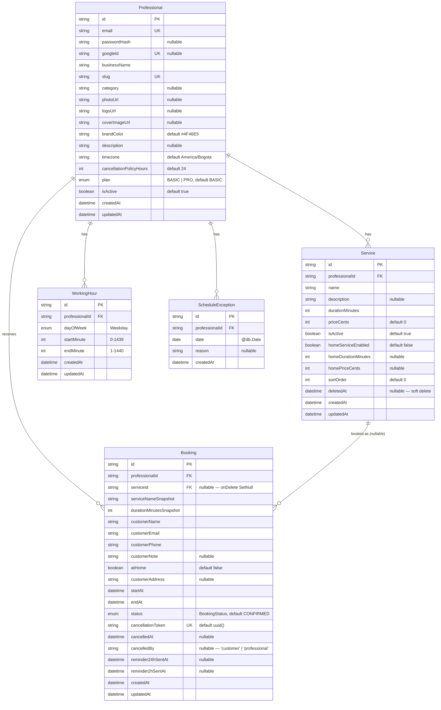

Source: `apps/api/prisma/schema.prisma`. Provider PostgreSQL, all primary keys
`String @id @default(uuid())`.

## Relationships & cascade rules

| From | To | Cardinality | `onDelete` |
| --- | --- | --- | --- |
| `Service.professional` | `Professional` | many-to-one | `Cascade` — delete a professional, delete their services |
| `WorkingHour.professional` | `Professional` | many-to-one | `Cascade` |
| `ScheduleException.professional` | `Professional` | many-to-one | `Cascade` |
| `Booking.professional` | `Professional` | many-to-one | `Cascade` |
| `Booking.service` | `Service` | many-to-one, **optional** | `SetNull` — deleting a service keeps its bookings; `serviceId` becomes `null`, and `serviceNameSnapshot` / `durationMinutesSnapshot` preserve what was booked |

## Enums

| Enum | Values |
| --- | --- |
| `Weekday` | `SUNDAY`, `MONDAY`, `TUESDAY`, `WEDNESDAY`, `THURSDAY`, `FRIDAY`, `SATURDAY` |
| `BookingStatus` | `PENDING`, `CONFIRMED`, `CANCELLED`, `COMPLETED`, `NO_SHOW`, `EXPIRED` |
| `Plan` | `BASIC`, `PRO` |

## Design notes

- **No `Customer` table.** Customer identity is three fields
  (`customerName` / `customerEmail` / `customerPhone`) captured per booking.
  A `Customer` entity is explicitly deferred past Phase 1.
- **Snapshots on `Booking`.** `serviceNameSnapshot` and
  `durationMinutesSnapshot` freeze what the customer booked, so later edits to
  (or deletion of) the `Service` don't rewrite history.
- **Soft delete on `Service`** via `deletedAt`; queries filter `deletedAt:
  null`. Hard delete is never issued from application code.
- **Money** is integer minor units (`priceCents`, `homePriceCents`) — no
  floats. Range `0 … 100_000_000`.
- **Time of day** is "minutes from midnight" integers on `WorkingHour`
  (`0–1439` start, `1–1440` end).

See [Prisma models](/en/database/models/) for field-level detail and
[Indexes & constraints](/en/database/indexes/) for the index strategy.
