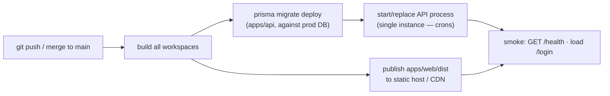
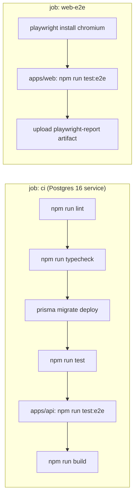

:::note[Where each piece runs]
- **API:** Railway (`agendya-api`), environments `dev` (branch `dev` →
  `https://agendya-dev.up.railway.app`) and `production` (branch `main` →
  `https://api.agendya.co`). The start command runs `prisma migrate deploy`
  then `npm run start:prod`.
- **Web:** GoDaddy/cPanel. `.github/workflows/deploy-web.yml` builds
  `apps/web` with `VITE_API_URL` and uploads `dist/` over FTPS: branch `dev`
  → `https://app-dev.agendya.co`, branch `main` → `https://app.agendya.co`.
- **CI:** `.github/workflows/ci.yml` (lint, typecheck, test, build) on push
  and PR to `dev` and `main`. It does not deploy.
:::

## What the repo defines

### Production builds

| Artifact | Command | Output | Run with |
| --- | --- | --- | --- |
| Shared types | `npm run build -w packages/types` (also on `postinstall`) | `packages/types/dist/` | — |
| API | `npm run build -w apps/api` → `nest build` | `apps/api/dist/` | `node apps/api/dist/main` (or `npm run start:prod` in `apps/api`) |
| Web | `npm run build -w apps/web` → `tsc -b && vite build` | `apps/web/dist/` (static) | any static host / CDN |

`npm run build` at the root builds all three.

### Runtime requirements (API)

- Node.js 24.
- Env: `DATABASE_URL`, `JWT_SECRET` (**strong, not the placeholder**),
  `WEB_URL` (the real frontend origin — drives CORS, OAuth redirect, email
  links). Optional: `JWT_EXPIRES_IN`, `PORT`, `SLOT_GRID_MINUTES`,
  `RESEND_API_KEY`, `CLOUDINARY_URL`, `GOOGLE_CLIENT_ID` /
  `GOOGLE_CLIENT_SECRET` / `GOOGLE_CALLBACK_URL`. See
  [Environment variables](/en/getting-started/environment/).
- A reachable PostgreSQL. The in-process cron jobs (`RemindersScheduler`,
  `ExpirationScheduler`) run wherever the API process runs — **run exactly one
  instance**, or they will duplicate work (there is no distributed lock).

### Runtime requirements (web)

- Static files only. Set `VITE_API_URL` at **build time** to the API origin
  (it's inlined by Vite). SPA fallback: every unknown path must serve
  `index.html` (client-side routing, incl. `/:slug`).

### Database migrations

```bash
cd apps/api
npx prisma migrate deploy        # apply pending migrations, no prompts
```

Run this as a release step **before** the new API version serves traffic.
Migrations are forward-only; roll back by deploying the previous code + a new
compensating migration.



## CI (what actually runs today)

`.github/workflows/ci.yml`, on push and PR to `dev` and `main`:



Runners: `ubuntu-latest`, Node from `.nvmrc`, `npm ci`. CI env:
`DATABASE_URL` (service container on `:5432`), `JWT_SECRET: ci-test-secret`,
`JWT_EXPIRES_IN`, `SLOT_GRID_MINUTES`, `PORT`. No third-party credentials.

## Deploying this documentation site

A workflow is included: **`.github/workflows/docs.yml`** builds `docs/` with
Astro and publishes to **GitHub Pages** on pushes to `main` that touch `docs/**`.

- Enable Pages → "GitHub Actions" in repo settings.
- Set the real URL in `docs/astro.config.mjs` (`site`, and `base: '/Agendya/'`
  for a project site) — currently `https://emberalab.github.io` with a `TODO`.
- Local: `cd docs && npm run build && npm run preview`.

## TODO — still open

- Backup policy for Railway Postgres.
- Apex `agendya.co` for public booking (`/{slug}`) in addition to
  `app.agendya.co` / `app-dev.agendya.co` (CORS currently allows a single
  `WEB_URL`).
- Exactly one API instance per environment (crons have no distributed lock).
