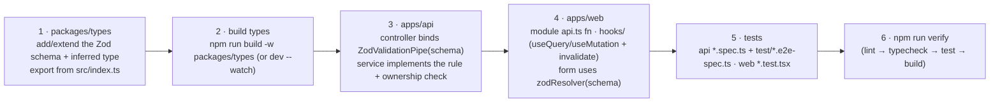

## Conventions

### Formatting

| Area | Tool | Config |
| --- | --- | --- |
| `apps/web`, `packages/types` | Prettier (root) | `.prettierrc` — `singleQuote`, `trailingComma: all` |
| `apps/api` | Prettier (own) | `apps/api/.prettierrc` + its own `format` script; **excluded** from the root Prettier run (`.prettierignore`) |
| Markdown (incl. planning docs) | — | Excluded from Prettier entirely |

`npm run format` / `npm run format:check` at the root.

### Linting

- `apps/api` → **ESLint** (`npm run lint` = `eslint --fix`).
- `apps/web` → **oxlint**.
- `npm run lint` at the root fans out to both.

### Tests

- `apps/api` → **Jest**: `*.spec.ts` colocated with source; e2e in
  `apps/api/test/*.e2e-spec.ts`.
- `apps/web` → **Vitest** (`*.test.tsx`) + **Playwright** (`apps/web/tests/`).

### Language

User-facing strings (API error messages, UI copy, emails) are **Spanish
(es-CO)**. Code, comments, identifiers, and this documentation are English.

### Design principles in the codebase

- **Layered / single-responsibility** — controller (HTTP) → service (rules) →
  Prisma (data) → pure helpers (`booking-policy.ts`, `common/utils/*`). Pure
  helpers hold no framework/DB deps so they're unit-tested directly.
- **Contract-first / DRY** — one Zod schema per payload in `@agendya/types`,
  used for compile-time types on both sides and runtime validation on the API.
- **Don't-repeat security wiring** — `configureApp()` is shared by `main.ts`
  and the e2e suite so tests run exactly what production runs.
- **Fail safe on integrations** — missing Resend/Cloudinary/Google degrade
  gracefully rather than crash.
- **Server is authoritative** — client validation is UX; the API re-validates
  and re-checks ownership, policy and availability.
- **Immutable history** — bookings snapshot service name/duration; services are
  soft-deleted.

## Git workflow

- Branch off `main`. Branch names in this repo follow
  `AG-<ticket>-<slug>` (Linear-style).
- CI runs on PRs to `main` (lint → typecheck → migrate → unit → api e2e →
  build, plus the Playwright job). Keep it green: run `npm run verify` before
  committing to catch the same failures locally.
- Commit messages: end with
  `Co-Authored-By: Claude Sonnet 5 <noreply@anthropic.com>` when generated with
  Claude Code; PR descriptions end with the Claude Code footer.

---

## Recipe: add a feature that changes a payload shape



Check `MVP-v1.md` first — if the feature belongs to `Fase-2/3/4-*.md`, it's out
of scope for Phase 1.

## Recipe: add an API endpoint

1. Pick/extend the module under `apps/api/src/modules/<feature>/`.
2. **Controller** — add the handler: HTTP verb + path, `@UseGuards(JwtAuthGuard)`
   if authenticated, `@Throttle({...})` if it needs a tighter limit,
   `@Body(new ZodValidationPipe(schema))` / `@Query(...)`, `@CurrentUser()` for
   the professional, `@Param('id')` for ids. Delegate immediately to the
   service.
3. **Service** — implement. Load-and-check ownership
   (`findFirst({ id, professionalId })` → `NotFoundException`). Enforce policy.
   Use `$transaction` (`Serializable` for slot writes) where races matter. Map
   Prisma errors (`P2002` → `ConflictException`).
4. **DTO mapper** — return a typed shape from `@agendya/types`, not the raw
   Prisma row (`toDto` / `toProfile` / `toAgendaBooking` patterns).
5. **Web** — add the `api.ts` wrapper + a hook; invalidate the right query key
   on mutation success.
6. **Tests** — unit spec for the service rule; e2e spec for the HTTP contract
   (happy path, validation `400`, auth `401`, ownership `404`, the conflict
   case). Add to the [API reference](/en/api/reference/) table.

## Recipe: add a database model / field

```bash
cd apps/api
# edit prisma/schema.prisma
npx prisma migrate dev --name add_<thing>     # creates SQL, applies, regenerates client
```

- Commit the new `prisma/migrations/<timestamp>_add_<thing>/` folder.
- Add `@@index(...)` for any new query pattern (composite, most-selective
  column first; Postgres does **not** auto-index FK columns).
- If it's part of an API payload, update `@agendya/types` and both consumers.
- Update [ER model](/en/database/er-model/), [Prisma models](/en/database/models/),
  [Indexes](/en/database/indexes/).
- Run `npm run test:e2e` in `apps/api` (real DB) and `npm run typecheck`.

## Recipe: add tests

| Layer | Location | Notes |
| --- | --- | --- |
| API unit | `apps/api/src/**/<name>.spec.ts` | Prefer testing pure helpers directly |
| API e2e | `apps/api/test/<area>.e2e-spec.ts` | Import `configureApp`; real Postgres; set `DISABLE_SCHEDULED_JOBS=true` |
| Web unit | `apps/web/src/**/<Name>.test.tsx` | Testing Library + MSW; don't stub `apiClient` |
| Web e2e | `apps/web/tests/e2e/<area>/<name>.spec.ts` | Extend fixtures in `tests/fixtures/`; API is stubbed |

## Recipe: add a documentation page

1. Create `docs/src/content/docs/<section>/<page>.md` with frontmatter
   (`title`, `description`).
2. Add it to the `sidebar` in `docs/astro.config.mjs` (by `slug`).
3. Use Mermaid fences (```` ```mermaid ````) for diagrams, tables over prose,
   and Starlight asides (`:::note`, `:::caution`, `:::tip`, `:::danger`).
4. `cd docs && npm run dev` to preview; `npm run build` must pass (it validates
   every internal link and sidebar slug).
5. Derive content from the code. If something is genuinely unclear, write a
   `TODO` aside rather than guessing.

## Gotcha: `serviceFormSchema` mirrors `createServiceSchema`

`ServiceFormPage.tsx` keeps a **local** Zod schema that duplicates the rules in
`@agendya/types`' `createServiceSchema` (localised messages, non-nullable form
defaults). If you change the shared service rules, change the page-local schema
too. See [Forms & validation](/en/frontend/forms-and-validation/).
