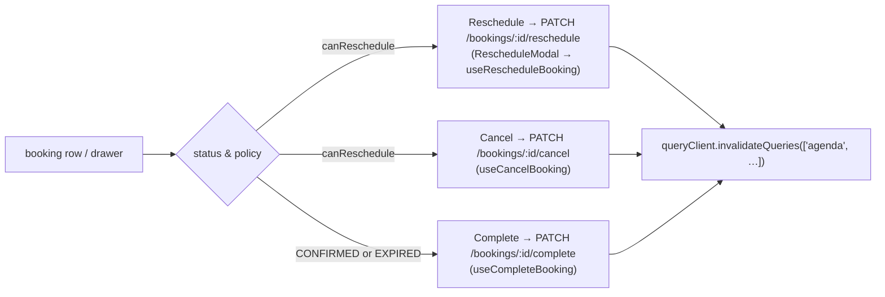

Route `/dashboard/agenda` (`AgendaPage.tsx`). Fetches a **date range** of
bookings and renders them as a list and a calendar grid
(`CalendarGridView.tsx`), with a detail drawer (`AppointmentDrawer.tsx`) and a
reschedule modal (`RescheduleModal.tsx`).

## Data

`GET /bookings?from=YYYY-MM-DD&to=YYYY-MM-DD` (JWT). `agendaQuerySchema`
validates both dates.

`BookingsService.listAgenda`:

1. Load the professional (for `timezone`).
2. `rangeStart = zonedInstant(from, 0, tz)`,
   `rangeEnd = zonedInstant(to, 1440, tz)`.
3. `booking.findMany({ professionalId, startAt: { gte: rangeStart, lt: rangeEnd } })`
   ordered by `startAt` — **all statuses**, not just confirmed.
4. Map each to an `AgendaBooking`.

```jsonc
// AgendaBooking
{
  "id": "uuid", "serviceId": "uuid", "serviceName": "…", "durationMinutes": 30,
  "customerName": "…", "customerEmail": "…", "customerPhone": "…",
  "customerNote": "… | null",            // note the customer left when booking
  "startAt": "…", "endAt": "…",
  "status": "CONFIRMED",
  "cancellationPolicyHours": 24,
  "canReschedule": true,                 // isModifiable(booking, professional)
  "createdAt": "…",
  "cancelledAt": null, "cancelledBy": null
}
```

## Status display

`modules/bookings/statusConfig.ts` maps each `BookingStatus` to a Spanish label
and theme-aware CSS custom properties (`statusBadge.tsx`):

| Status | Label |
| --- | --- |
| `PENDING` | Pendiente |
| `CONFIRMED` | Confirmada |
| `CANCELLED` | Cancelada |
| `COMPLETED` | Completada |
| `NO_SHOW` | No asistió |
| `EXPIRED` | Vencida |

## Actions



Each mutation hook (`useCancelBooking`, `useCompleteBooking`,
`useRescheduleBooking`) invalidates the agenda query on success so the list
re-renders with the new status. `ContextMenu.tsx` provides the right-click /
long-press action menu on the grid.

## Notifications triggered

| Agenda action | Emails sent |
| --- | --- |
| Cancel | `sendBookingCancelled` → customer |
| Reschedule | `sendBookingRescheduled` → customer |
| Complete | none |

(The customer-initiated edit/reschedule paths also notify the professional; the
professional-initiated reschedule from the agenda notifies only the customer.)
