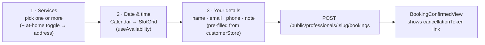
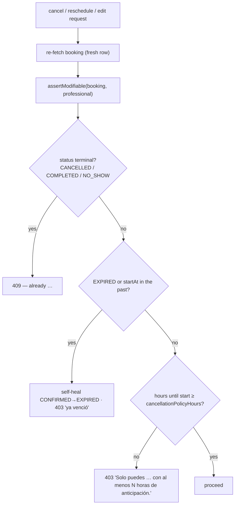

## Creating a booking (public wizard)

`BookingWizard.tsx` (`modules/publicBooking`) is a multi-step form. No account
is required.



Request body — `createBookingSchema`:

```jsonc
{
  "serviceIds": "uuid1,uuid2",          // comma-separated
  "startAt": "2026-09-10T14:00:00.000Z",// ISO datetime
  "customerName": "Ana Ruiz",
  "customerEmail": "ana@example.com",
  "customerPhone": "+57 300 1234567",   // /^[0-9+\-\s()]{7,20}$/
  "customerNote": "optional, ≤ 500",
  "atHome": false,
  "customerAddress": "required if atHome, 5–200 chars"
}
```

Server-side pipeline (`BookingsService.createPublicBooking`):

```mermaid
sequenceDiagram
  autonumber
  participant Ctl as BookingsCreateController
  participant Svc as BookingsService
  participant DB as PostgreSQL
  Ctl->>Svc: createPublicBooking(slug, input)
  Svc->>DB: professional by slug + isActive  (404)
  Svc->>Svc: resolveServiceSelection — load services, sum duration,<br/>at-home requires address + homeServiceEnabled
  Svc->>Svc: reject startAt in the past (400)
  Svc->>DB: assertSlotWithinSchedule — fits a WorkingHour block? no ScheduleException? (409)
  Svc->>DB: SERIALIZABLE tx — overlap findFirst → create; retry x3 on 40001/P2034
  DB-->>Svc: Booking (CONFIRMED, cancellationToken)
  Svc->>Svc: MailService.sendBookingConfirmation
  Svc-->>Ctl: PublicBooking DTO
```

## The `PublicBooking` DTO

Returned by every `/public/...` booking endpoint:

```jsonc
{
  "id": "uuid",
  "businessName": "…",
  "professionalSlug": "…",
  "serviceId": "uuid",              // primary service; "" if it was later deleted
  "serviceName": "Corte + Barba",   // snapshot
  "durationMinutes": 45,            // snapshot
  "customerName": "…", "customerEmail": "…", "customerPhone": "…",
  "customerNote": null,
  "atHome": false, "customerAddress": null,
  "startAt": "…", "endAt": "…",
  "status": "CONFIRMED",
  "cancellationToken": "uuid",
  "cancellationPolicyHours": 24,
  "canCancel": true,               // = canReschedule = isModifiable(booking, professional)
  "canReschedule": true
}
```

## Customer self-service (token link)

The confirmation email contains `{PUBLIC_WEB_URL or WEB_URL}/bookings/<cancellationToken>`
(`BookingCancelPage.tsx`). From there:

| Action | API | Notes |
| --- | --- | --- |
| View | `GET /public/bookings/:token` | Any status |
| **Edit in place** | `PATCH /public/bookings/:token` | Same body as create; can change services, modality, time, contact details. No new row; re-runs all guards. Emails: rescheduled (both parties) if the time moved, else re-confirmation. |
| **Reschedule** | `POST /public/bookings/:token/reschedule` | `{ newStartAt }`; keeps `durationMinutesSnapshot`; serializable overlap guard |
| **Cancel** | `POST /public/bookings/:token/cancel` | Sets `CANCELLED`, `cancelledBy: "customer"` |

All are `@Throttle`d (10/60s for mutations, 30/60s for the read) and gated by
`assertModifiable`.

## Professional actions (from the agenda)

| Action | API | Guard |
| --- | --- | --- |
| Cancel | `PATCH /bookings/:id/cancel` | `assertModifiable`; `cancelledBy: "professional"` |
| Complete | `PATCH /bookings/:id/complete` | status must be `CONFIRMED` or `EXPIRED` → `COMPLETED` |
| Reschedule | `PATCH /bookings/:id/reschedule` | `assertModifiable`; `{ newStartAt }`; serializable overlap guard; emails customer |

See [Agenda & calendar](/en/features/agenda/) for the list view and
[Appointment lifecycle](/en/database/appointment-lifecycle/) for the state machine.

## Reschedule / cancel policy gate



`meetsCancellationWindow` and `isModifiable` are pure functions in
`booking-policy.ts`, unit-tested directly and reused for the DTO's
`canCancel` / `canReschedule` flags.
