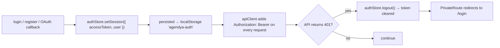

Covered end-to-end (with sequence diagrams) in
[Architecture → Authentication flow](/en/architecture/authentication/). This page
is the feature-level summary and endpoint list.

## Ways to authenticate

| Method | Entry point (web) | API | Notes |
| --- | --- | --- | --- |
| Email + password | `/register`, `/login` | `POST /auth/register`, `POST /auth/login` | bcrypt (`SALT_ROUNDS = 10`); passwords 8–72 chars |
| Google OAuth 2.0 | "Sign in with Google" button | `GET /auth/google` → `GET /auth/google/callback` | Only available when Google credentials are configured |

There is a `/forgot-password` route and page in the web app, but **no
password-reset endpoint exists in the API yet** — treat the page as a
placeholder.

:::caution[TODO — password reset]
`ForgotPasswordPage.tsx` is routed and rendered, but no `/auth/forgot-password`
or `/auth/reset-password` handler exists in `apps/api`. Wiring this up is
unfinished work, not a documented feature.
:::

## Endpoints

| Method | Path | Auth | Body / params | Response |
| --- | --- | --- | --- | --- |
| `POST` | `/auth/register` | none · `@Throttle 5/60s` | `{ email, password, businessName }` (`registerSchema`) | `{ accessToken, user }` |
| `POST` | `/auth/login` | none · `@Throttle 5/60s` | `{ email, password }` (`loginSchema`) | `{ accessToken, user }` · `401 ACCOUNT_NOT_FOUND` stays on `/login` with a register CTA |
| `GET` | `/auth/me` | JWT | — | `{ id, email, businessName, slug, role, accessStatus }` |
| `GET` | `/auth/google` | none | — | 302 to Google (+ sets `oauth_state` cookie) |
| `GET` | `/auth/google/callback` | `state` cookie + Google | `?code&state` | 302 to `{WEB_URL}/auth/callback#token=<JWT>` · declined: `/login?error=declined` · invalid `state`: `/login?error=oauth` |

`user` shape: `{ id, email, businessName, slug, role, accessStatus }`. `PENDING`
lands on `/acceso-pendiente`. `SUPER_ADMIN` lands on `/dashboard` without the
professional nav.

## Account model

- One table: **`Professional`**. `passwordHash` is nullable (Google-only
  accounts have none); logging in with a password on such an account returns
  `401 "Esta cuenta usa autenticación con Google."`.
- Registration derives a unique `slug` from `businessName` via `slugify` +
  `ensureUniqueSlug`.
- Google sign-in resolves the account by `googleId`, else by `email` (linking
  `googleId` onto the existing row), else creates a new professional named
  `"First Last"`.
- `isActive = false` disables an account: `JwtStrategy.validate` rejects its
  tokens with `401`.
- `accessStatus`: `PENDING` \| `APPROVED` \| `DECLINED`. Sign-up always creates
  the row. Without a grant in closed beta it is `PENDING` (session yes, dashboard
  no). `DECLINED` cannot sign in. `JwtStrategy` rejects `DECLINED` and allows
  `PENDING`.
- `role`: `INDEPENDENT` by default; `SUPER_ADMIN` when the email has a
  `PlatformAccessEmail` row with `access = SUPER_ADMIN` (the seed includes
  `info@agendya.co` and `afz.0228@gmail.com`). `BUSINESS_ADMIN` is in the enum
  and unused.

## Closed beta (pending access)

Registration **always** creates a `Professional`. Without a
`PlatformAccessEmail` grant (or a `PROFESSIONAL_EMAIL_ALLOWLIST` match)
`accessStatus` is `PENDING` and the web sends them to `/acceso-pendiente`.
Super Admin sees every account under **Registros** and can Accept / Decline.

`PROFESSIONAL_EMAIL_ALLOWLIST=""` (empty string) opens the product: stored
`PENDING` can enter the dashboard with no mass update (`DECLINED` stays out).
A `SUPER_ADMIN` or `ALLOWLISTED` grant is born `APPROVED`. Public `/:slug`
pages only show `APPROVED` accounts while the kill switch is off.

## Session lifecycle (web)

Token TTL is `JWT_EXPIRES_IN` (default `7d`). There is no refresh-token flow;
expiry means re-login.
