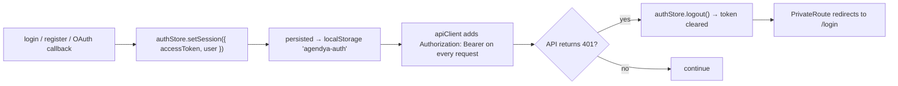

Covered end-to-end (with sequence diagrams) in
[Architecture → Authentication flow](/en/architecture/authentication/). This page
is the feature-level summary and endpoint list.

## Ways to authenticate

| Method | Entry point (web) | API | Notes |
| --- | --- | --- | --- |
| Email + password | `/register`, `/login` | `POST /auth/register`, `POST /auth/login` | bcrypt (`SALT_ROUNDS = 10`); passwords 8–72 chars |
| Google OAuth 2.0 | "Sign in with Google" button | `GET /auth/google` → `GET /auth/google/callback` | Only available when Google credentials are configured |
| Password recovery | `/forgot-password`, `/reset-password` | `POST /auth/forgot-password`, `POST /auth/reset-password` | One-time tokens with SHA-256, valid for 1 hour |

## Endpoints

| Method | Path | Auth | Body / params | Response |
| --- | --- | --- | --- | --- |
| `POST` | `/auth/register` | none · `@Throttle 5/60s` | `{ email, password, businessName }` (`registerSchema`) | `{ accessToken, user }` |
| `POST` | `/auth/login` | none · `@Throttle 5/60s` | `{ email, password }` (`loginSchema`) | `{ accessToken, user }` · `401 ACCOUNT_NOT_FOUND` stays on `/login` with a register CTA |
| `POST` | `/auth/forgot-password` | none · `@Throttle 3/60s` | `{ email }` (`forgotPasswordSchema`) | `{ success: true }` · Always returns same response to avoid revealing if email exists |
| `POST` | `/auth/reset-password` | none · `@Throttle 5/60s` | `{ token, password }` (`resetPasswordSchema`) | `{ success: true }` · `400 RESET_TOKEN_INVALID` if token doesn't exist, was already used, or expired |
| `GET` | `/auth/me` | JWT | — | `{ id, email, businessName, slug, role, accessStatus }` |
| `GET` | `/auth/google` | none | — | 302 to Google (+ sets `oauth_state` cookie) |
| `GET` | `/auth/google/callback` | `state` cookie + Google | `?code&state` | 302 to `{WEB_URL}/auth/callback#token=<JWT>` · declined: `/login?error=declined` · invalid `state`: `/login?error=oauth` |

`user` shape: `{ id, email, businessName, slug, role, accessStatus }`. `PENDING`
lands on `/acceso-pendiente`. `SUPER_ADMIN` lands on `/dashboard` without the
professional nav.

## Account model

- One table: **`Professional`**. `passwordHash` is nullable (Google-only
  accounts have none); logging in with a password on such an account returns
  `401 "Esta cuenta usa autenticación con Google."`.
- Registration derives a unique `slug` from `businessName` via `slugify` +
  `ensureUniqueSlug`.
- Google sign-in resolves the account by `googleId`, else by `email` (linking
  `googleId` onto the existing row), else creates a new professional named
  `"First Last"`.
- `isActive = false` disables an account: `JwtStrategy.validate` rejects its
  tokens with `401`.
- `accessStatus`: `PENDING` \| `APPROVED` \| `DECLINED`. Sign-up always creates
  the row. Without a grant in closed beta it is `PENDING` (session yes, dashboard
  no). `DECLINED` cannot sign in. `JwtStrategy` rejects `DECLINED` and allows
  `PENDING`.
- `role`: `INDEPENDENT` by default; `SUPER_ADMIN` when the email has a
  `PlatformAccessEmail` row with `access = SUPER_ADMIN` (the seed includes
  `info@agendya.co` and `afz.0228@gmail.com`). `BUSINESS_ADMIN` is in the enum
  and unused.

## Closed beta (pending access)

Registration **always** creates a `Professional`. Without a
`PlatformAccessEmail` grant (or a `PROFESSIONAL_EMAIL_ALLOWLIST` match)
`accessStatus` is `PENDING` and the web sends them to `/acceso-pendiente`.
Super Admin sees every account under **Registros** and can Accept / Decline.

`PROFESSIONAL_EMAIL_ALLOWLIST=""` (empty string) opens the product: stored
`PENDING` can enter the dashboard with no mass update (`DECLINED` stays out).
A `SUPER_ADMIN` or `ALLOWLISTED` grant is born `APPROVED`. Public `/:slug`
pages only show `APPROVED` accounts while the kill switch is off.

## Session lifecycle (web)

```mermaid
flowchart LR
  L["login / register / OAuth callback"] --> S["authStore.setSession({ accessToken, user })"]
  S --> P["persisted → localStorage 'agendya-auth'"]
  P --> R["apiClient adds Authorization: Bearer on every request"]
  R --> E{"API returns 401?"}
  E -->|yes| O["authStore.logout() → token cleared"]
  O --> RD["PrivateRoute redirects to /login"]
  E -->|no| C["continue"]
```

Token TTL is `JWT_EXPIRES_IN` (default `7d`). There is no refresh-token flow;
expiry means re-login.

## Password Recovery

The password reset flow consists of two steps:

1. **Request recovery** (`/forgot-password`): User enters their email address. The API generates a one-time token, sends it by email, and always returns the same response to avoid revealing if the email exists in the system.

2. **Reset password** (`/reset-password`): User clicks the link in the email, enters a new password, and the API validates the token, updates the password, and marks the token as used.

### PasswordResetToken Table

| Field | Type | Description |
| --- | --- | --- |
| `id` | UUID | Unique identifier |
| `professionalId` | UUID | FK to `Professional` (cascade delete) |
| `tokenHash` | String (SHA-256) | Hash of the random 32-byte token |
| `expiresAt` | DateTime | Expiration timestamp (1 hour from creation) |
| `usedAt` | DateTime? | Timestamp when token was used (null = unused) |
| `createdAt` | DateTime | Creation timestamp |

### Security

- **One-time tokens**: Token is marked as used (`usedAt`) after successfully resetting the password. Cannot be reused.
- **SHA-256 hashing**: Only the hash is stored in the database, not the plain token. The plain token is only sent via email.
- **1-hour expiration**: Tokens expire after 1 hour for security.
- **Previous token invalidation**: When requesting a new token, all previous unused tokens for that account are marked as used.
- **Race condition protection**: Uses interactive transaction with `updateMany` and count check to prevent concurrent use of the same token.
- **Constant-time responses**: `/auth/forgot-password` always returns `{ success: true }` whether the email exists or not.
- **DECLINED accounts**: Do not receive password reset emails (silent fail).
