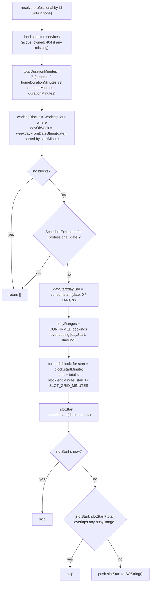

**Endpoint:** `GET /public/professionals/:slug/availability?serviceIds=&date=&atHome=`
(unauthenticated, `@Throttle 30/60s`).
**Query schema:** `availabilityQuerySchema` — `serviceIds` comma-separated,
`date` `YYYY-MM-DD`, `atHome` the string `"true"`/`"false"` → boolean.
**Response:** `{ slots: string[] }` — ISO-8601 UTC instants, each a valid
*start* time.
**Code:** `apps/api/src/modules/schedules/availability.service.ts`.

## Algorithm

## Inputs that shape the result

| Input | Effect |
| --- | --- |
| `serviceIds` | Sum of durations sets how much contiguous room a slot needs. Any unknown/inactive id → `404`. |
| `atHome=true` | Uses each service's `homeDurationMinutes` when set (falls back to `durationMinutes`). Note: the availability endpoint does **not** itself reject services where `homeServiceEnabled` is false — that check happens at booking time. |
| `date` | Picks the weekday's working blocks; a matching `ScheduleException` zeroes the day. |
| `SLOT_GRID_MINUTES` env (default `15`) | Grid step — candidate starts are `block.start`, `+grid`, `+2·grid`, … |
| Professional `timezone` | `zonedInstant` maps each wall-clock minute to the correct UTC instant regardless of server TZ. |
| Existing `CONFIRMED` bookings | Half-open overlap test `slotStart < busyEnd && slotEnd > busyStart` removes conflicts. |
| `now` | Past slots are dropped. |

## Worth knowing

- Only `CONFIRMED` bookings count as busy. `CANCELLED` / `COMPLETED` /
  `EXPIRED` free their time.
- A slot must fit **entirely** inside a single working block — the algorithm
  never spans two blocks or crosses a break.
- The list is advisory. Booking re-checks everything server-side
  (`assertSlotWithinSchedule` + a `Serializable` overlap guard), so a slot that
  was shown but got taken in the meantime fails cleanly with
  `"Ese horario ya no está disponible."`.

## Frontend

`useAvailability` (`modules/publicBooking/hooks`) queries this endpoint keyed on
`(slug, serviceIds, date, atHome)`; `SlotGrid.tsx` renders the returned ISO
strings as selectable times in the professional's timezone.
