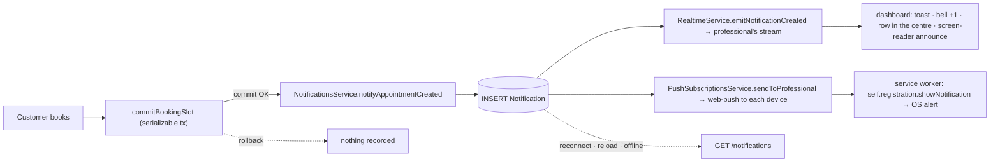
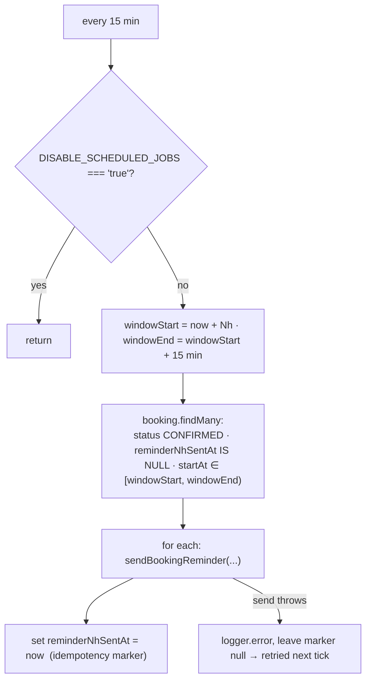
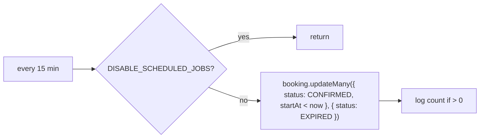

Agendya has **two kinds** of notification:

1. **Email to the customer** — always email, via `MailService`
   (`infra/mail/mail.service.ts`) with **Resend**. No SMS.
2. **The professional's notification centre** — a **persistent** dashboard feed
   with two immediate delivery channels layered on top: **SSE** (while the
   dashboard is open) and **Web Push** (an OS-level alert even when the PWA is
   closed). See [Notification centre](#notification-centre).

## Email catalogue

| Method | Trigger | Recipient | Subject (es-CO) |
| --- | --- | --- | --- |
| `sendBookingConfirmation` | Booking created; also on token-edit when the time didn't change | Customer | `Reserva confirmada con <business>` |
| `sendBookingReminder` | Reminder cron, 24h and 2h before `startAt` | Customer | `Recordatorio: tu cita con <business>` |
| `sendBookingRescheduled` | Any reschedule / time-changing edit | Customer | `Cita modificada con <business>` |
| `sendBookingRescheduledToProfessional` | Customer-initiated reschedule / edit | Professional | `Modificación de reserva - <customer>` |
| `sendBookingCancelled` | Cancel by customer or professional | Customer | `Reserva cancelada con <business>` |

- **From:** `Agendya <reservas@agendya.app>` (hard-coded).
- **Dates:** `Intl.DateTimeFormat('es-CO', { dateStyle: 'full', timeStyle:
  'short', timeZone })` in the professional's timezone.
- **Cancel link:** `{WEB_URL}/bookings/<cancellationToken>`.
- **XSS:** every interpolated value (`customerName`, `businessName`,
  `serviceName`, …) passes through `escapeHtml` — the booking form is public
  and the professional receives some of those values in their inbox.
- **Unconfigured:** no `RESEND_API_KEY` → `send()` logs
  `[dev] Email a <to>: <subject>` and returns. A Resend API error when
  configured is caught and logged, never thrown, so email never breaks a
  booking response.

## Notification centre

`modules/notifications` on the API and the web. The `Notification` database row
is the **source of truth**; SSE and Web Push are immediate delivery channels
layered on top of it.

- **Ordering guarantee:** the notification is **persisted after the booking
  commits** and **before** the events are emitted. If the booking fails, there is
  no row.
- **Best-effort:** `NotificationsService.notifyAppointmentCreated` swallows its
  own errors, and `BookingsService` also wraps the call in `.catch()`; a failed
  notification never breaks an already-saved booking. The Web Push fan-out is
  fire-and-forget inside `create()` — dispatched after the `INSERT` and the SSE
  emit, and `sendToProfessional` swallows its own errors.
- **Ephemeral vs. persistent:** the SSE event is ephemeral, the row is not. A
  professional who was offline, had the tab closed, or missed the event sees the
  notification on their next dashboard load — the badge and feed load from the
  API.

### `Notification` model

| Field | Type | Notes |
| --- | --- | --- |
| `id` | uuid | |
| `professionalId` | uuid | FK → `Professional`, `onDelete: Cascade` |
| `type` | `NotificationType` | today only `APPOINTMENT_CREATED`; reserved `APPOINTMENT_CANCELLED` / `APPOINTMENT_RESCHEDULED` / `APPOINTMENT_REMINDER` / `SYSTEM` |
| `title` / `body` | string | ready-to-render strings (es-CO); also serve a future Web Push payload |
| `data` | `Json` | `{ bookingId, customerName, serviceName, startAt }` — `bookingId` is the navigation reference; the rest avoids a join and is point-in-time |
| `readAt` | `DateTime?` | `null` while unread |
| `createdAt` | `DateTime` | |

Customer email / phone / address / note and the `cancellationToken` are **not**
copied in.

### Indexes

- `@@index([professionalId, createdAt(sort: Desc)])` — the only list query
  (`WHERE professionalId = ? ORDER BY createdAt DESC`, keyset over `(createdAt, id)`).
- `@@index([professionalId, readAt])` — the unread badge
  (`WHERE professionalId = ? AND readAt IS NULL`).

### API

All require JWT and are scoped to `req.user.id` server-side — see the
[endpoint reference](/en/api/reference/#real-time--modulesrealtime).

| Method | Path | Response |
| --- | --- | --- |
| `GET` | `/notifications?cursor=&limit=` (1–50, default 20) | `{ items: Notification[], nextCursor: string \| null }` |
| `GET` | `/notifications/unread-count` | `{ count }` |
| `PATCH` | `/notifications/:id/read` | `Notification` — `404` if not yours; idempotent |
| `PATCH` | `/notifications/read-all` | `{ updated }` |
| `GET` | `/notifications/push/public-key` | `{ publicKey: string \| null }` — `null` when the server has no VAPID keys |
| `GET` | `/notifications/push/status` | `{ subscribed: boolean }` — whether this professional has any device registered |
| `POST` | `/notifications/push/subscribe` | `204` — body = the browser's `PushSubscription.toJSON()`; upsert by `endpoint` |
| `POST` | `/notifications/push/unsubscribe` | `204` — body = `{ endpoint }`; scoped to the professional's rows |

`markRead` / `markAllRead` use `updateMany` with `professionalId` in the `where`,
so a professional can never mark another professional's notification read.
`push/subscribe` and `push/unsubscribe` are scoped the same way: `endpoint` is
globally unique, but `unsubscribe` filters by `professionalId` and the `upsert`
reassigns the device to the authenticated professional.

### Real-time event

`notification.created` (`realtimeEventSchema` in `@agendya/types`):
`{ type, notification: Notification }` — the same row the API returns.
Transport: `GET /realtime/stream` (SSE, NestJS `@Sse()`, the same `JwtAuthGuard`,
`fetch` with an `Authorization` header, zero new dependencies). `event: ping`
heartbeat every `REALTIME_HEARTBEAT_MS` (25s default).

### Frontend

- **One shared connection** (`shared/realtime/realtimeClient.ts`): exponential
  backoff + jitter, reconnect on tab re-focus, stop on logout / 401.
- **React Query:** `['notifications','list']` (`useInfiniteQuery`, only while the
  centre is open) and `['notifications','unread']` (always mounted; refetched on
  dashboard mount and on window focus). On `notification.created` the hook
  **inserts into the list cache** (no refetch) and **invalidates the count** (a
  tiny `{count}` document; a blind increment double-counts when the last fetch
  already included the row). Mark-read mutations are optimistic with rollback.
- **UI:** a 🔔 bell with a badge in the sidebar (desktop) and the top bar
  (mobile); opens a right-side drawer (`role="dialog"`, focus-trap, Escape,
  focus returns to the bell). Loading skeleton, empty state, error state.
  Read/unread is **not** conveyed by colour alone: a dot, a "Nuevo" tag and bold
  weight, and the item's accessible name is prefixed with "Sin leer.".
- **Explicit read:** opening the centre marks **nothing**; an item is marked when
  activated (click / Enter), which also navigates to the agenda with
  `?booking=<id>&date=<day>` and opens that reservation's detail — the same in the
  list or the calendar view, since both use the one drawer. The agenda widens its
  date range to include the day, then strips the params from the URL.
  "Marcar todas como leídas" lives in the header.
- **Screen reader:** an `aria-live="polite"` region in the shell announces every
  new notification.

### Retention

Not implemented. Rows are small and Phase 1 volume is low. Suggested future
strategy: a daily `@Cron` deleting
`readAt IS NOT NULL AND createdAt < now() - interval '90 days'`, plus a hard cap
per professional (e.g. keep the 500 most recent). It would honour
`DISABLE_SCHEDULED_JOBS` like the other crons.

### Web Push

An OS-level alert on the professional's device, even when the PWA is closed. Like
SSE, it is a **delivery channel** for the `Notification` row, never the source of
truth.

**API** — `PushSubscriptionsService` (`modules/notifications/push-subscriptions.service.ts`):

- Configures `web-push` with the VAPID keys (`VAPID_PUBLIC_KEY` /
  `VAPID_PRIVATE_KEY` / `VAPID_SUBJECT`). **With any of the three missing** → the
  same degradation contract as `MailService`: `publicKey` is `null`,
  `sendToProfessional` is a no-op, and the feed keeps working over SSE + row.
- `NotificationsService.create()` calls `sendToProfessional(professionalId,
  { title, body, notificationId, bookingId, startAt })` (`pushMessageSchema` in
  `@agendya/types`) after the `INSERT` and the SSE emit, fire-and-forget.
- Delivers to every `PushSubscription` row for the professional via
  `Promise.allSettled`. A `404`/`410` from the push service → the row is
  **pruned**; other errors are logged and swallowed. A successful send refreshes
  `lastActiveAt`.

**`PushSubscription` model:**

| Field | Type | Notes |
| --- | --- | --- |
| `id` | uuid | |
| `professionalId` | uuid | FK → `Professional`, `onDelete: Cascade` |
| `endpoint` | string | global **`@unique`** — a browser re-subscribing returns the same endpoint, so the `upsert` keeps one row per device |
| `p256dh` / `auth` | string | encryption material from `PushSubscription.toJSON().keys` |
| `userAgent` | string? | best-effort provenance for the settings UI; not used for delivery |
| `createdAt` / `lastActiveAt` | `DateTime` | `lastActiveAt` is refreshed on each successful send — enables a future sweep of dead endpoints |

Index: `@@index([professionalId])` — delivery loads every subscription for one
professional.

**Service worker** (`apps/web/src/sw.ts`, `vite-plugin-pwa` `injectManifest`
strategy):

- Precaches the SPA shell (`precacheAndRoute(self.__WB_MANIFEST)`) — the reason
  for moving from `generateSW` to `injectManifest`.
- `push` → `self.registration.showNotification(title, { body, icon, badge, tag:
  'booking-<id>', data: { url } })`.
- `notificationclick` → focuses an open dashboard tab and navigates it, or opens
  a new window, to `/dashboard/agenda?booking=<id>&date=<day>`.

**Frontend:**

- `shared/push/pushManager.ts` — support detection, permission, and the
  `pushManager.subscribe({ userVisibleOnly: true, applicationServerKey })` +
  register-with-API dance. `modules/notifications/push.ts` is the REST half.
- `usePushNotifications` reconciles three sources — the browser permission, the
  local `PushManager` subscription, and whether the server even has VAPID keys —
  into a small state that renders `PushNotificationToggle`, a banner in the
  notification centre header. The banner is **hidden** when the browser can't do
  push or the server has no VAPID keys.
- On logout (`Sidebar`), `disablePush()` drops this browser's subscription
  **before** the token is cleared, so pushes for that account stop reaching the
  device.

**iOS:** Web Push only works with the PWA **installed to the Home Screen** (iOS
16.4+); permission must be requested from a user gesture (the banner's "Activar"
button).

## Reminder scheduler

`modules/bookings/reminders.scheduler.ts` — two `@Cron('*/15 * * * *')` jobs
(24h and 2h).

Because the marker is only written **after** a successful send, a failed send
is retried on the next run; a successful one is never re-sent. The
15-minute window matches the cron cadence so each booking falls in exactly one
window.

## Expiration scheduler

`modules/bookings/expiration.scheduler.ts` — one `@Cron('*/15 * * * *')`.

This is a **backstop for the agenda view**, not the enforcement mechanism:
every mutating endpoint already revalidates `startAt` against `Date.now()` and
self-heals the row it touches (`assertModifiable`), so a booking can never be
rescheduled merely because this sweep hasn't run.

## Not implemented

- No reminder to the **professional**.
- No cancellation email to the professional (only the customer is emailed on
  cancel).
- No `NO_SHOW` flow, so no related notification.
- No digest / daily-summary email.
