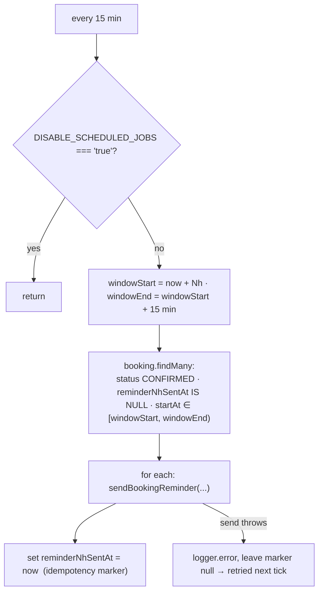
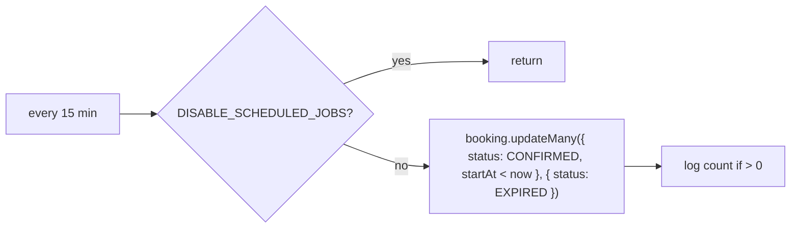

All notifications are **email**, sent through `MailService`
(`infra/mail/mail.service.ts`) via **Resend**. No SMS, no push, no in-app
notifications.

## Email catalogue

| Method | Trigger | Recipient | Subject (es-CO) |
| --- | --- | --- | --- |
| `sendBookingConfirmation` | Booking created; also on token-edit when the time didn't change | Customer | `Reserva confirmada con <business>` |
| `sendBookingReminder` | Reminder cron, 24h and 2h before `startAt` | Customer | `Recordatorio: tu cita con <business>` |
| `sendBookingRescheduled` | Any reschedule / time-changing edit | Customer | `Cita modificada con <business>` |
| `sendBookingRescheduledToProfessional` | Customer-initiated reschedule / edit | Professional | `Modificación de reserva - <customer>` |
| `sendBookingCancelled` | Cancel by customer or professional | Customer | `Reserva cancelada con <business>` |

- **From:** `Agendya <reservas@agendya.app>` (hard-coded).
- **Dates:** `Intl.DateTimeFormat('es-CO', { dateStyle: 'full', timeStyle:
  'short', timeZone })` in the professional's timezone.
- **Cancel link:** `{WEB_URL}/bookings/<cancellationToken>`.
- **XSS:** every interpolated value (`customerName`, `businessName`,
  `serviceName`, …) passes through `escapeHtml` — the booking form is public
  and the professional receives some of those values in their inbox.
- **Unconfigured:** no `RESEND_API_KEY` → `send()` logs
  `[dev] Email a <to>: <subject>` and returns. A Resend API error when
  configured is caught and logged, never thrown, so email never breaks a
  booking response.

## Reminder scheduler

`modules/bookings/reminders.scheduler.ts` — two `@Cron('*/15 * * * *')` jobs
(24h and 2h).

Because the marker is only written **after** a successful send, a failed send
is retried on the next run; a successful one is never re-sent. The
15-minute window matches the cron cadence so each booking falls in exactly one
window.

## Expiration scheduler

`modules/bookings/expiration.scheduler.ts` — one `@Cron('*/15 * * * *')`.

This is a **backstop for the agenda view**, not the enforcement mechanism:
every mutating endpoint already revalidates `startAt` against `Date.now()` and
self-heals the row it touches (`assertModifiable`), so a booking can never be
rescheduled merely because this sweep hasn't run.

## Not implemented

- No reminder to the **professional**.
- No cancellation email to the professional (only the customer is emailed on
  cancel).
- No `NO_SHOW` flow, so no related notification.
- No digest / daily-summary email.
