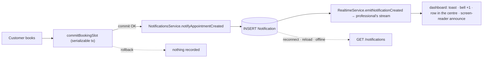
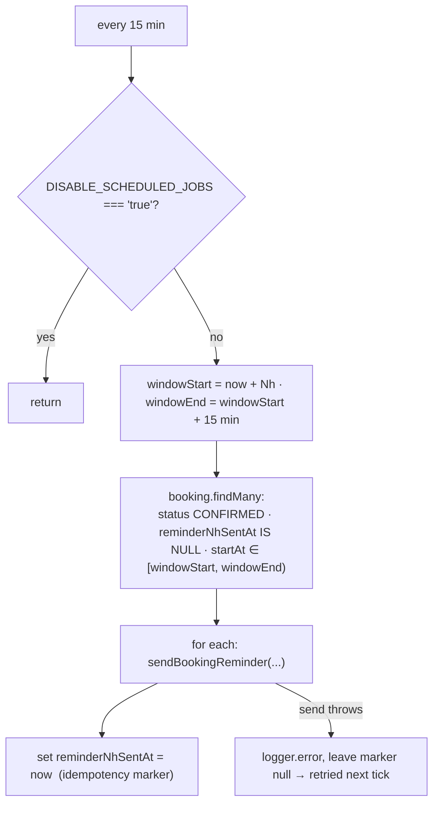
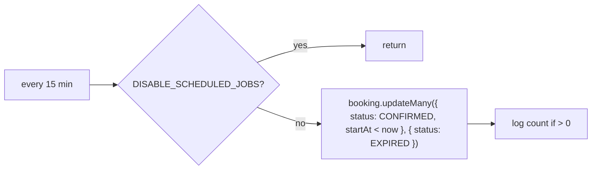

Agendya has **two kinds** of notification:

1. **Email to the customer** — always email, via `MailService`
   (`infra/mail/mail.service.ts`) with **Resend**. No SMS.
2. **The professional's notification centre** — a **persistent** dashboard feed
   with real-time (SSE) delivery layered on top. See
   [Notification centre](#notification-centre).

## Email catalogue

| Method | Trigger | Recipient | Subject (es-CO) |
| --- | --- | --- | --- |
| `sendBookingConfirmation` | Booking created; also on token-edit when the time didn't change | Customer | `Reserva confirmada con <business>` |
| `sendBookingReminder` | Reminder cron, 24h and 2h before `startAt` | Customer | `Recordatorio: tu cita con <business>` |
| `sendBookingRescheduled` | Any reschedule / time-changing edit | Customer | `Cita modificada con <business>` |
| `sendBookingRescheduledToProfessional` | Customer-initiated reschedule / edit | Professional | `Modificación de reserva - <customer>` |
| `sendBookingCancelled` | Cancel by customer or professional | Customer | `Reserva cancelada con <business>` |

- **From:** `Agendya <reservas@agendya.app>` (hard-coded).
- **Dates:** `Intl.DateTimeFormat('es-CO', { dateStyle: 'full', timeStyle:
  'short', timeZone })` in the professional's timezone.
- **Cancel link:** `{WEB_URL}/bookings/<cancellationToken>`.
- **XSS:** every interpolated value (`customerName`, `businessName`,
  `serviceName`, …) passes through `escapeHtml` — the booking form is public
  and the professional receives some of those values in their inbox.
- **Unconfigured:** no `RESEND_API_KEY` → `send()` logs
  `[dev] Email a <to>: <subject>` and returns. A Resend API error when
  configured is caught and logged, never thrown, so email never breaks a
  booking response.

## Notification centre

`modules/notifications` on the API and the web. The `Notification` database row
is the **source of truth**; SSE is only an immediate delivery channel and a
future Web Push would be another.

- **Ordering guarantee:** the notification is **persisted after the booking
  commits** and **before** the event is emitted. If the booking fails, there is
  no row.
- **Best-effort:** `NotificationsService.notifyAppointmentCreated` swallows its
  own errors, and `BookingsService` also wraps the call in `.catch()`; a failed
  notification never breaks an already-saved booking.
- **Ephemeral vs. persistent:** the SSE event is ephemeral, the row is not. A
  professional who was offline, had the tab closed, or missed the event sees the
  notification on their next dashboard load — the badge and feed load from the
  API.

### `Notification` model

| Field | Type | Notes |
| --- | --- | --- |
| `id` | uuid | |
| `professionalId` | uuid | FK → `Professional`, `onDelete: Cascade` |
| `type` | `NotificationType` | today only `APPOINTMENT_CREATED`; reserved `APPOINTMENT_CANCELLED` / `APPOINTMENT_RESCHEDULED` / `APPOINTMENT_REMINDER` / `SYSTEM` |
| `title` / `body` | string | ready-to-render strings (es-CO); also serve a future Web Push payload. Home service: `title` = `"Nueva cita a domicilio"` |
| `data` | `Json` | `{ bookingId, customerName, serviceName, startAt, atHome? }` — `bookingId` is the navigation reference; the rest avoids a join and is point-in-time. `atHome: true` is added only for a home-service booking (a flag, never the address) |
| `readAt` | `DateTime?` | `null` while unread |
| `createdAt` | `DateTime` | |

Customer email / phone / address / note and the `cancellationToken` are **not**
copied in.

### Indexes

- `@@index([professionalId, createdAt(sort: Desc)])` — the only list query
  (`WHERE professionalId = ? ORDER BY createdAt DESC`, keyset over `(createdAt, id)`).
- `@@index([professionalId, readAt])` — the unread badge
  (`WHERE professionalId = ? AND readAt IS NULL`).

### API

All require JWT and are scoped to `req.user.id` server-side — see the
[endpoint reference](/en/api/reference/#real-time--modulesrealtime).

| Method | Path | Response |
| --- | --- | --- |
| `GET` | `/notifications?cursor=&limit=` (1–50, default 20) | `{ items: Notification[], nextCursor: string \| null }` |
| `GET` | `/notifications/unread-count` | `{ count }` |
| `PATCH` | `/notifications/:id/read` | `Notification` — `404` if not yours; idempotent |
| `PATCH` | `/notifications/read-all` | `{ updated }` |

`markRead` / `markAllRead` use `updateMany` with `professionalId` in the `where`,
so a professional can never mark another professional's notification read.

### Real-time event

`notification.created` (`realtimeEventSchema` in `@agendya/types`):
`{ type, notification: Notification }` — the same row the API returns.
Transport: `GET /realtime/stream` (SSE, NestJS `@Sse()`, the same `JwtAuthGuard`,
`fetch` with an `Authorization` header, zero new dependencies). `event: ping`
heartbeat every `REALTIME_HEARTBEAT_MS` (25s default).

### Frontend

- **One shared connection** (`shared/realtime/realtimeClient.ts`): exponential
  backoff + jitter, reconnect on tab re-focus, stop on logout / 401.
- **React Query:** `['notifications','list']` (`useInfiniteQuery`, only while the
  centre is open) and `['notifications','unread']` (always mounted; refetched on
  dashboard mount and on window focus). On `notification.created` the hook
  **inserts into the list cache** (no refetch) and **invalidates the count** (a
  tiny `{count}` document; a blind increment double-counts when the last fetch
  already included the row). Mark-read mutations are optimistic with rollback.
- **UI:** a 🔔 bell with a badge in the sidebar (desktop) and the top bar
  (mobile); opens a right-side drawer (`role="dialog"`, focus-trap, Escape,
  focus returns to the bell). Loading skeleton, empty state, error state.
  Read/unread is **not** conveyed by colour alone: a dot, a "Nuevo" tag and bold
  weight, and the item's accessible name is prefixed with "Sin leer.".
- **Explicit read:** opening the centre marks **nothing**; an item is marked when
  activated (click / Enter), which also navigates to the agenda with
  `?booking=<id>&date=<day>` and opens that reservation's detail — the same in the
  list or the calendar view, since both use the one drawer. The agenda widens its
  date range to include the day, then strips the params from the URL.
  "Marcar todas como leídas" lives in the header.
- **Screen reader:** an `aria-live="polite"` region in the shell announces every
  new notification.

### Retention

Not implemented. Rows are small and Phase 1 volume is low. Suggested future
strategy: a daily `@Cron` deleting
`readAt IS NOT NULL AND createdAt < now() - interval '90 days'`, plus a hard cap
per professional (e.g. keep the 500 most recent). It would honour
`DISABLE_SCHEDULED_JOBS` like the other crons.

### Web Push (future)

`NotificationsService.create()` is the feed's single write path. Adding Web Push
is one more line there: after the `INSERT`, if a `PushSubscription` exists for
the professional, send the push with the `title` / `body` / `data` already
prepared. The row stays the source of truth; SSE and push are delivery channels,
not replacements for the centre.

## Reminder scheduler

`modules/bookings/reminders.scheduler.ts` — two `@Cron('*/15 * * * *')` jobs
(24h and 2h).

Because the marker is only written **after** a successful send, a failed send
is retried on the next run; a successful one is never re-sent. The
15-minute window matches the cron cadence so each booking falls in exactly one
window.

## Expiration scheduler

`modules/bookings/expiration.scheduler.ts` — one `@Cron('*/15 * * * *')`.

This is a **backstop for the agenda view**, not the enforcement mechanism:
every mutating endpoint already revalidates `startAt` against `Date.now()` and
self-heals the row it touches (`assertModifiable`), so a booking can never be
rescheduled merely because this sweep hasn't run.

## Not implemented

- No reminder to the **professional**.
- No cancellation email to the professional (only the customer is emailed on
  cancel).
- No `NO_SHOW` flow, so no related notification.
- No digest / daily-summary email.
