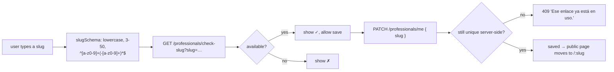

The `Professional` is the only account type. Everything else (services,
hours, bookings) hangs off it.

## Profile fields

Edited at `/dashboard/profile` (`ProfilePage.tsx`), saved via
`PATCH /professionals/me` with a **partial** body (`updateProfileSchema` — every
field optional).

| Group | Fields |
| --- | --- |
| Identity | `businessName`, `slug`, `category` |
| Branding | `logoUrl`, `coverImageUrl`, `photoUrl`, `brandColor` (6-digit hex) |
| Copy | `description` (≤ 500) |
| Booking rules | `timezone` (IANA), `cancellationPolicyHours` (one of `1, 2, 3, 4, 6, 24`) |

`brandColor` is edited with a hue slider (`professionals/color.ts` —
`hueToHex` / `hexToHue`, fixed S/L) plus preset swatches
(`BRAND_COLOR_PRESETS`).

Images are downscaled in-browser (`professionals/image.ts`) then sent to
`POST /upload/image?type=logo|cover`, which returns a Cloudinary URL that is
saved back into the profile.

## Slug management



`check-slug` excludes the caller's own current slug, so re-saving an unchanged
slug reports available.

## Endpoints

| Method | Path | Auth | Purpose |
| --- | --- | --- | --- |
| `GET` | `/professionals/me` | JWT | Full profile + `bookingsThisMonth` + `monthlyBookingLimit` |
| `PATCH` | `/professionals/me` | JWT | Partial update; slug uniqueness re-checked |
| `GET` | `/professionals/check-slug?slug=` | JWT | `{ available: boolean }` |
| `GET` | `/public/professionals/:slug` | none · `@Throttle 30/60s` | Public profile + active services |

## `GET /professionals/me` response

```jsonc
{
  "id": "uuid",
  "email": "pro@example.com",
  "businessName": "Barbería Central",
  "slug": "barberia-central",
  "category": "Barbería",
  "photoUrl": null,
  "logoUrl": "https://res.cloudinary.com/…",
  "coverImageUrl": null,
  "brandColor": "#4F46E5",
  "description": "…",
  "timezone": "America/Bogota",
  "cancellationPolicyHours": 24,
  "plan": "BASIC",
  "bookingsThisMonth": 12,      // non-cancelled bookings created since the 1st (UTC)
  "monthlyBookingLimit": 100,   // null on PRO
  "createdAt": "…",
  "updatedAt": "…"
}
```

## Public page

`GET /public/professionals/:slug` (used by `PublicBookingPage`) returns only
what a customer should see: `businessName`, `slug`, `category`, images,
`brandColor`, `description`, and **active, non-deleted services** ordered by
`sortOrder` — no email, plan, timezone or counts.

## Plans

| | `BASIC` (`Plan Gratuito`) | `PRO` (`Plan Pro`) |
| --- | --- | --- |
| Services | 3 | unlimited |
| Bookings / month | 100 | unlimited |

Constants live in `@agendya/types` (`PLAN_SERVICE_LIMITS`,
`PLAN_MONTHLY_BOOKING_LIMITS`, `PLAN_LABELS`). There is **no billing/upgrade
flow** — `plan` is only ever `BASIC` unless changed directly in the database.
