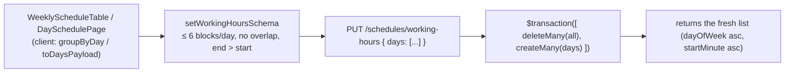
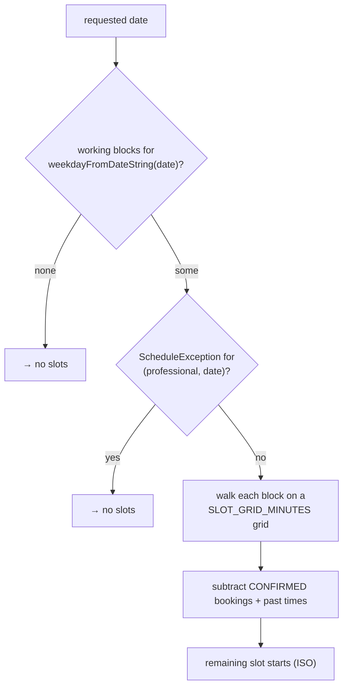

Two independent mechanisms decide when a professional *could* be booked, before
existing bookings are subtracted:

1. **Working hours** — recurring weekly blocks (`WorkingHour`).
2. **Schedule exceptions** — specific closed dates (`ScheduleException`).

Both are edited under `/dashboard/schedule` (`SchedulePage.tsx`,
`DaySchedulePage.tsx` for one weekday, `BlockedDatesManager.tsx`).

## Working hours

- A weekday can have **up to 6 blocks** (`MAX_BLOCKS_PER_DAY`), each
  `{ dayOfWeek, startMinute, endMinute }` in minutes-from-midnight.
- Blocks for the same day **must not overlap** and `endMinute > startMinute` —
  both checked in `setWorkingHoursSchema` (Zod `superRefine`) before the write.
- `PUT /schedules/working-hours` **replaces the entire week** — the service
  does `deleteMany` + `createMany` in one `$transaction`. There is no
  per-block PATCH.

Client helpers in `schedules/blocks.ts`: `groupByDay`, `toDaysPayload`,
`formatRange`, `formatBlockDuration`, `dayPartLabel` (`Mañana`/`Tarde`/`Noche`),
`blocksOverlap`, `findOverlap`. Weekday order/labels/slugs in
`schedules/weekday.ts` (Monday-first, Spanish labels, accentless slugs).

## Schedule exceptions

- One row per `(professionalId, date)` — the `@@unique` constraint means a
  duplicate `POST` returns `409 "Ya existe un bloqueo para esa fecha."`
  (Prisma `P2002` mapped in the service).
- `date` is a `@db.Date` column; the service converts the `YYYY-MM-DD` string
  with `dateOnlyUtc()` (UTC midnight of that calendar day).
- An exception blocks the **whole day** regardless of working hours.

| Method | Path | Purpose |
| --- | --- | --- |
| `GET` | `/schedules/working-hours` | List blocks (`dayOfWeek` asc, `startMinute` asc) |
| `PUT` | `/schedules/working-hours` | Replace the whole week |
| `GET` | `/schedules/exceptions` | List exceptions (`date` asc) |
| `POST` | `/schedules/exceptions` | Add `{ date, reason? }` |
| `DELETE` | `/schedules/exceptions/:id` | Remove — `findFirst({ id, professionalId })` guard, `404` if not owned |

All JWT-guarded.

## How this feeds availability

Details and the exact algorithm: [Availability](/en/features/availability/).
