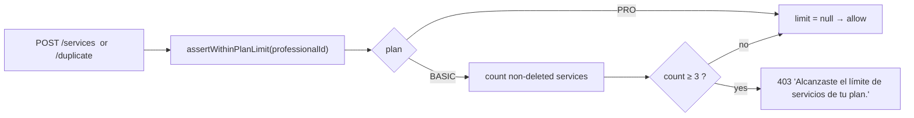

Managed at `/dashboard/services` (`ServicesPage.tsx`) and
`/dashboard/services/new` · `/dashboard/services/:id/edit`
(`ServiceFormPage.tsx`). All endpoints are JWT-guarded and scoped to the
caller.

## Fields

| Field | Rule |
| --- | --- |
| `name` | 2–100 chars |
| `description` | ≤ 500 chars, optional |
| `durationMinutes` | integer 5–480; the form offers a fixed option list (`SERVICE_DURATION_OPTIONS`) |
| `priceCents` | integer minor units, `0 … 100_000_000` |
| `isActive` | boolean — inactive services are hidden from the public page |
| `homeServiceEnabled` | boolean — reveals the at-home fields |
| `homeDurationMinutes` | required when `homeServiceEnabled`, else forced `null` |
| `homePriceCents` | required when `homeServiceEnabled`, else forced `null` |
| `sortOrder` | set server-side to the current service count on create |

The at-home dependency is enforced in three places: `homeServiceRefinement`
(Zod, shared), a page-local mirror schema in `ServiceFormPage`, and the API
service (which nulls the home fields when the toggle is off).

## Operations

| Method | Path | Effect |
| --- | --- | --- |
| `GET` | `/services` | List non-deleted services for the professional, `sortOrder` asc |
| `POST` | `/services` | Create — checks plan limit first, sets `sortOrder` |
| `PATCH` | `/services/:id` | Partial update — `findOwnedOrThrow` first |
| `POST` | `/services/:id/duplicate` | Copy the source as `"<name> (copia)"`, checks plan limit, appends |
| `DELETE` | `/services/:id` | **Soft delete** — sets `deletedAt = now()` and `isActive = false` |

```mermaid
stateDiagram-v2
  [*] --> Active: POST /services
  Active --> Inactive: PATCH { isActive: false }
  Inactive --> Active: PATCH { isActive: true }
  Active --> Deleted: DELETE (deletedAt set)
  Inactive --> Deleted: DELETE
  Deleted --> [*]: filtered out of every query;<br/>existing bookings keep the snapshot
  note right of Deleted
    Bookings that referenced it:
    serviceId → null (onDelete SetNull),
    serviceNameSnapshot preserved.
  end note
```

## Plan limits

The web app shows a `PlanLimitDialog` before the request when the client
already knows the limit is reached.

## Multi-service bookings

The public wizard lets a customer select several services at once. The API
combines them: `serviceNameSnapshot = names.join(' + ')`,
`durationMinutesSnapshot = Σ duration`, and `serviceId` on the booking points
at the **first** selected service (`primaryServiceId`). At-home totals use
`homeDurationMinutes ?? durationMinutes` per service.
