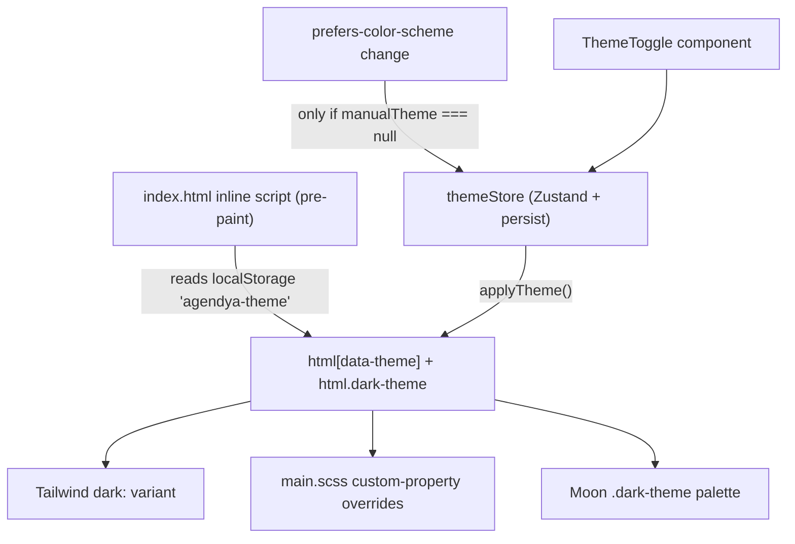

## Libraries

| Layer | What |
| --- | --- |
| **Moon Design System** | `@moondesignsystem/react` (components: `Button`, `Input`, `FormGroup`, `Checkbox`, `Select`, …) + `@moondesignsystem/ui` (CSS: `moon-core.css`, `moon-components.css`) |
| **Tailwind CSS v4** | via `@tailwindcss/vite`; utilities + a small `@theme` block |
| **SCSS** | `src/main.scss` — CSS custom properties (colour tokens, status-badge palette) that swap per theme |
| **Fonts** | Outfit (display), Plus Jakarta Sans (body), Inter (mono) — loaded via `<link>` in `index.html` |

`src/styles/tailwind.css` is the single stylesheet that imports Tailwind **and**
Moon's CSS together (Tailwind only compiles `@theme` where it also sees its own
`@import 'tailwindcss'`).

```css
@import 'tailwindcss';
@import '@moondesignsystem/ui/dist/styles/moon-core.css';
@import '@moondesignsystem/ui/dist/styles/moon-components.css';

@theme inline {
  --font-display: 'Outfit', sans-serif;
  --font-body: 'Plus Jakarta Sans', sans-serif;
  --font-mono: 'Inter', monospace;
}

@custom-variant dark (&:where([data-theme="dark"], [data-theme="dark"] *));
```

## Theming



Three consumers stay in sync off one attribute:

1. **Tailwind** `dark:` — bound to `[data-theme="dark"]`, **not**
   `prefers-color-scheme`, so it follows the in-app toggle.
2. **`main.scss`** — redefines colour custom properties under the dark
   selector.
3. **Moon** — needs its own `.dark-theme` class on `<html>`, which `applyTheme`
   also toggles.

Effective theme = `manualTheme ?? OS preference`. Only the manual override is
persisted (`partialize`), so a later OS change is picked up on the next visit
if the user never toggled.

## Shared atoms — `src/shared/components/`

| Component | Purpose |
| --- | --- |
| `Button` | App-styled button wrapper |
| `Input` | Label + input + error slot |
| `Card` | Surface container |
| `Badge` | Small status/label pill (status badges use `bookings/statusBadge.tsx` + `statusConfig.ts`) |

Feature-local components live under `modules/<feature>/components/`
(e.g. `services/components/Toggle.tsx`, `PlanLimitDialog.tsx`,
`ServiceRowMenu.tsx`; `publicBooking/components/Calendar.tsx`, `SlotGrid.tsx`,
`BookingConfirmedView.tsx`).

## Accessibility

- `shared/a11y/useFocusTrap.ts` traps focus inside modals/drawers
  (`RescheduleModal`, `AppointmentDrawer`, `BlockFormDrawer`).
- `DashboardLayout` renders a skip link (`#main-content`), and `<main>` has
  `tabIndex={-1}` so the skip link can focus it.
- Mobile nav is a labelled `<nav aria-label="Principal">`.
- The Playwright suite runs `@axe-core/playwright` audits
  (`tests/e2e/a11y/audit.spec.ts`).

## Brand assets

- Logo mark: `src/imports/LogoGroup/` and `src/imports/Group11/` (Figma-exported
  React SVG components) — three indigo/violet paths.
- Favicons: `apps/web/public/favicon.svg` (+ PNG sizes, apple-touch-icon).
- Default brand colour `#4F46E5` (indigo-600), also each professional's
  editable `brandColor`.
