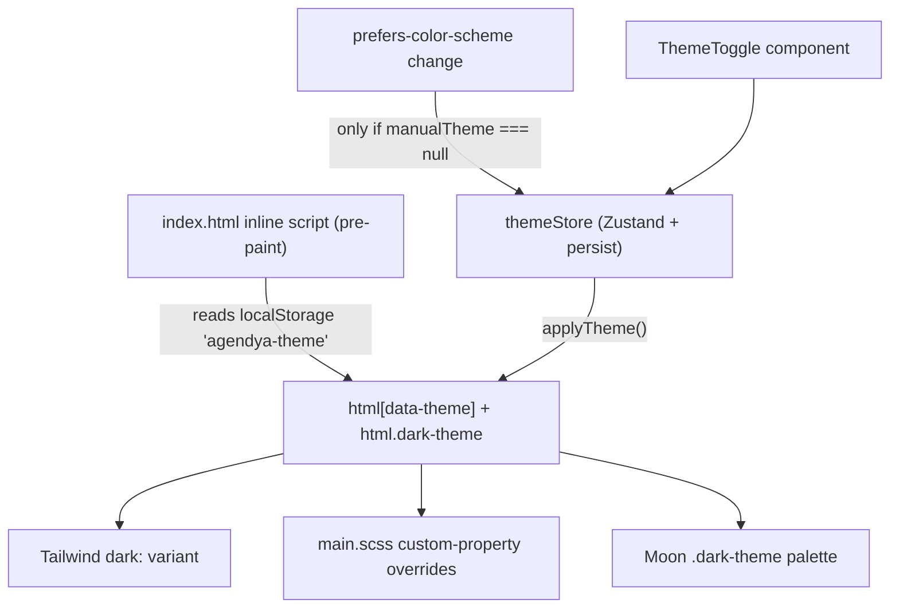

## Libraries

| Layer | What |
| --- | --- |
| **Moon Design System** | `@moondesignsystem/react` (components: `Button`, `Input`, `FormGroup`, `Checkbox`, `Select`, …) + `@moondesignsystem/ui` (CSS: `moon-core.css`, `moon-components.css`) |
| **Tailwind CSS v4** | via `@tailwindcss/vite`; utilities + a small `@theme` block |
| **SCSS** | `src/main.scss` — CSS custom properties (colour tokens, status-badge palette) that swap per theme |
| **Fonts** | Outfit (display), Plus Jakarta Sans (body), Inter (mono) — loaded via `<link>` in `index.html` |

`src/styles/tailwind.css` is the single stylesheet that imports Tailwind **and**
Moon's CSS together (Tailwind only compiles `@theme` where it also sees its own
`@import 'tailwindcss'`).

```css
@import 'tailwindcss';
@import '@moondesignsystem/ui/dist/styles/moon-core.css';
@import '@moondesignsystem/ui/dist/styles/moon-components.css';

@theme inline {
  --font-display: 'Outfit', sans-serif;
  --font-body: 'Plus Jakarta Sans', sans-serif;
  --font-mono: 'Inter', ui-sans-serif, system-ui, sans-serif; /* Inter is proportional; the name is historical */
}

@custom-variant dark (&:where([data-theme="dark"], [data-theme="dark"] *));
```

## Theming


```mermaid
flowchart TB
  IH["index.html inline script (pre-paint)"] -->|"reads localStorage 'agendya-theme'"| SET["html[data-theme] + html.dark-theme"]
  TS["themeStore (Zustand + persist)"] -->|"applyTheme()"| SET
  OS["prefers-color-scheme change"] -->|"only if manualTheme === null"| TS
  TT["ThemeToggle component"] --> TS
  SET --> TW["Tailwind dark: variant"]
  SET --> SCSS["main.scss custom-property overrides"]
  SET --> MOON["Moon .dark-theme palette"]
```

Three consumers stay in sync off one attribute:

1. **Tailwind** `dark:` — bound to `[data-theme="dark"]`, **not**
   `prefers-color-scheme`, so it follows the in-app toggle.
2. **`main.scss`** — redefines colour custom properties under the dark
   selector.
3. **Moon** — needs its own `.dark-theme` class on `<html>`, which `applyTheme`
   also toggles.

Effective theme = `manualTheme ?? OS preference`. Only the manual override is
persisted (`partialize`), so a later OS change is picked up on the next visit
if the user never toggled.

## Semantic tokens

Every colour, overlay and elevation comes from a CSS custom property defined in
`src/main.scss` (`:root` for light, `html[data-theme='dark']` for dark). The
Backoffice (`apps/backoffice-web/src/styles/tailwind.css`) duplicates the same
names and values in a Tailwind `@theme` block — keep both files in sync.

| Family | Tokens | Notes |
| --- | --- | --- |
| Surfaces | `--color-surface`, `--color-surface-soft` | `surface-soft` is the page background, `surface` cards/panels/dialogs |
| Text | `--color-text-primary`, `-secondary`, `-muted`, `--color-text-brand`, `--color-text-on-brand` | All AA (≥4.5:1) on both surfaces in both themes. Use `text-brand` (not `brand-primary`) for small brand-coloured text |
| Brand | `--color-brand-primary`, `-hover`, `--color-brand-tint`, `--color-brand-surface`, `--color-brand-border` | Brand surfaces double as the "info" family |
| Borders | `--color-border` (decorative), `--color-border-strong` (form controls) | `border-strong` clears WCAG 1.4.11's 3:1 for control boundaries |
| Danger | `--color-danger`, `-surface`, `-border`, `-fill` | `-fill` = solid button background behind white text |
| Success | `--color-success`, `-surface`, `-border` | |
| Warning | `--color-warning`, `-surface`, `-border`, `-fill` | |
| Booking status | `--status-{pending,confirmed,cancelled,completed,noshow,expired}-{color,bg,border}` | See `bookings/statusConfig.ts` |
| Elevation | `--shadow-menu`, `--shadow-dialog`, `--shadow-drawer`, `--shadow-focus-brand`, `--overlay-scrim` | Dark theme swaps slate shadows for black ones |
| Radius | `--radius-control` (8px) | Cards use 16–24px (`rounded-2xl`/`rounded-3xl`) |

Hardcoded hex values are reserved for: the per-professional `brandColor`
default (`#4F46E5`), third-party marks (Google logo), decorative rating stars,
and the auth hero image placeholder.

Moon's own `--font-default` is pointed at the body font in `main.scss`, so Moon
components and its `text-*` utilities (including responsive variants such as
`lg:text-sm`) never fall back to the unloaded "DM Sans".

## Shared atoms — `src/shared/components/`

| Component | Purpose |
| --- | --- |
| `Button` | App-styled button wrapper |
| `Input` | Label + input + error slot |
| `Card` | Surface container |
| `Badge` | Small status/label pill (status badges use `bookings/statusBadge.tsx` + `statusConfig.ts`) |
| `ConfirmDialog` / `useConfirmDialog` | The app's confirmation dialog (focus trap, Escape, destructive variant). `await confirm({...})` replaces `window.confirm()` |

`Button`, `Input`, `Card` and `Badge` use the same tokens and variant names as
the Backoffice's components of the same name.

Feature-local components live under `modules/<feature>/components/`
(e.g. `services/components/Toggle.tsx`, `PlanLimitDialog.tsx`,
`ServiceRowMenu.tsx`; `publicBooking/components/Calendar.tsx`, `SlotGrid.tsx`,
`BookingConfirmedView.tsx`).

## Accessibility

- `shared/a11y/useFocusTrap.ts` traps focus inside modals/drawers
  (`RescheduleModal`, `AppointmentDrawer`, `BlockFormDrawer`).
- `DashboardLayout` renders a skip link (`#main-content`), and `<main>` has
  `tabIndex={-1}` so the skip link can focus it.
- Mobile nav is a labelled `<nav aria-label="Principal">`. Below `lg` the
  top-bar avatar opens an account menu (`dashboard/MobileAccountMenu.tsx`) —
  the only logout path on phones and tablets.
- Hand-rolled text fields get a global 2px brand `:focus-visible` ring from
  `main.scss` (it overrides their inline `outline: none`); Moon controls draw
  their own ring.
- A global `prefers-reduced-motion` rule shortens every transition/animation.
- The admin panel's sections use the WAI-ARIA tabs pattern (arrow keys,
  Home/End).
- The Playwright suite runs `@axe-core/playwright` audits
  (`tests/e2e/a11y/audit.spec.ts`).

## Brand assets

- Logo mark: `src/imports/LogoGroup/` and `src/imports/Group11/` (Figma-exported
  React SVG components) — three indigo/violet paths.
- Favicons: `apps/web/public/favicon.svg` (+ PNG sizes, apple-touch-icon).
- Default brand colour `#4F46E5` (indigo-600), also each professional's
  editable `brandColor`.
