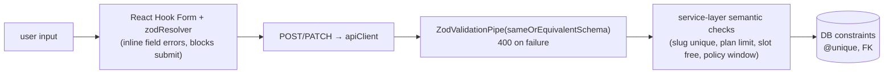

Every form uses **React Hook Form** with a **Zod** resolver
(`@hookform/resolvers/zod`). Moon's `Input` / `FormGroup` / `Checkbox` /
`Select` are wired through RHF's `<Controller>`.

```tsx
const { control, handleSubmit, formState: { errors } } =
  useForm<LoginInput>({ resolver: zodResolver(loginSchema) });

const onSubmit = handleSubmit((data) => loginMutation.mutate(data, {
  onSuccess: () => navigate('/dashboard/profile', { replace: true }),
}));
```

## Two sources of schema

| Form | Schema | Source |
| --- | --- | --- |
| Login | `loginSchema` | `@agendya/types` — **same object the API validates** |
| Register | `registerSchema` | `@agendya/types` |
| Profile | `updateProfileSchema` (+ `slugSchema`, `hexColorSchema`) | `@agendya/types` |
| Service form | page-local `serviceFormSchema` in `ServiceFormPage.tsx` | **mirrors** `createServiceSchema` with localised messages and non-nullable form defaults |
| Working hours | `setWorkingHoursSchema` | `@agendya/types` (`superRefine`: ≤ 6 blocks/day, no overlap) |
| Booking wizard | `createBookingSchema` fields, step by step | `@agendya/types` |

:::note[Why some forms mirror instead of reuse]
`createServiceSchema` uses `.superRefine` and nullable optionals that don't map
cleanly to controlled inputs with defined defaults, and its messages are
generic. `ServiceFormPage` keeps a local schema with the same rules, Spanish
messages, and `toFormValues` / `toPayload` adapters. When the shared rule
changes, **both** must change — this is called out in the
[Development guide](/en/development-guide/).
:::

## Validation layers



The client validation is for UX; the API never trusts it. Semantic rules that
need the database (uniqueness, availability, ownership, plan limits) only exist
server-side and surface as `409` / `403` / `404`, which forms display via
`getApiErrorMessage`.

## Error display

- **Field errors:** `formState.errors.<field>.message` under each input.
- **Form-level errors** (server rejects): a banner rendered from
  `getApiErrorMessage(mutation.error, '…')`.
- **Conflict handling:** the booking wizard inspects `ApiError.status === 409`
  to send the user back to slot selection with a "that time was just taken"
  message.

## Common field rules (from `@agendya/types`)

| Field | Rule |
| --- | --- |
| `email` | trimmed, lowercased, RFC email |
| `password` (register) | 8–72 chars |
| `businessName` | 2–100 |
| `slug` | lowercase, 3–50, `^[a-z0-9]+(-[a-z0-9]+)*$` |
| `brandColor` | `^#[0-9a-fA-F]{6}$` |
| `customerPhone` | `^[0-9+\-\s()]{7,20}$` |
| `durationMinutes` | int 5–480 |
| `priceCents` | int 0–100 000 000 |
| `date` params | `^\d{4}-\d{2}-\d{2}$` |
| profile image URLs | must start `http://` / `https://` (blocks `javascript:` / `data:`) |
