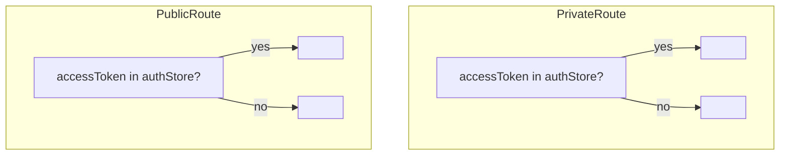

Defined entirely in `src/routes/AppRouter.tsx` with `<BrowserRouter>` and a
single `<Routes>` block wrapped in one `<Suspense fallback={<RouteFallback/>}>`.

## Route table

| Path | Component | Guard | Bundle |
| --- | --- | --- | --- |
| `/login` | `LoginPage` | `<PublicRoute>` | **initial** |
| `/register` | `RegisterPage` | `<PublicRoute>` | lazy |
| `/forgot-password` | `ForgotPasswordPage` | `<PublicRoute>` | lazy · *(no API behind it yet)* |
| `/auth/callback` | `GoogleCallbackPage` | none | lazy |
| `/dashboard/profile` | `ProfilePage` | `<PrivateRoute>` → `<DashboardLayout>` | lazy |
| `/dashboard/services` | `ServicesPage` | `<PrivateRoute>` → `<DashboardLayout>` | lazy |
| `/dashboard/services/new` | `ServiceFormPage` | ″ | lazy |
| `/dashboard/services/:id/edit` | `ServiceFormPage` | ″ | lazy |
| `/dashboard/schedule` | `SchedulePage` | ″ | lazy |
| `/dashboard/schedule/:day` | `DaySchedulePage` | ″ | lazy |
| `/dashboard/agenda` | `AgendaPage` | ″ | lazy |
| `/bookings/:token` | `BookingCancelPage` | none (token-scoped) | lazy |
| `/:slug` | `PublicBookingPage` | none | lazy |
| `/` | → `Navigate to="/login"` | — | — |
| `*` | → `Navigate to="/login"` | — | — |

## Guards

Both read `useAuthStore((s) => s.accessToken)`. There is **no route-level role
check** — there is only one role. `GoogleCallbackPage` is deliberately outside
both guards because it runs during the transition from unauthenticated to
authenticated.

## Route params

| Param | Route | Used for |
| --- | --- | --- |
| `:slug` | `/:slug` | `usePublicProfessional(slug)` → public page + wizard |
| `:token` | `/bookings/:token` | `useBookingByToken(token)` → view / cancel / reschedule |
| `:id` | `/dashboard/services/:id/edit` | `ServiceFormPage` edit mode (`useServices` + find) |
| `:day` | `/dashboard/schedule/:day` | `slugToWeekday(day)` (`lunes`…`domingo`) |

`/:slug` is declared **last** so literal routes (`/login`, `/dashboard/*`,
`/bookings/*`, `/auth/*`) always win.

## Code splitting

Only `LoginPage` ships in the entry chunk — it's the guaranteed landing route
(`/` and `*` both redirect there). Everything else is `lazy(() => import(...))`.
`vite.config.ts` additionally pins the React runtime
(`react`, `react-dom`, `react-router*`, `scheduler`) into a stable
`react-vendor` chunk so app deploys don't bust it from cache. See
[Performance](/en/performance/).

## Layout shell

`DashboardLayout` renders the desktop `Sidebar` + a mobile top bar and bottom
nav (`NAV_ITEMS` in `dashboard/navItems.ts`: Agenda, Servicios, Horario,
Perfil), an `<a href="#main-content">` skip link, the `ThemeToggle`, and an
`<Outlet/>` for the active dashboard page.
