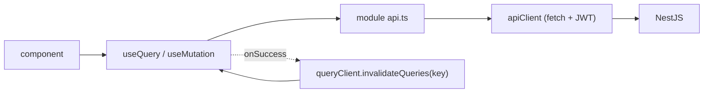

## The split

| Kind of state | Owner | Examples |
| --- | --- | --- |
| **Server state** (anything the API is the source of truth for) | **TanStack Query** | profile, services, working hours, exceptions, agenda, availability, public professional, booking-by-token |
| **Client state** (survives navigation, sometimes reloads) | **Zustand** (`persist`) | auth session, theme override, public-booking customer details |
| **Ephemeral UI state** | `useState` / React Hook Form | dialog open, current wizard step, form fields |

## apiClient

`src/shared/api/apiClient.ts` — a thin `fetch` wrapper, **not** axios (axios is
listed in old docs but the code uses `fetch`).

```ts
apiClient.get<T>(path, { params, headers, signal })
apiClient.post<T>(path, body, opts)   // body: object → JSON; FormData → multipart
apiClient.put<T> / patch<T> / delete<T>
// → Promise<{ data: T }>
```

- Base URL: `import.meta.env.VITE_API_URL || http://${location.hostname}:4000`.
- Injects `Authorization: Bearer <token>` from `useAuthStore.getState()` when a
  token exists.
- Non-2xx → throws `ApiError(status, parsedBody)`. `401` also calls
  `useAuthStore.getState().logout()`.
- `isApiError(e)` type-guards it; the booking wizard branches on
  `e.status === 409`.

## Query hook pattern

Each module has `hooks/` with one hook per operation:

```ts
// read
export const SERVICES_QUERY_KEY = ['services'] as const;
export function useServices() {
  return useQuery({ queryKey: SERVICES_QUERY_KEY, queryFn: listServices });
}

// write
export function useCreateService() {
  const qc = useQueryClient();
  return useMutation({
    mutationFn: createService,
    onSuccess: () => qc.invalidateQueries({ queryKey: SERVICES_QUERY_KEY }),
  });
}
```

Query keys in use: `['services']`, `['profile']`, `['working-hours']`,
`['exceptions']`, `['agenda', from, to]`, `['availability', slug, serviceIds,
date, atHome]`, `['public-professional', slug]`, `['booking', token]`.

`QueryClient` is created once in `main.tsx` with default options (no global
`staleTime` override).



## Zustand stores

### `authStore` (`modules/auth/authStore.ts`)

```ts
{ accessToken: string | null, user: AuthUser | null,
  setSession({ accessToken, user }), logout() }
```

`persist` → `localStorage['agendya-auth']`. Read **synchronously** by
`apiClient` and both route guards, so a refresh keeps you logged in with no
flash.

### `themeStore` (`shared/theme/themeStore.ts`)

```ts
{ theme: 'light' | 'dark',              // derived, applied to <html data-theme>
  manualTheme: 'light' | 'dark' | null, // persisted (partialize)
  setTheme(t), toggleTheme(), useSystemTheme() }
```

Effective theme is always `manualTheme ?? OS preference`. `index.html` runs an
inline script pre-paint to avoid a flash; the store keeps DOM + state in sync
afterwards and listens to `prefers-color-scheme` changes while no manual
override is set. Also mirrors `.dark-theme` onto `<html>` for Moon components.

### `customerStore` (`modules/publicBooking/customerStore.ts`)

Holds the customer's name/email/phone so the wizard's contact step is
pre-filled on repeat bookings. Not persisted.
