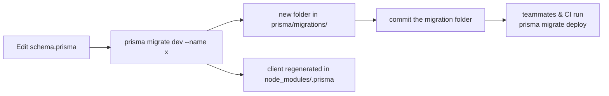

## Local PostgreSQL

```bash
docker compose -f infra/docker-compose.yml up -d      # start
docker compose -f infra/docker-compose.yml logs -f    # follow logs
docker compose -f infra/docker-compose.yml down       # stop (keeps the volume)
docker compose -f infra/docker-compose.yml down -v    # stop + delete data
```

| Setting | Value |
| --- | --- |
| Image | `postgres:16-alpine` |
| Container | `agendya-postgres` |
| User / password | `agendya` / `agendya_dev_password` |
| Database | `agendya_dev` |
| Host port | `5433` → container `5432` |
| Volume | `agendya_postgres_data` (named, persists across restarts) |

The matching `DATABASE_URL` is already in `apps/api/.env.example`.

## Prisma setup

- **Schema:** `apps/api/prisma/schema.prisma`
- **Client generator:** `prisma-client-js`
- **Datasource:** `postgresql`, URL from `DATABASE_URL`
- **Driver adapter:** `@prisma/adapter-pg` (`PrismaPg`) — see
  `apps/api/src/database/prisma.service.ts`. `PrismaService` extends
  `PrismaClient`, connects `onModuleInit`, disconnects `onModuleDestroy`, and
  is exported from a `@Global()` `DatabaseModule`.

```ts
// apps/api/src/database/prisma.service.ts
constructor() {
  super({ adapter: new PrismaPg({ connectionString: process.env.DATABASE_URL }) });
}
```

## Migrations

12 migrations ship with Phase 1, from `20260724171135_init` to
`20260907120000_optimize_booking_indexes`.

| Command | When |
| --- | --- |
| `npx prisma migrate deploy` | First setup, and after every `git pull` that adds migrations. Applies pending migrations only; **no** schema drift or client regen. Used in CI. |
| `npx prisma migrate dev --name <description>` | You changed `schema.prisma` and want a new migration. Creates the SQL, applies it, regenerates the client. Dev only. |
| `npx prisma migrate reset` | Wipe and re-apply everything from scratch (drops all data). |
| `npx prisma generate` | Regenerate the typed client without touching the database. |
| `npx prisma studio` | GUI browser at `http://localhost:5555`. |

Run all of these from `apps/api/`.



## Seeding

There is no `prisma db seed` hook wired up. A standalone script,
`apps/api/prisma/seed-services.mjs`, inserts a batch of example services for an
existing professional:

```bash
node apps/api/prisma/seed-services.mjs
```

Read the script before running it — it targets a specific account.

:::note[Schema header quirk]
Line 2 of `schema.prisma` references a plan-file path on the original author's
machine (`/Users/.../dreamy-mixing-lark.md`). It is a stale comment; ignore it.
:::

For the full model reference see [Database](/en/database/er-model/).
