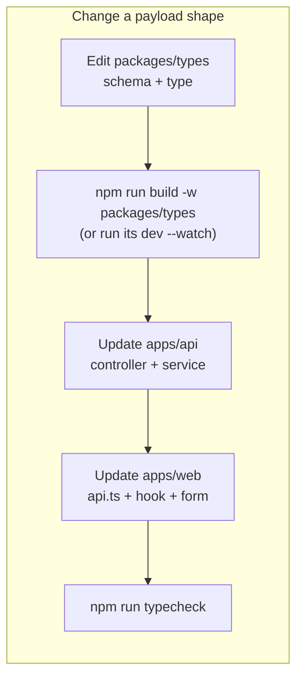
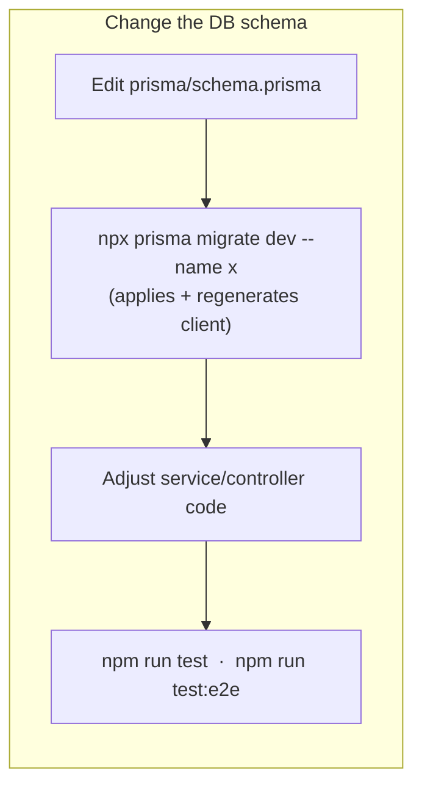

## Root scripts (`package.json`)

| Command | What it does |
| --- | --- |
| `npm run dev:api` | `start:dev` in `apps/api` — NestJS watch mode on `:4000` |
| `npm run dev:web` | `vite` in `apps/web` on `:5173` |
| `npm run dev:web:host` | Vite exposed on the LAN (`--host`) for testing from a phone/another device |
| `npm run build` | `build` in every workspace |
| `npm run lint` | `lint` in every workspace (ESLint for `apps/api`, oxlint for `apps/web`) |
| `npm run test` | `test` in every workspace (Jest unit / Vitest) |
| `npm run typecheck` | `typecheck` in every workspace |
| `npm run format` / `format:check` | Prettier over the repo (excludes `apps/api` and all `*.md`) |

## API-only (`cd apps/api`)

| Command | What it does |
| --- | --- |
| `npm run start:dev` | Watch-mode server |
| `npm run test` | Jest unit specs (`src/**/*.spec.ts`) |
| `npm run test:e2e` | Jest e2e specs (`test/**/*.e2e-spec.ts`, `--runInBand`) — needs Postgres |
| `npm run lint` | ESLint `--fix` |
| `npx prisma migrate dev --name <desc>` | Create + apply a new migration |
| `npx prisma studio` | Browse the database in a GUI |
| `npx prisma generate` | Regenerate the client after a schema edit |

## Web-only (`cd apps/web`)

| Command | What it does |
| --- | --- |
| `npm run dev` | Vite dev server |
| `npm run build` | `tsc -b && vite build` |
| `npm run test` | Vitest (run mode) |
| `npm run typecheck` | `tsc -b --noEmit` + `tsc -p tsconfig.e2e.json` |
| `npm run lint` | oxlint |
| `npm run test:e2e` | Playwright (starts/reuses the Vite dev server, stubs the API) |
| `npm run test:e2e:ui` / `:headed` / `:report` | Playwright UI / headed / open last report |
| `npm run test:e2e:install` | One-off: download the Chromium build |

## Typical loops





:::tip[Watch the shared package]
Run `npm run dev --workspace packages/types` (`tsc --watch`) in a spare
terminal while touching `@agendya/types` so both apps pick up changes without a
manual rebuild.
:::

## Editing this documentation

```bash
cd docs
npm install        # first time only
npm run dev        # Starlight dev server on http://localhost:4321
npm run build      # production build into docs/dist/
```

Pages are Markdown/MDX under `docs/src/content/docs/`. The sidebar is defined
in `docs/astro.config.mjs`. See the [Development guide](/en/development-guide/) for
the "add a docs page" checklist.
