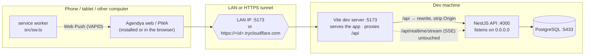
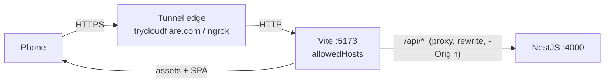
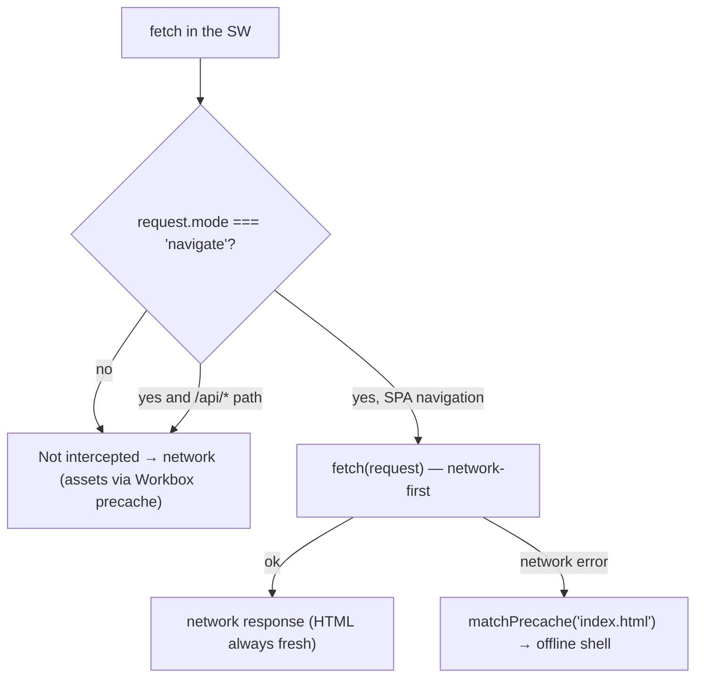
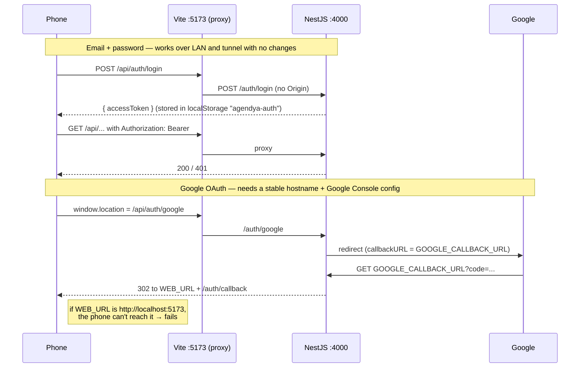
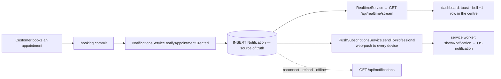
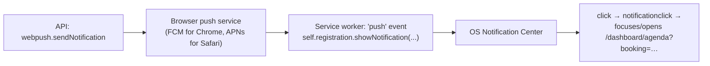

Agendya's web app is an **installable PWA**: offline app shell + OS-level Web
Push to the professional. The notification permission prompt and "Add to Home
Screen" only work over `localhost` or **HTTPS**, so testing on a real phone means
reaching the dev machine over the **LAN** or an **HTTPS tunnel**. None of this is
needed for normal `localhost` development.

## Architecture

Key points:

- **The API host is never hardcoded.**
  `apps/web/src/shared/api/apiClient.ts` resolves it at runtime: `VITE_API_URL`
  if set → else `http://localhost:4000` on localhost → else **same-origin
  `/api`**, which the Vite dev server proxies to `:4000`
  (`apps/web/vite.config.ts` → `server.proxy`). A LAN IP or a per-run tunnel
  hostname just works, and an HTTPS page reaches the API over HTTPS with no
  mixed-content block.
- The API listens on `0.0.0.0` (`apps/api/src/main.ts`), so the proxy reaches it
  on any interface.
- Auth is a **JWT in the `Authorization` header** (no cookies): there is no
  `SameSite`/`Secure`/CSRF surface for cross-device use. The SSE stream uses the
  same header via `fetch` (not `EventSource`).
- The Vite proxy **strips the `Origin` header** on the hop to Nest: that hop is
  server-to-server and the API's CORS allowlist rejects non-localhost/private
  origins. The browser never sees a CORS check because page and request share an
  origin.

## Tunnel architecture

There is no bundled tunnel process or start script: run **cloudflared** or
**ngrok** by hand in a third terminal, pointed at the Vite port.

- **One tunnel**, to port **5173**. Assets and `/api` (REST + SSE) all flow
  through it. `:4000` is not tunnelled separately.
- **HTTPS** is terminated at the tunnel edge. The app inherits the page's `https`
  scheme, so `apiBaseUrl` becomes `https://<tunnel>/api` and there is no
  mixed content.
- **Allowed hosts**: only `*.trycloudflare.com`, `*.ngrok-free.app` and
  `*.ngrok.io` are in `server.allowedHosts` in `vite.config.ts`. For another
  provider, add the domain there (otherwise Vite answers
  `Blocked request. This host is not allowed`).
- **CORS**: `isAllowedOrigin` (`apps/api/src/common/utils/cors.util.ts`) allows
  the exact `WEB_URL` plus any http(s) origin on `localhost` / `127.0.0.1` /
  `10.x` / `192.168.x` / `172.16–31.x`. Tunnel requests arrive same-origin with
  no `Origin`, so they never hit CORS.
- The tunnel hostname **changes every run** and is stored nowhere. Only Google
  OAuth needs a stable hostname (see below).

## Environment setup

`cp apps/api/.env.example apps/api/.env` and `cp apps/web/.env.example apps/web/.env`.
See also [Environment variables](/en/getting-started/environment/).

| File | Variable | Role for PWA / network |
| --- | --- | --- |
| `apps/api/.env` | `WEB_URL` | CORS allow-origin **and** the base the Google OAuth callback redirects back to. `http://localhost:5173` by default; only change it for tunnelled OAuth. |
| `apps/api/.env` | `GOOGLE_CLIENT_ID` / `_SECRET` / `GOOGLE_CALLBACK_URL` | Google sign-in. `GOOGLE_CALLBACK_URL` defaults to `http://localhost:4000/auth/google/callback`. |
| `apps/api/.env` | `VAPID_PUBLIC_KEY` / `VAPID_PRIVATE_KEY` / `VAPID_SUBJECT` | Web Push. Generate the pair with `npx web-push generate-vapid-keys`. All three must be set; any missing → push disabled, feed still works over SSE. |
| `apps/api/.env` | `REALTIME_HEARTBEAT_MS` | Optional. SSE keep-alive interval (default `25000`). |
| `apps/web/.env` | `VITE_API_URL` | **Leave unset** for LAN/tunnel dev (auto-detect + `/api` proxy). Set it only to pin a fixed backend, or in a **production build**, where there is no Vite proxy. Client vars must be prefixed `VITE_`. |

## Development commands

| Goal | Commands |
| --- | --- |
| Normal dev (localhost) | `npm run dev:api` · `npm run dev:web` |
| PWA over LAN | `npm run dev:api` · `npm run dev:web:host` (Vite prints the `Network:` line) |
| PWA over HTTPS tunnel | the above + in another terminal: `cloudflared tunnel --url http://localhost:5173` **or** `ngrok http 5173` |
| Verify the production PWA | `npm run verify:pwa` — build + `vite preview` + headless checks over the manifest, service worker, precache and offline navigation |
| PWA E2E (dev) | `npm run test:e2e --workspace apps/web` (includes `tests/e2e/pwa/pwa.spec.ts`) |

The service worker also registers in dev (`devOptions.enabled` in
`vite.config.ts`), so the manifest, the install icon and DevTools ▸ Application
work without a production build. Safari/iOS still needs real HTTPS (a tunnel) for
"Add to Home Screen".

### Access from another device, step by step

1. Start Postgres: `docker compose -f infra/docker-compose.yml up -d`.
2. Start the API: `npm run dev:api`.
3. Start the exposed web app: `npm run dev:web:host`.
4. (Tunnel) Start `cloudflared` / `ngrok` pointed at `5173`.
5. Copy the generated URL (Vite's `Network:` line, or the tunnel HTTPS URL).
6. Open it on the phone (same Wi-Fi for LAN).
7. Install: Android Chrome ▸ ⋮ ▸ *Install app*; iOS Safari ▸ Share ▸ *Add to
   Home Screen* (iOS 16.4+ and launch from the icon for Web Push).
8. In the notification centre, tap **Activar** on the push banner.

## PWA architecture

- **`vite-plugin-pwa`, `injectManifest` strategy** (`vite.config.ts`): the
  service worker is hand-written (`apps/web/src/sw.ts`); Workbox only injects the
  precache manifest into it. `generateSW` is not used.
- **Manifest** (generated from `vite.config.ts` → `manifest`): `name` /
  `short_name` `Agendya`, `start_url` and `scope` `/`, `display` `standalone`,
  `theme_color` `#4F46E5` (kept in sync with `<meta name="theme-color">` in
  `index.html`), `background_color` `#FFFFFF`, 192/512 `any` + 192/512
  `maskable` icons in `apps/web/public/`.
- **iOS**: `index.html` adds the `apple-mobile-web-app-*` tags
  `vite-plugin-pwa` does not. iOS Web Push only with the PWA **installed**
  (iOS 16.4+) and requesting permission from a user gesture.
- **Registration**: `vite-plugin-pwa` injects `registerSW.js`, which registers
  `/sw.js` with scope `/` on the `load` event.

### Service worker strategy

- **Precache** (`precacheAndRoute(self.__WB_MANIFEST)` + `cleanupOutdatedCaches()`):
  only the static shell — `js/css/html/svg/png/ico/webmanifest` — versioned per
  build. ~1 MB, ~51 entries.
- **Navigations**: a hand-written `fetch` handler, **network-first** with a
  fallback to the precached `index.html` when the network is gone. A hard
  refresh or a deep link opens offline, while an online visit always gets the
  freshest HTML (never a stale shell). `/api/*` is explicitly excluded.
- **API responses are never cached.** The SW has no runtime routes for `/api` —
  REST, auth and SSE always hit the network. No stale private data or sessions
  in the cache.
- **Updates**: `registerType: 'autoUpdate'` + `skipWaiting()` +
  `clients.claim()` — a new deploy activates the new SW on the next full page
  load. There is no in-app "new version available" prompt yet; to force it:
  DevTools ▸ Application ▸ Service Workers ▸ *Unregister* and reload.

## Authentication flow over network / tunnel

- **Email + password**: works everywhere. The JWT rides in `Authorization`, is
  persisted in `localStorage` (`agendya-auth`), and a `401` triggers `logout()`
  on both REST and SSE.
- **Google OAuth**: the callback redirects to **`WEB_URL`** and Google only
  redirects to the **exact** `GOOGLE_CALLBACK_URL` registered in the Console.
  With the defaults (both `localhost`) **Google sign-in from a phone/tunnel does
  not work**. To enable it you need a tunnel with a **stable hostname**
  (cloudflared named tunnel, or an ngrok reserved domain) and:
  1. Google Cloud Console ▸ *APIs & Services* ▸ *Credentials* ▸ your OAuth 2.0
     client:
     - *Authorized JavaScript origins*: `https://<stable-tunnel-host>`
     - *Authorized redirect URIs*:
       `https://<stable-tunnel-host>/api/auth/google/callback`
       (the Vite proxy strips `/api` before it reaches Nest at
       `/auth/google/callback`).
  2. `apps/api/.env`: `WEB_URL=https://<stable-tunnel-host>` and
     `GOOGLE_CALLBACK_URL=https://<stable-tunnel-host>/api/auth/google/callback`.
  3. Restart the API. Leave the production OAuth client/redirects untouched — use
     a separate dev client.
- Logout (`Sidebar`): `disablePush()` removes this browser's push subscription
  **before** the token is cleared, so pushes for that account stop reaching the
  device.

See also [Authentication flow](/en/architecture/authentication/).

## Real-time notification architecture

The detail lives in [Notifications](/en/features/notifications/); summary for the
PWA case:

- The `Notification` row is the **source of truth**; SSE and Web Push are
  best-effort delivery channels **on top of** the `INSERT`.
- A missed SSE event (professional offline, tab closed, event not received,
  multiple tabs) is **recovered** on opening the dashboard: the badge and feed
  load from `GET /notifications`.
- The SSE client is a single ref-counted connection with exponential backoff +
  jitter, reconnect on tab-visible, and stop on `logout` / `401`. It does not
  duplicate toasts or rows while reconnecting.

### Adding native push later

The professional Web Push channel is already implemented. If it is extended
later (e.g. push to the customer too, or new event types) the architecture does
**not** need rewriting:

- `NotificationsService.create()` is the **single write path** for the feed;
  every channel hangs off it after the `INSERT`. A new channel is one more
  fire-and-forget call — no schema or API change.
- The `PushSubscription` model is already one row per `(professional, endpoint)`
  with a globally-unique `endpoint`; customer push would just need an analogous
  model tied to `Booking`/customer.
- The service worker already does `push` + `notificationclick` with a deep link;
  new types only add fields to `pushMessageSchema` (`@agendya/types`) and a
  navigation branch.
- Production operational requirements: serve the app over HTTPS, stable VAPID
  keys in the server environment, and a valid contact `VAPID_SUBJECT`.

### Native OS notification on desktop (macOS / Windows / Linux)

The same Web Push channel produces the entry in the **macOS Notification
Center** when the PWA is installed in Chrome. The full chain and its conditions:

1. **Secure context** — `http://localhost` and `127.0.0.1` **do** count as a
   secure context: Service Worker, Notification API and Push API all work without
   HTTPS on `localhost`. Chrome's "Your connection to this site is not secure"
   warning is only about the missing certificate; it does **not** disable those
   APIs on `localhost`. An HTTPS tunnel works too.
2. **Site permission** — `Notification.permission === 'granted'` (Chrome ▸ lock ▸
   Notifications: *Allow*). Necessary but **not sufficient**.
3. **A registered subscription** — the app must have called
   `pushManager.subscribe()` and done `POST /notifications/push/subscribe`. That
   happens when you click **Activar** in the notification centre. It is **per
   browser and per device**: enabling it on the iPhone does not enable it on the
   Mac. Verify: `GET /notifications/push/status` → `{ "subscribed": true }`, or
   `npx prisma studio` → `PushSubscription` table.
4. **OS permission for the browser** — macOS ▸ Settings ▸ Notifications ▸
   *Google Chrome* (and the installed *Agendya* app): *Allow Notifications* on,
   alert style other than "None", no **Focus / Do Not Disturb**. If Chrome is
   muted at the OS level, `showNotification` does **not** throw but nothing
   appears.
5. **A live service worker** — in dev the SW is a Vite-served module; when Chrome
   wakes it for a `push` it must load its imports. Keep `npm run dev:web:host`
   running and reopen the PWA after restarting Vite. A production build
   (`sw.js`, one file) is more robust.

Isolate the failure: `node apps/api/scripts/push-doctor.mjs --send` sends a real
test push to every registered device and prints the push service's response.
`OK` + nothing visible ⇒ the block is at the OS/browser level (steps 4–5), not in
Agendya.

## Troubleshooting

| Symptom | Cause / fix |
| --- | --- |
| CORS error in the console | LAN/tunnel requests go same-origin through `/api` and shouldn't hit CORS. If they do, `VITE_API_URL` is probably set and pointing cross-origin: unset it. |
| `Blocked request. This host … is not allowed` (Vite) | Add the tunnel domain to `server.allowedHosts` in `apps/web/vite.config.ts`. |
| OAuth redirects to `http://localhost:5173` on the phone | Expected with default config — see [authentication flow](#authentication-flow-over-network--tunnel). Use email/password, or set up a stable tunnel. |
| `redirect_uri_mismatch` from Google | `GOOGLE_CALLBACK_URL` doesn't match an *Authorized redirect URI* in the Console character-for-character. |
| Mixed content / API blocked on HTTPS | Something calls `http://localhost:4000` directly. Ensure `VITE_API_URL` is unset so the app uses same-origin `/api`. |
| Service worker won't update | `autoUpdate`: a new deploy activates on the next full page load. Force it: DevTools ▸ Application ▸ Service Workers ▸ *Unregister* + reload. |
| Stale cache | Only the static shell is precached; API responses never are. DevTools ▸ Application ▸ *Clear storage*. |
| API unreachable from the device | Start the API with `npm run dev:api` (binds `0.0.0.0`). Check a firewall on `:5173`/`:4000`. Tunnel: confirm it points at `5173`, not `4000`. |
| SSE won't connect / no real time | A proxy may buffer `GET /api/realtime/stream`. The feed still catches up on reload from `GET /notifications`. Lower `REALTIME_HEARTBEAT_MS` if the proxy closes idle connections. |
| Push banner missing / "Activar" does nothing | Server has no VAPID keys (`GET /api/notifications/push/public-key` → `null`), the browser blocked notifications, or (iOS) the app wasn't launched from the installed icon. |
| Push enabled but no native notification | The subscription is **per browser/device** — click **Activar** on each (`GET /api/notifications/push/status`). Then the OS: macOS ▸ Settings ▸ Notifications ▸ *Google Chrome* / *Agendya* → allow, no Focus. `node apps/api/scripts/push-doctor.mjs --send` → if it prints `OK` and you see nothing, the block is OS/browser-level. See [Native OS notification](#native-os-notification-on-desktop-macos--windows--linux). |
| "Cookies not being sent" | Agendya uses a bearer token, not cookies. If a request is unauthenticated, the JWT in `localStorage` (`agendya-auth`) is missing or expired: log in again. |
| PWA not installable | Needs HTTPS (or localhost), a reachable manifest, 192 + 512 icons and an active service worker. Run `npm run verify:pwa` or check DevTools ▸ Application ▸ Manifest. |
