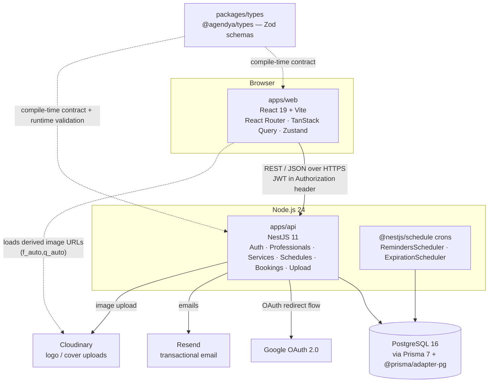

Agendya is a **two-app monorepo** plus a shared contract package:



## Request path

Every mutating request follows the same layered path:

```
User → React component
     → module hook (TanStack Query / RHF)
     → module api.ts (apiClient: fetch + JWT)
     → NestJS Controller  (route, ZodValidationPipe, guards)
     → NestJS Service     (business rules, policy checks)
     → PrismaService      (typed queries, transactions)
     → PostgreSQL
```

See [Data flow](/en/architecture/data-flow/) for a worked example (creating a
booking) and [Backend architecture](/en/architecture/backend/) for the module
breakdown.

## Repositories & workspaces

| Workspace | Package name | Stack | Purpose |
| --- | --- | --- | --- |
| `apps/api` | `api` | NestJS 11, Prisma 7, PostgreSQL | REST API, auth, cron jobs |
| `apps/web` | `web` | React 19, Vite, TS | Professional dashboard + public booking |
| `packages/types` | `@agendya/types` | Zod | Shared request/response schemas & constants |

`apps/web/Agendya-main/` is a **Figma Make design export** kept for reference
only. It is gitignored and is not the running app — see
[Repository layout](/en/overview/repository-layout/).

## Key characteristics

- **Stateless API auth.** The JWT travels in the `Authorization` header, never
  a cookie, so CORS `credentials` stays `false`. (The one cookie in the system
  is the short-lived OAuth `state` cookie for login-CSRF protection.)
- **Contract-first.** A payload shape changes in `packages/types` first, then
  both consumers. The API re-validates every body/query with the same Zod
  schema at runtime via `ZodValidationPipe`.
- **Timezone-correct.** Each professional has an IANA `timezone`. Wall-clock
  interpretation (working hours, "today") goes through
  `common/utils/timezone.util.ts`; absolute instants (`startAt`) are compared
  directly.
- **Concurrency-safe booking writes.** Slot commits and reschedules run in
  `Serializable` transactions with a bounded retry on serialization failure.
- **Graceful third-party degradation.** No `RESEND_API_KEY` → emails log to
  console. No `CLOUDINARY_URL` → upload endpoint returns 503. No Google
  credentials → the OAuth strategy simply isn't registered.
