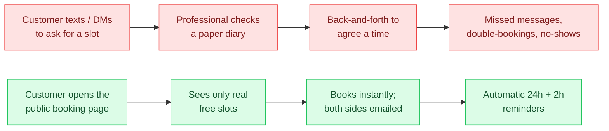

**Agendya** is a web scheduling platform. A professional signs up, configures
their services and working hours, and receives a public booking page at
`agendya.app/<slug>`. Their customers open that page, pick one or more services,
choose an available time, and book — no account required. Confirmation,
reminder, reschedule and cancellation emails are sent automatically.

## Who it is for

Phase 1 (the current MVP) targets **barbers and hairstylists**: single-operator
businesses that need an online booking page and a simple agenda, not a full
salon-management suite.

| Role | Has an account? | What they do |
| --- | --- | --- |
| **Professional** | Yes (password or Google) | Manage profile & branding, services, weekly working hours, blocked dates; view and manage the agenda. |
| **Customer** | No | Browse a professional's public page, book a slot, then reschedule or cancel via a tokenised link. |

There is no separate `Customer` table — customer identity is captured as
name / email / phone fields **snapshotted onto each booking**. See
[Appointment data & lifecycle](/en/database/appointment-lifecycle/).

## The problem it solves

## Feature set (Phase 1)

- **Authentication** — email/password (bcrypt) and Google OAuth 2.0, JWT
  sessions. [Details](/en/features/authentication/)
- **Professional profile & branding** — business name, category, description,
  logo, cover image, brand colour, timezone, cancellation-policy window, public
  `slug`. [Details](/en/features/professionals/)
- **Services** — name, duration, price (integer minor units), optional at-home
  variant with its own duration/price, sort order, soft delete, duplicate.
  Plan-based limits. [Details](/en/features/services/)
- **Working hours** — up to 6 non-overlapping blocks per weekday.
  [Details](/en/features/schedule/)
- **Schedule exceptions** — one-off closed dates. [Details](/en/features/schedule/)
- **Availability** — grid-based free-slot computation honouring working hours,
  exceptions, existing bookings, service duration and modality.
  [Details](/en/features/availability/)
- **Public booking** — multi-step wizard: services → date/time → contact
  details → confirmation. Multi-service bookings supported.
  [Details](/en/features/appointments/)
- **Agenda** — the professional's date-range list of bookings with status,
  cancel / complete / reschedule actions. [Details](/en/features/agenda/)
- **Reschedule & cancel** — by the professional from the agenda, or by the
  customer via the `cancellationToken` link, both gated by the cancellation
  policy. [Details](/en/features/appointments/)
- **Transactional email** — confirmation, reminder (24h & 2h), reschedule
  (to customer and professional), cancellation. Sent via Resend; logged to
  console when unconfigured. [Details](/en/features/notifications/)
- **Plans** — `BASIC` (free): 3 services, 100 bookings/month. `PRO`:
  unlimited. Enforced server-side.

## What is *not* in Phase 1

The repository root contains planning docs for later phases
(`Fase-2-Retencion.md`, `Fase-3-Marketplace.md`,
`Fase-4-Negocios-WhatsApp.md`). Retention tooling, a customer marketplace,
multi-staff businesses, WhatsApp integration, and online payments are all
**out of scope** and not implemented. Do not document them as if they exist.

:::note[Naming]
The product was renamed from **Ronda** to **Agendya** early on. Live config,
identifiers and CI have all been updated; remaining `Ronda` mentions survive
only in the hand-authored planning prose (`Arquitectura-Tecnica.md`,
`Stack-Tecnologico.md`, `MVP-v1.md`, `Fase-4-*.md`), which is kept as
historical record.
:::
