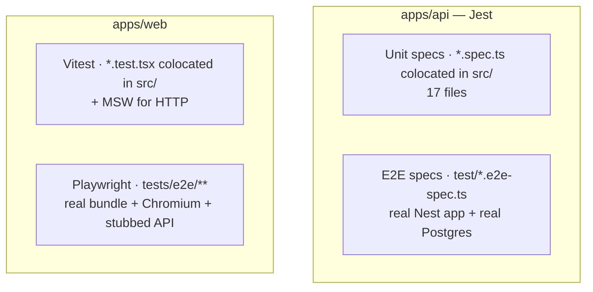

Agendya has **three** test layers.



## API — Jest

Config is inline in `apps/api/package.json` (`rootDir: src`,
`testRegex: .*\.spec\.ts$`, `ts-jest`).

| Command (from `apps/api`) | Scope |
| --- | --- |
| `npm run test` | Unit specs in `src/**` |
| `npm run test:watch` | Watch mode |
| `npm run test:cov` | Coverage → `../coverage` |
| `npm run test:e2e` | `test/*.e2e-spec.ts` via `test/jest-e2e.json`, `--runInBand` |

### Unit specs (`src/**/*.spec.ts`)

Pure logic and service behaviour, mostly without a real DB:
`booking-policy.spec.ts`, `auth.service.spec.ts`, `bookings.service.spec.ts`,
`availability.service.spec.ts`, `schedules.service.spec.ts`,
`professionals.service.spec.ts`, `services.service.spec.ts`,
`reminders.scheduler.spec.ts`, `expiration.scheduler.spec.ts`,
`google-oauth-state.guard.spec.ts`, and the `common/utils` helpers
(`slug`, `timezone`, `cors`), `infra/mail/html.util`, `mail.service`,
`infra/upload/upload.controller`, `app.controller`.

### E2E specs (`test/*.e2e-spec.ts`)

Boot the real `AppModule` with `configureApp()` (same wiring as `main.ts`) and
hit a **real PostgreSQL**. Set `DISABLE_SCHEDULED_JOBS=true` so the cron jobs
don't race serializable booking transactions.

| File | Covers |
| --- | --- |
| `app.e2e-spec.ts` | `GET /`, `GET /health` |
| `auth-professionals.e2e-spec.ts` | register/login/`/auth/me`, profile GET/PATCH, `check-slug`, public profile, URL validation |
| `services.e2e-spec.ts` | CRUD, plan limits, ownership |
| `schedules.e2e-spec.ts` | working hours (replace, multi-block, overlap reject), exceptions, public availability |
| `bookings.e2e-spec.ts` | create, overlap reject, token lookup, cancel/complete/reschedule, policy window, **two concurrent bookings — only one wins**, self-heal `CONFIRMED→EXPIRED`, two concurrent reschedules |
| `security.e2e-spec.ts` | helmet headers, no `X-Powered-By`, CORS origin rules, OAuth `state` CSRF rejection |

## Web — Vitest

Config in `vite.config.ts` (`environment: jsdom`, `globals: true`,
`setupFiles: ['./src/test/setup.ts']`, excludes `tests/**`).

```bash
cd apps/web && npm run test          # run mode
```

Suites: `App.test.tsx`, `shared/image/cloudinary.test.ts`,
`shared/theme/themeStore.test.ts`, `modules/publicBooking/PublicBookingPage.test.tsx`,
`modules/publicBooking/BookingCancelPage.test.tsx`,
`modules/bookings/AgendaPage.test.tsx`,
`modules/schedules/SchedulePage.test.tsx`,
`modules/services/ServicesPage.test.tsx`.

HTTP is intercepted with **MSW**. Testing Library drives the DOM; assertions
via `@testing-library/jest-dom`.

## Web — Playwright

Config `apps/web/playwright.config.ts`. `testDir: ./tests`, Chromium only
(Firefox/WebKit commented out), `webServer` starts/reuses the Vite dev server.

```bash
cd apps/web
npm run test:e2e:install   # one-off: download Chromium
npm run test:e2e           # headless
npm run test:e2e:ui        # UI mode
```

The Agendya REST API is **stubbed at the network boundary**
(`tests/fixtures/api.ts` — in-memory store + request recorder;
`api.overrideOnce(...)` for one-off errors). Third-party hosts (Google,
Cloudinary, Resend) are blocked. `tests/auth.setup.ts` seeds the
`agendya-auth` `localStorage` entry into `playwright/.auth/user.json`;
dashboard specs opt in with `test.use({ storageState })`.

Specs: `smoke`, `auth/login`, `navigation/dashboard-nav`, `dashboard/profile`,
`dashboard/services`, `dashboard/agenda`, `theme/system-preference`,
`a11y/audit` (`@axe-core/playwright`), `public-booking/booking`.

## Conventions

- **API unit:** `*.spec.ts` next to the source; prefer testing pure helpers
  (`booking-policy.ts`) directly over going through the service graph.
- **API e2e:** exercise the HTTP surface; never re-implement `configureApp` —
  import it.
- **Web unit:** `*.test.tsx` next to the component; mock HTTP with MSW, not by
  stubbing `apiClient`.
- **Web e2e:** never hit a real backend; add fixtures to `tests/fixtures/`.
- Keep `npm run test` (root) green — it's the CI gate along with typecheck,
  lint, e2e and build.
