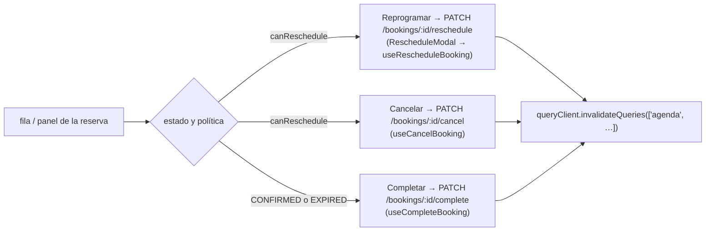

Ruta `/dashboard/agenda` (`AgendaPage.tsx`). Obtiene un **rango de fechas** de
reservas y las renderiza como una lista y una grilla de calendario
(`CalendarGridView.tsx`), con un panel de detalle (`AppointmentDrawer.tsx`) y un
modal de reprogramación (`RescheduleModal.tsx`).

## Datos

`GET /bookings?from=YYYY-MM-DD&to=YYYY-MM-DD` (JWT). `agendaQuerySchema` valida
ambas fechas.

`BookingsService.listAgenda`:

1. Carga al profesional (para la `timezone`).
2. `rangeStart = zonedInstant(from, 0, tz)`,
   `rangeEnd = zonedInstant(to, 1440, tz)`.
3. `booking.findMany({ professionalId, startAt: { gte: rangeStart, lt: rangeEnd } })`
   ordenado por `startAt` — **todos los estados**, no solo confirmadas.
4. Mapea cada una a un `AgendaBooking`.

```jsonc
// AgendaBooking
{
  "id": "uuid", "serviceId": "uuid", "serviceName": "…", "durationMinutes": 30,
  "customerName": "…", "customerEmail": "…", "customerPhone": "…",
  "customerNote": "… | null",            // observaciones que dejó el cliente al reservar
  "atHome": false,                       // modalidad a domicilio
  "customerAddress": "… | null",         // dirección del cliente — solo si atHome; solo la ve su profesional
  "startAt": "…", "endAt": "…",
  "status": "CONFIRMED",
  "cancellationPolicyHours": 24,
  "canReschedule": true,                 // isModifiable(booking, professional)
  "createdAt": "…",
  "cancelledAt": null, "cancelledBy": null
}
```

## Visualización del estado

`modules/bookings/statusConfig.ts` mapea cada `BookingStatus` a una etiqueta en
español y propiedades CSS personalizadas conscientes del tema
(`statusBadge.tsx`):

| Estado | Etiqueta |
| --- | --- |
| `PENDING` | Pendiente |
| `CONFIRMED` | Confirmada |
| `CANCELLED` | Cancelada |
| `COMPLETED` | Completada |
| `NO_SHOW` | No asistió |
| `EXPIRED` | Vencida |

## Acciones



Cada hook de mutación (`useCancelBooking`, `useCompleteBooking`,
`useRescheduleBooking`) invalida la query de la agenda al tener éxito para que la
lista se re-renderice con el nuevo estado. `ContextMenu.tsx` provee el menú de
acciones de clic derecho / pulsación larga en la grilla.

## Notificaciones que se disparan

| Acción en la agenda | Correos enviados |
| --- | --- |
| Cancelar | `sendBookingCancelled` → cliente |
| Reprogramar | `sendBookingRescheduled` → cliente |
| Completar | ninguno |

(Los caminos de edición/reprogramación iniciados por el cliente también
notifican al profesional; la reprogramación iniciada por el profesional desde la
agenda notifica solo al cliente.)
