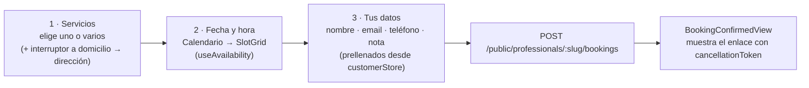
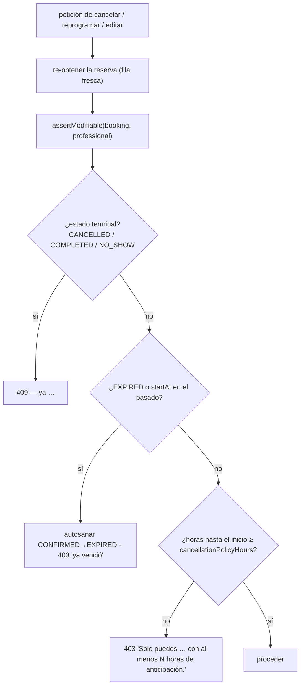

## Crear una reserva (asistente público)

`BookingWizard.tsx` (`modules/publicBooking`) es un formulario de varios pasos.
No se requiere cuenta.



Cuerpo de la petición — `createBookingSchema`:

```jsonc
{
  "serviceIds": "uuid1,uuid2",          // separados por coma
  "startAt": "2026-09-10T14:00:00.000Z",// datetime ISO
  "customerName": "Ana Ruiz",
  "customerEmail": "ana@example.com",
  "customerPhone": "+57 300 1234567",   // /^[0-9+\-\s()]{7,20}$/
  "customerNote": "opcional, ≤ 500",
  "atHome": false,
  "customerAddress": "obligatorio si atHome, 5–200 caracteres"
}
```

Tubería del lado del servidor (`BookingsService.createPublicBooking`):

```mermaid
sequenceDiagram
  autonumber
  participant Ctl as BookingsCreateController
  participant Svc as BookingsService
  participant DB as PostgreSQL
  Ctl->>Svc: createPublicBooking(slug, input)
  Svc->>DB: profesional por slug + isActive  (404)
  Svc->>Svc: resolveServiceSelection — cargar servicios, sumar duración,<br/>a domicilio requiere dirección + homeServiceEnabled
  Svc->>Svc: rechazar startAt en el pasado (400)
  Svc->>DB: assertSlotWithinSchedule — ¿cabe en un bloque WorkingHour? ¿sin ScheduleException? (409)
  Svc->>DB: tx SERIALIZABLE — findFirst de solapamiento → create; reintento x3 ante 40001/P2034
  DB-->>Svc: Booking (CONFIRMED, cancellationToken)
  Svc->>Svc: MailService.sendBookingConfirmation
  Svc-->>Ctl: DTO PublicBooking
```

## El DTO `PublicBooking`

Devuelto por cada endpoint de reserva `/public/...`:

```jsonc
{
  "id": "uuid",
  "businessName": "…",
  "professionalSlug": "…",
  "serviceId": "uuid",              // servicio primario; "" si se borró luego
  "serviceName": "Corte + Barba",   // snapshot
  "durationMinutes": 45,            // snapshot
  "customerName": "…", "customerEmail": "…", "customerPhone": "…",
  "customerNote": null,
  "atHome": false, "customerAddress": null,
  "startAt": "…", "endAt": "…",
  "status": "CONFIRMED",
  "cancellationToken": "uuid",
  "cancellationPolicyHours": 24,
  "canCancel": true,               // = canReschedule = isModifiable(booking, professional)
  "canReschedule": true
}
```

## Autoservicio del cliente (enlace con token)

El correo de confirmación contiene `{PUBLIC_WEB_URL o WEB_URL}/bookings/<cancellationToken>`
(`BookingCancelPage.tsx`). Desde ahí:

| Acción | API | Notas |
| --- | --- | --- |
| Ver | `GET /public/bookings/:token` | Cualquier estado |
| **Editar en el sitio** | `PATCH /public/bookings/:token` | Mismo cuerpo que crear; puede cambiar servicios, modalidad, hora, datos de contacto. Sin fila nueva; revuelve todas las guardas. Correos: reprogramación (ambas partes) si la hora cambió, si no re-confirmación. |
| **Reprogramar** | `POST /public/bookings/:token/reschedule` | `{ newStartAt }`; conserva `durationMinutesSnapshot`; guarda de solapamiento serializable |
| **Cancelar** | `POST /public/bookings/:token/cancel` | Pone `CANCELLED`, `cancelledBy: "customer"` |

Todos tienen `@Throttle` (10/60s para mutaciones, 30/60s para la lectura) y
están controlados por `assertModifiable`.

## Acciones del profesional (desde la agenda)

| Acción | API | Guarda |
| --- | --- | --- |
| Cancelar | `PATCH /bookings/:id/cancel` | `assertModifiable`; `cancelledBy: "professional"` |
| Completar | `PATCH /bookings/:id/complete` | el estado debe ser `CONFIRMED` o `EXPIRED` → `COMPLETED` |
| Reprogramar | `PATCH /bookings/:id/reschedule` | `assertModifiable`; `{ newStartAt }`; guarda de solapamiento serializable; envía correo al cliente |

Ver [Agenda y calendario](/features/agenda/) para la vista de lista y
[Ciclo de vida de la cita](/database/appointment-lifecycle/) para la máquina de
estados.

## Puerta de política de reprogramación / cancelación



`meetsCancellationWindow` e `isModifiable` son funciones puras en
`booking-policy.ts`, testeadas directamente y reutilizadas para los flags
`canCancel` / `canReschedule` del DTO.
