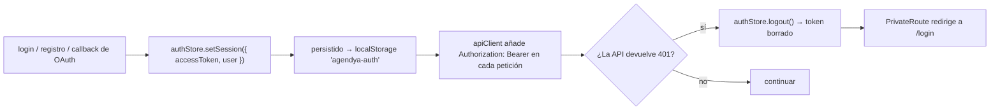

Cubierto de extremo a extremo (con diagramas de secuencia) en
[Arquitectura → Flujo de autenticación](/architecture/authentication/). Esta
página es el resumen a nivel de funcionalidad y la lista de endpoints.

## Formas de autenticarse

| Método | Punto de entrada (web) | API | Notas |
| --- | --- | --- | --- |
| Email + contraseña | `/register`, `/login` | `POST /auth/register`, `POST /auth/login` | bcrypt (`SALT_ROUNDS = 10`); contraseñas de 8–72 caracteres |
| Google OAuth 2.0 | Botón «Iniciar sesión con Google» | `GET /auth/google` → `GET /auth/google/callback` | Solo disponible cuando las credenciales de Google están configuradas |

Hay una ruta y una página `/forgot-password` en la app web, pero **todavía no
existe un endpoint de restablecimiento de contraseña en la API** — trata la
página como un placeholder.

:::caution[TODO — restablecimiento de contraseña]
`ForgotPasswordPage.tsx` está enrutada y se renderiza, pero no existe un handler
`/auth/forgot-password` ni `/auth/reset-password` en `apps/api`. Conectar esto es
trabajo sin terminar, no una funcionalidad documentada.
:::

## Endpoints

| Método | Ruta | Auth | Cuerpo / parámetros | Respuesta |
| --- | --- | --- | --- | --- |
| `POST` | `/auth/register` | ninguna · `@Throttle 5/60s` | `{ email, password, businessName }` (`registerSchema`) | `{ accessToken, user }` |
| `POST` | `/auth/login` | ninguna · `@Throttle 5/60s` | `{ email, password }` (`loginSchema`) | `{ accessToken, user }` |
| `GET` | `/auth/me` | JWT | — | `{ id, email, businessName, slug }` |
| `GET` | `/auth/google` | ninguna | — | 302 a Google (+ pone la cookie `oauth_state`) |
| `GET` | `/auth/google/callback` | cookie `state` + Google | `?code&state` | 302 a `{WEB_URL}/auth/callback#token=<JWT>` |

Forma de `user`: `{ id, email, businessName, slug }`.

## Modelo de cuenta

- Una tabla: **`Professional`**. `passwordHash` es nullable (las cuentas solo de
  Google no tienen); iniciar sesión con contraseña en una cuenta así devuelve
  `401 "Esta cuenta usa autenticación con Google."`.
- El registro deriva un `slug` único a partir de `businessName` vía `slugify` +
  `ensureUniqueSlug`.
- El login con Google resuelve la cuenta por `googleId`, si no por `email`
  (enlazando `googleId` a la fila existente), si no crea un nuevo profesional
  llamado `"Nombre Apellido"`.
- `isActive = false` deshabilita una cuenta: `JwtStrategy.validate` rechaza sus
  tokens con `401`.

## Ciclo de vida de la sesión (web)

El TTL del token es `JWT_EXPIRES_IN` (por defecto `7d`). No hay flujo de refresh
token; la expiración implica volver a iniciar sesión.
