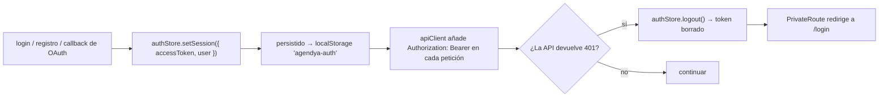
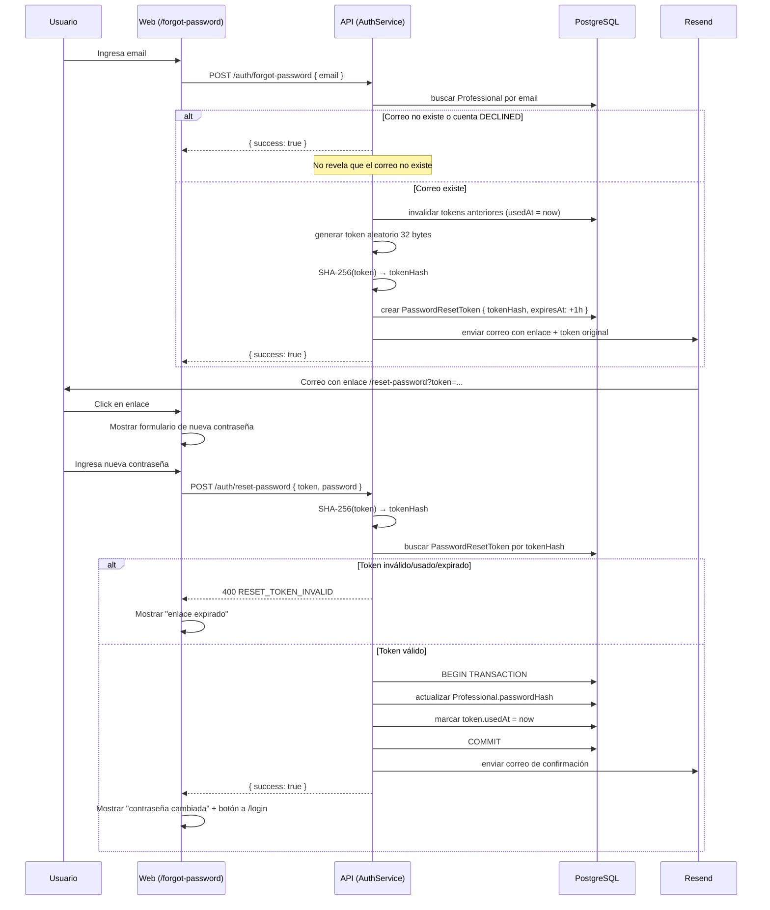

Cubierto de extremo a extremo (con diagramas de secuencia) en
[Arquitectura → Flujo de autenticación](/architecture/authentication/). Esta
página es el resumen a nivel de funcionalidad y la lista de endpoints.

## Formas de autenticarse

| Método | Punto de entrada (web) | API | Notas |
| --- | --- | --- | --- |
| Email + contraseña | `/register`, `/login` | `POST /auth/register`, `POST /auth/login` | bcrypt (`SALT_ROUNDS = 10`); contraseñas de 8–72 caracteres |
| Google OAuth 2.0 | Botón «Iniciar sesión con Google» | `GET /auth/google` → `GET /auth/google/callback` | Solo disponible cuando las credenciales de Google están configuradas |
| Recuperación de contraseña | `/forgot-password`, `/reset-password` | `POST /auth/forgot-password`, `POST /auth/reset-password` | Tokens de un solo uso con SHA-256, válidos por 1 hora |

## Endpoints

| Método | Ruta | Auth | Cuerpo / parámetros | Respuesta |
| --- | --- | --- | --- | --- |
| `POST` | `/auth/register` | ninguna · `@Throttle 5/60s` | `{ email, password, businessName }` (`registerSchema`) | `{ accessToken, user }` |
| `POST` | `/auth/login` | ninguna · `@Throttle 5/60s` | `{ email, password }` (`loginSchema`) | `{ accessToken, user }` · `401 ACCOUNT_NOT_FOUND` se queda en `/login` con CTA a registro |
| `POST` | `/auth/forgot-password` | ninguna · `@Throttle 3/60s` | `{ email }` (`forgotPasswordSchema`) | `{ success: true }` · Siempre responde igual para no revelar si el correo existe |
| `POST` | `/auth/reset-password` | ninguna · `@Throttle 5/60s` | `{ token, password }` (`resetPasswordSchema`) | `{ success: true }` · `400 RESET_TOKEN_INVALID` si el token no existe, ya se usó o expiró |
| `GET` | `/auth/me` | JWT | — | `{ id, email, businessName, slug, role, accessStatus }` |
| `GET` | `/auth/google` | ninguna | — | 302 a Google (+ pone la cookie `oauth_state`) |
| `GET` | `/auth/google/callback` | cookie `state` + Google | `?code&state` | 302 a `{WEB_URL}/auth/callback#token=<JWT>` · declinado: `/login?error=declined` · `state` inválido: `/login?error=oauth` |

Forma de `user`: `{ id, email, businessName, slug, role, accessStatus }`. `PENDING`
entra a `/acceso-pendiente`. `SUPER_ADMIN` entra a `/dashboard` sin el menú del
profesional.

## Modelo de cuenta

- Una tabla: **`Professional`**. `passwordHash` es nullable (las cuentas solo de
  Google no tienen); iniciar sesión con contraseña en una cuenta así devuelve
  `401 "Esta cuenta usa autenticación con Google."`.
- El registro deriva un `slug` único a partir de `businessName` vía `slugify` +
  `ensureUniqueSlug`.
- El login con Google resuelve la cuenta por `googleId`, si no por `email`
  (enlazando `googleId` a la fila existente), si no crea un nuevo profesional
  llamado `"Nombre Apellido"`.
- `isActive = false` deshabilita una cuenta: `JwtStrategy.validate` rechaza sus
  tokens con `401`.
- `accessStatus`: `PENDING` \| `APPROVED` \| `DECLINED`. El registro siempre crea
  la fila. Sin grant en beta cerrada queda `PENDING` (sesión sí, panel no).
  `DECLINED` no entra. `JwtStrategy` rechaza `DECLINED` y permite `PENDING`.
- `role`: `INDEPENDENT` por defecto; `SUPER_ADMIN` si el correo tiene una fila
  `PlatformAccessEmail` con `access = SUPER_ADMIN` (la semilla incluye
  `info@agendya.co` y `afz.0228@gmail.com`). `BUSINESS_ADMIN` está en el enum
  y no se usa.

## Periodo de prueba (acceso pendiente)

El registro **siempre** crea un `Professional`. Sin grant en
`PlatformAccessEmail` (ni match en `PROFESSIONAL_EMAIL_ALLOWLIST`) el
`accessStatus` queda `PENDING` y la web manda a `/acceso-pendiente`. Super
Admin ve todas las cuentas en **Registros** y puede Aceptar / Declinar.

`PROFESSIONAL_EMAIL_ALLOWLIST=""` (string vacío) abre el producto: los
`PENDING` entran al panel sin un update masivo (`DECLINED` sigue fuera). Un
grant `SUPER_ADMIN` o `ALLOWLISTED` nace `APPROVED`. Las páginas públicas
`/:slug` solo muestran cuentas `APPROVED` mientras el kill switch no esté
abierto.

## Ciclo de vida de la sesión (web)

```mermaid
flowchart LR
  L["login / registro / callback de OAuth"] --> S["authStore.setSession({ accessToken, user })"]
  S --> P["persistido → localStorage 'agendya-auth'"]
  P --> R["apiClient añade Authorization: Bearer en cada petición"]
  R --> E{"¿La API devuelve 401?"}
  E -->|sí| O["authStore.logout() → token borrado"]
  O --> RD["PrivateRoute redirige a /login"]
  E -->|no| C["continuar"]
```

El TTL del token es `JWT_EXPIRES_IN` (por defecto `7d`). No hay flujo de refresh
token; la expiración implica volver a iniciar sesión.

## Recuperación de contraseña

El flujo de restablecimiento de contraseña consta de dos pasos:

1. **Solicitud de recuperación** (`/forgot-password`): El usuario ingresa su correo electrónico. La API genera un token de un solo uso, lo envía por correo y siempre responde igual para no revelar si el correo existe en el sistema.

2. **Restablecer contraseña** (`/reset-password`): El usuario hace clic en el enlace del correo, ingresa una contraseña nueva y la API valida el token, actualiza la contraseña y marca el token como usado.

### Tabla PasswordResetToken

| Campo | Tipo | Descripción |
| --- | --- | --- |
| `id` | UUID | Identificador único |
| `professionalId` | UUID | FK a `Professional` (cascade delete) |
| `tokenHash` | String (SHA-256) | Hash del token aleatorio de 32 bytes |
| `expiresAt` | DateTime | Timestamp de expiración (1 hora desde creación) |
| `usedAt` | DateTime? | Timestamp cuando se usó el token (null = no usado) |
| `createdAt` | DateTime | Timestamp de creación |

### Seguridad

- **Tokens de un solo uso**: El token se marca como usado (`usedAt`) después de restablecer la contraseña exitosamente. No se puede reutilizar.
- **Expiración**: Los tokens expiran después de 1 hora (`TOKEN_EXPIRY_HOURS = 1`).
- **Hashing**: Los tokens se hashean con SHA-256 antes de guardarlos en la base de datos. El token original (base64url de 32 bytes aleatorios) solo se envía por correo.
- **Invalidación de tokens previos**: Al solicitar un nuevo token, todos los tokens anteriores no usados del mismo usuario se marcan como usados automáticamente.
- **Respuesta uniforme**: `POST /auth/forgot-password` siempre responde `{ success: true }`, independientemente de si el correo existe o no, para prevenir enumeración de cuentas.
- **Rate limiting**: Ambos endpoints tienen rate limiting para prevenir abuso.

### Flujo completo

```mermaid
sequenceDiagram
  participant Usuario
  participant Web as Web (/forgot-password)
  participant API as API (AuthService)
  participant DB as PostgreSQL
  participant Mail as Resend

  Usuario->>Web: Ingresa email
  Web->>API: POST /auth/forgot-password { email }
  API->>DB: buscar Professional por email
  alt Correo no existe o cuenta DECLINED
    API-->>Web: { success: true }
    Note over API: No revela que el correo no existe
  else Correo existe
    API->>DB: invalidar tokens anteriores (usedAt = now)
    API->>API: generar token aleatorio 32 bytes
    API->>API: SHA-256(token) → tokenHash
    API->>DB: crear PasswordResetToken { tokenHash, expiresAt: +1h }
    API->>Mail: enviar correo con enlace + token original
    API-->>Web: { success: true }
  end

  Mail->>Usuario: Correo con enlace /reset-password?token=...
  Usuario->>Web: Click en enlace
  Web->>Web: Mostrar formulario de nueva contraseña
  Usuario->>Web: Ingresa nueva contraseña
  Web->>API: POST /auth/reset-password { token, password }
  API->>API: SHA-256(token) → tokenHash
  API->>DB: buscar PasswordResetToken por tokenHash
  alt Token inválido/usado/expirado
    API-->>Web: 400 RESET_TOKEN_INVALID
    Web->>Web: Mostrar "enlace expirado"
  else Token válido
    API->>DB: BEGIN TRANSACTION
    API->>DB: actualizar Professional.passwordHash
    API->>DB: marcar token.usedAt = now
    API->>DB: COMMIT
    API->>Mail: enviar correo de confirmación
    API-->>Web: { success: true }
    Web->>Web: Mostrar "contraseña cambiada" + botón a /login
  end
```

### Correos enviados

El flujo de recuperación envía dos correos:

1. **Correo de recuperación** (`forgot-password.template.ts`): Contiene el enlace con el token para restablecer la contraseña. Se envía después de `POST /auth/forgot-password`.

2. **Confirmación de cambio** (`password-changed.template.ts`): Se envía después de un restablecimiento exitoso para notificar al usuario que su contraseña fue cambiada.

### Pendiente

:::caution[Invalidar sesiones existentes]
El restablecimiento de contraseña **no invalida automáticamente los JWT ya emitidos**. Si un atacante obtuvo el token JWT de la víctima, ese token seguirá siendo válido hasta que expire (`JWT_EXPIRES_IN`).

Una mejora futura sería agregar un campo `passwordChangedAt` en `Professional` y validarlo en `JwtStrategy` para rechazar tokens emitidos antes de ese timestamp.
:::
