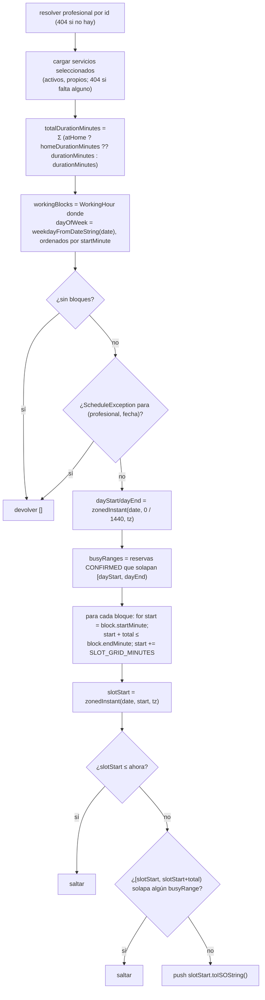

**Endpoint:** `GET /public/professionals/:slug/availability?serviceIds=&date=&atHome=`
(sin autenticar, `@Throttle 30/60s`).
**Esquema de query:** `availabilityQuerySchema` — `serviceIds` separados por
coma, `date` `YYYY-MM-DD`, `atHome` la cadena `"true"`/`"false"` → booleano.
**Respuesta:** `{ slots: string[] }` — instantes UTC ISO-8601, cada uno una hora
de *inicio* válida.
**Código:** `apps/api/src/modules/schedules/availability.service.ts`.

## Algoritmo

## Entradas que dan forma al resultado

| Entrada | Efecto |
| --- | --- |
| `serviceIds` | La suma de duraciones fija cuánto espacio contiguo necesita un slot. Cualquier id desconocido/inactivo → `404`. |
| `atHome=true` | Usa el `homeDurationMinutes` de cada servicio cuando está definido (cae de vuelta a `durationMinutes`). Nota: el endpoint de disponibilidad **no** rechaza por sí mismo los servicios donde `homeServiceEnabled` es false — esa comprobación ocurre al reservar. |
| `date` | Elige los bloques de horario de ese día de la semana; un `ScheduleException` que coincida anula el día. |
| Env `SLOT_GRID_MINUTES` (por defecto `15`) | Paso de la grilla — los inicios candidatos son `block.start`, `+grid`, `+2·grid`, … |
| `timezone` del profesional | `zonedInstant` mapea cada minuto de hora de pared al instante UTC correcto sin importar la TZ del servidor. |
| Reservas `CONFIRMED` existentes | El test de solapamiento semiabierto `slotStart < busyEnd && slotEnd > busyStart` elimina conflictos. |
| `now` | Los slots pasados se descartan. |

## Vale la pena saber

- Solo las reservas `CONFIRMED` cuentan como ocupado. `CANCELLED` /
  `COMPLETED` / `EXPIRED` liberan su tiempo.
- Un slot debe caber **por completo** dentro de un único bloque de horario — el
  algoritmo nunca abarca dos bloques ni cruza un descanso.
- La lista es orientativa. La reserva revalida todo en el servidor
  (`assertSlotWithinSchedule` + una guarda de solapamiento `Serializable`), así
  que un slot que se mostró pero fue tomado mientras tanto falla limpiamente con
  `"Ese horario ya no está disponible."`.

## Frontend

`useAvailability` (`modules/publicBooking/hooks`) consulta este endpoint con
clave `(slug, serviceIds, date, atHome)`; `SlotGrid.tsx` renderiza las cadenas
ISO devueltas como horas seleccionables en la timezone del profesional.
