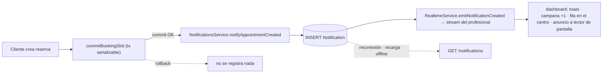
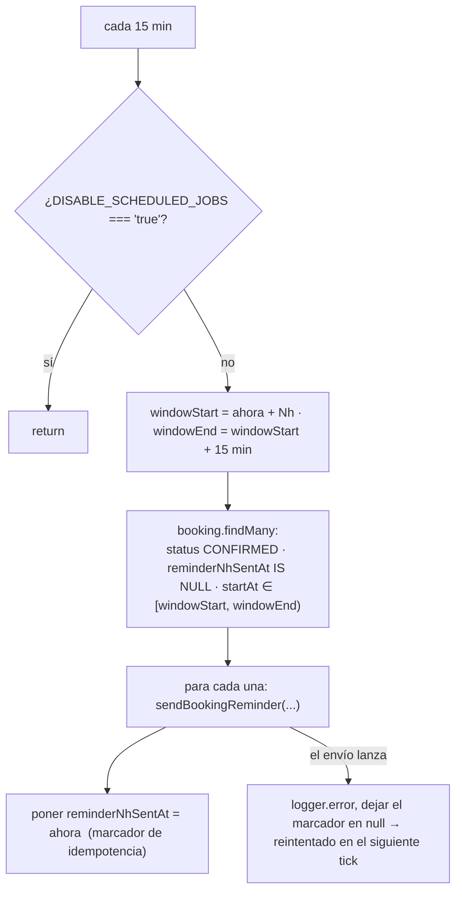
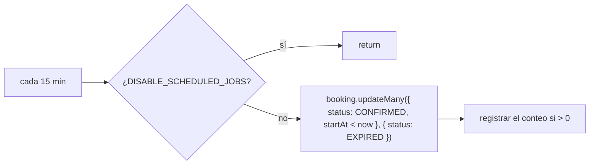

Hay **dos tipos** de notificación en Agendya:

1. **Correo al cliente** — siempre email, vía `MailService`
   (`infra/mail/mail.service.ts`) con **Resend**. Sin SMS.
2. **Centro de notificaciones del profesional** — un feed **persistente** en el
   dashboard con entrega en tiempo real (SSE) encima. Ver
   [Centro de notificaciones](#centro-de-notificaciones).

## Catálogo de correos

| Método | Disparador | Destinatario | Asunto (es-CO) |
| --- | --- | --- | --- |
| `sendBookingConfirmation` | Reserva creada; también en la edición por token cuando la hora no cambió | Cliente | `Reserva confirmada con <negocio>` |
| `sendBookingReminder` | Cron de recordatorio, 24h y 2h antes de `startAt` | Cliente | `Recordatorio: tu cita con <negocio>` |
| `sendBookingRescheduled` | Cualquier reprogramación / edición que cambie la hora | Cliente | `Cita modificada con <negocio>` |
| `sendBookingRescheduledToProfessional` | Reprogramación / edición iniciada por el cliente | Profesional | `Modificación de reserva - <cliente>` |
| `sendBookingCancelled` | Cancelación por el cliente o el profesional | Cliente | `Reserva cancelada con <negocio>` |

- **Origen:** `Agendya <reservas@agendya.app>` (fijo en el código).
- **Fechas:** `Intl.DateTimeFormat('es-CO', { dateStyle: 'full', timeStyle:
  'short', timeZone })` en la timezone del profesional.
- **Enlace de cancelación:** `{WEB_URL}/bookings/<cancellationToken>`.
- **XSS:** cada valor interpolado (`customerName`, `businessName`,
  `serviceName`, …) pasa por `escapeHtml` — el formulario de reserva es público
  y el profesional recibe algunos de esos valores en su bandeja de entrada.
- **Sin configurar:** sin `RESEND_API_KEY` → `send()` registra
  `[dev] Email a <to>: <subject>` y retorna. Un error de la API de Resend cuando
  sí está configurado se captura y registra, nunca se lanza, así que el correo
  nunca rompe la respuesta de una reserva.

## Centro de notificaciones

`modules/notifications` en la API y en la web. La fila `Notification` de la base
de datos es la **fuente de verdad**; SSE es solo un canal de entrega inmediata y
un futuro Web Push sería otro.

- **Orden garantizado:** la notificación se **persiste después del commit** de la
  reserva y **antes** de emitir el evento. Si la reserva falla, no hay fila.
- **Best-effort:** `NotificationsService.notifyAppointmentCreated` traga sus
  errores y `BookingsService` además envuelve la llamada en `.catch()`; una
  notificación fallida nunca rompe una reserva ya guardada.
- **Efímero vs. persistente:** el evento SSE es efímero, la fila no. Un
  profesional offline, con la pestaña cerrada o que se perdió el evento ve la
  notificación al abrir el dashboard: el badge y el feed se cargan desde la API.

### Modelo `Notification`

| Campo | Tipo | Notas |
| --- | --- | --- |
| `id` | uuid | |
| `professionalId` | uuid | FK → `Professional`, `onDelete: Cascade` |
| `type` | `NotificationType` | hoy solo `APPOINTMENT_CREATED`; reservados `APPOINTMENT_CANCELLED` / `APPOINTMENT_RESCHEDULED` / `APPOINTMENT_REMINDER` / `SYSTEM` |
| `title` / `body` | string | textos listos para mostrar (es-CO); también sirven para un futuro payload de Web Push. A domicilio: `title` = `"Nueva cita a domicilio"` |
| `data` | `Json` | `{ bookingId, customerName, serviceName, startAt, atHome? }` — `bookingId` es la referencia de navegación; el resto evita un join y es *point-in-time*. `atHome: true` solo se añade para una reserva a domicilio (bandera, nunca la dirección) |
| `readAt` | `DateTime?` | `null` = sin leer |
| `createdAt` | `DateTime` | |

No se copian email / teléfono / dirección / nota del cliente ni el
`cancellationToken`.

### Índices

- `@@index([professionalId, createdAt(sort: Desc)])` — el único listado
  (`WHERE professionalId = ? ORDER BY createdAt DESC`, keyset sobre `(createdAt, id)`).
- `@@index([professionalId, readAt])` — badge de sin leer
  (`WHERE professionalId = ? AND readAt IS NULL`).

### API

Todos requieren JWT y se acotan a `req.user.id` en el servidor — ver
[Referencia de endpoints](/api/reference/#real-time--modulesrealtime).

| Método | Ruta | Respuesta |
| --- | --- | --- |
| `GET` | `/notifications?cursor=&limit=` (1–50, def. 20) | `{ items: Notification[], nextCursor: string \| null }` |
| `GET` | `/notifications/unread-count` | `{ count }` |
| `PATCH` | `/notifications/:id/read` | `Notification` — `404` si no es propia; idempotente |
| `PATCH` | `/notifications/read-all` | `{ updated }` |

`markRead` / `markAllRead` usan `updateMany` con `professionalId` en el `where`,
así que un profesional nunca puede marcar como leída la notificación de otro.

### Evento en tiempo real

`notification.created` (`realtimeEventSchema` en `@agendya/types`):
`{ type, notification: Notification }` — la misma fila que devuelve la API.
Transporte: `GET /realtime/stream` (SSE, `@Sse()` de NestJS, mismo `JwtAuthGuard`,
`fetch` con header `Authorization`, cero dependencias nuevas). Latido `event: ping`
cada `REALTIME_HEARTBEAT_MS` (25 s por defecto).

### Frontend

- **Conexión única** compartida (`shared/realtime/realtimeClient.ts`): backoff
  exponencial + jitter, reconexión al volver la pestaña al foco, parada en
  logout / 401.
- **React Query:** `['notifications','list']` (`useInfiniteQuery`, solo mientras
  el centro está abierto) y `['notifications','unread']` (siempre montado; se
  refresca al montar el dashboard y al enfocar la ventana). En `notification.created`
  el hook **inserta en la caché de la lista** (sin refetch) e **invalida el conteo**
  (documento `{count}` diminuto; incrementar a ciegas lo duplicaría si el último
  fetch ya lo incluía). Las mutaciones de marcar leído son optimistas con rollback.
- **UI:** campana 🔔 con badge en la sidebar (escritorio) y la barra superior
  (móvil); abre un drawer lateral derecho (`role="dialog"`, focus-trap, Escape,
  el foco vuelve a la campana). Skeleton de carga, estado vacío y estado de error.
  Distinción leído / no leído **no solo por color**: punto, etiqueta «Nuevo» y
  negrita; el nombre accesible del ítem empieza por «Sin leer.».
- **Marcado explícito:** abrir el centro **no** marca nada; un ítem se marca al
  activarlo (clic / Enter), lo que además navega a la agenda con
  `?booking=<id>&date=<día>` y abre el detalle de esa reserva —
  igual en vista de lista o de calendario, ya que ambas usan el mismo drawer. La
  agenda ensancha su rango de fechas para incluir el día y luego limpia los
  parámetros de la URL. «Marcar todas como leídas» en la cabecera.
- **Lector de pantalla:** una región `aria-live="polite"` en el shell anuncia
  cada notificación nueva.

### Retención

No implementada. Las filas son pequeñas y el volumen de Fase 1 es bajo.
Estrategia futura sugerida: un `@Cron` diario que borre
`readAt IS NOT NULL AND createdAt < now() - interval '90 days'`, más un tope duro
por profesional (p. ej. conservar las 500 más recientes). Se apagaría con
`DISABLE_SCHEDULED_JOBS` como los otros crons.

### Web Push (futuro)

`NotificationsService.create()` es el único punto de escritura del feed. Añadir
Web Push es una línea más ahí: tras el `INSERT`, si existe una `PushSubscription`
para el profesional, enviar el push con `title` / `body` / `data` ya listos. La
fila sigue siendo la fuente de verdad; SSE y push son canales de entrega, no
reemplazos del centro.

## Scheduler de recordatorios

`modules/bookings/reminders.scheduler.ts` — dos jobs `@Cron('*/15 * * * *')`
(24h y 2h).

Como el marcador solo se escribe **después** de un envío exitoso, un envío
fallido se reintenta en la siguiente ejecución; uno exitoso nunca se reenvía. La
ventana de 15 minutos coincide con la cadencia del cron, así que cada reserva
cae en exactamente una ventana.

## Scheduler de expiración

`modules/bookings/expiration.scheduler.ts` — un `@Cron('*/15 * * * *')`.

Esto es un **respaldo para la vista de agenda**, no el mecanismo de
cumplimiento: cada endpoint que muta datos ya revalida `startAt` contra
`Date.now()` y autosana la fila que toca (`assertModifiable`), así que una
reserva nunca puede reprogramarse solo porque este barrido no se haya ejecutado.

## No implementado

- Sin recordatorio al **profesional**.
- Sin correo de cancelación al profesional (solo se avisa al cliente al
  cancelar).
- Sin flujo `NO_SHOW`, por lo tanto sin notificación relacionada.
- Sin correo de resumen / digest diario.
