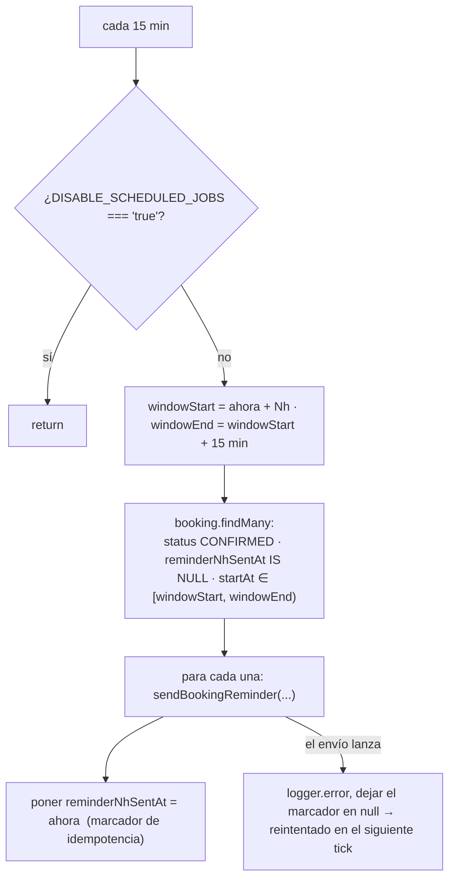
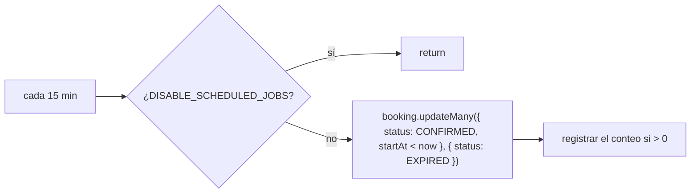

Todas las notificaciones son **correo electrónico**, enviadas mediante
`MailService` (`infra/mail/mail.service.ts`) vía **Resend**. Sin SMS, sin push,
sin notificaciones in-app.

## Catálogo de correos

| Método | Disparador | Destinatario | Asunto (es-CO) |
| --- | --- | --- | --- |
| `sendBookingConfirmation` | Reserva creada; también en la edición por token cuando la hora no cambió | Cliente | `Reserva confirmada con <negocio>` |
| `sendBookingReminder` | Cron de recordatorio, 24h y 2h antes de `startAt` | Cliente | `Recordatorio: tu cita con <negocio>` |
| `sendBookingRescheduled` | Cualquier reprogramación / edición que cambie la hora | Cliente | `Cita modificada con <negocio>` |
| `sendBookingRescheduledToProfessional` | Reprogramación / edición iniciada por el cliente | Profesional | `Modificación de reserva - <cliente>` |
| `sendBookingCancelled` | Cancelación por el cliente o el profesional | Cliente | `Reserva cancelada con <negocio>` |

- **Origen:** `Agendya <reservas@agendya.app>` (fijo en el código).
- **Fechas:** `Intl.DateTimeFormat('es-CO', { dateStyle: 'full', timeStyle:
  'short', timeZone })` en la timezone del profesional.
- **Enlace de cancelación:** `{WEB_URL}/bookings/<cancellationToken>`.
- **XSS:** cada valor interpolado (`customerName`, `businessName`,
  `serviceName`, …) pasa por `escapeHtml` — el formulario de reserva es público
  y el profesional recibe algunos de esos valores en su bandeja de entrada.
- **Sin configurar:** sin `RESEND_API_KEY` → `send()` registra
  `[dev] Email a <to>: <subject>` y retorna. Un error de la API de Resend cuando
  sí está configurado se captura y registra, nunca se lanza, así que el correo
  nunca rompe la respuesta de una reserva.

## Scheduler de recordatorios

`modules/bookings/reminders.scheduler.ts` — dos jobs `@Cron('*/15 * * * *')`
(24h y 2h).

Como el marcador solo se escribe **después** de un envío exitoso, un envío
fallido se reintenta en la siguiente ejecución; uno exitoso nunca se reenvía. La
ventana de 15 minutos coincide con la cadencia del cron, así que cada reserva
cae en exactamente una ventana.

## Scheduler de expiración

`modules/bookings/expiration.scheduler.ts` — un `@Cron('*/15 * * * *')`.

Esto es un **respaldo para la vista de agenda**, no el mecanismo de
cumplimiento: cada endpoint que muta datos ya revalida `startAt` contra
`Date.now()` y autosana la fila que toca (`assertModifiable`), así que una
reserva nunca puede reprogramarse solo porque este barrido no se haya ejecutado.

## No implementado

- Sin recordatorio al **profesional**.
- Sin correo de cancelación al profesional (solo se avisa al cliente al
  cancelar).
- Sin flujo `NO_SHOW`, por lo tanto sin notificación relacionada.
- Sin correo de resumen / digest diario.
